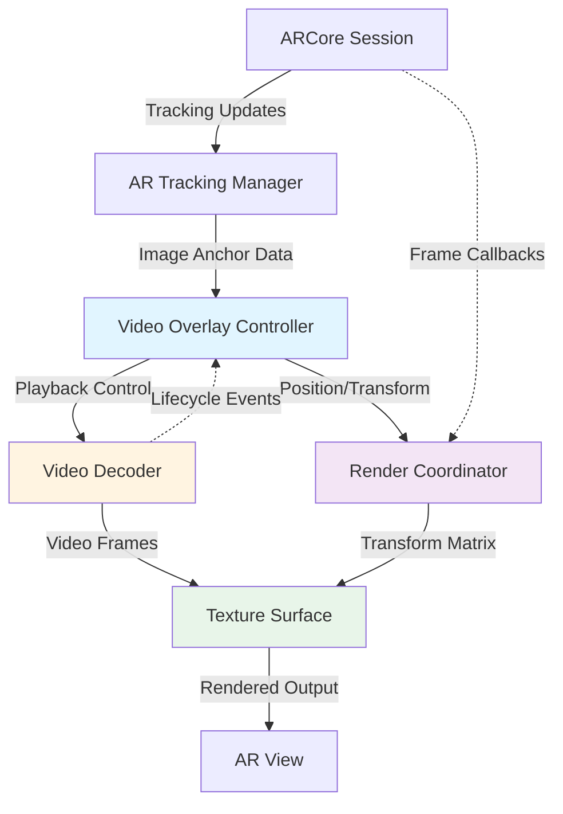
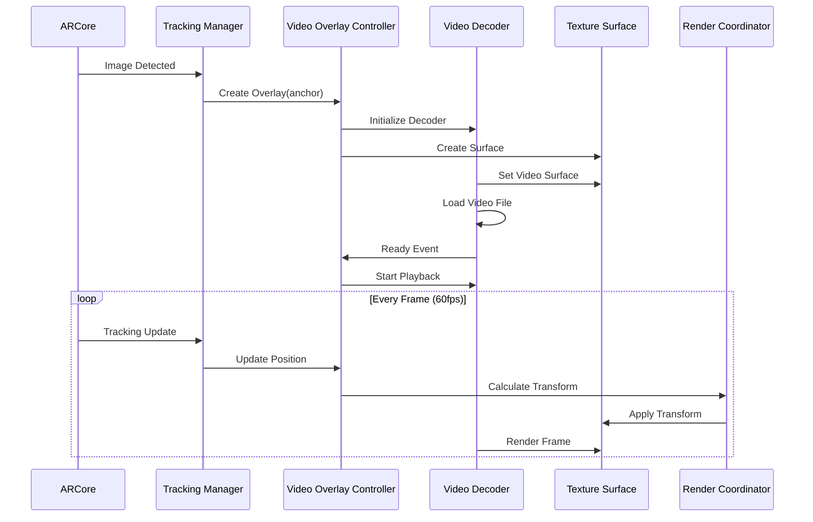
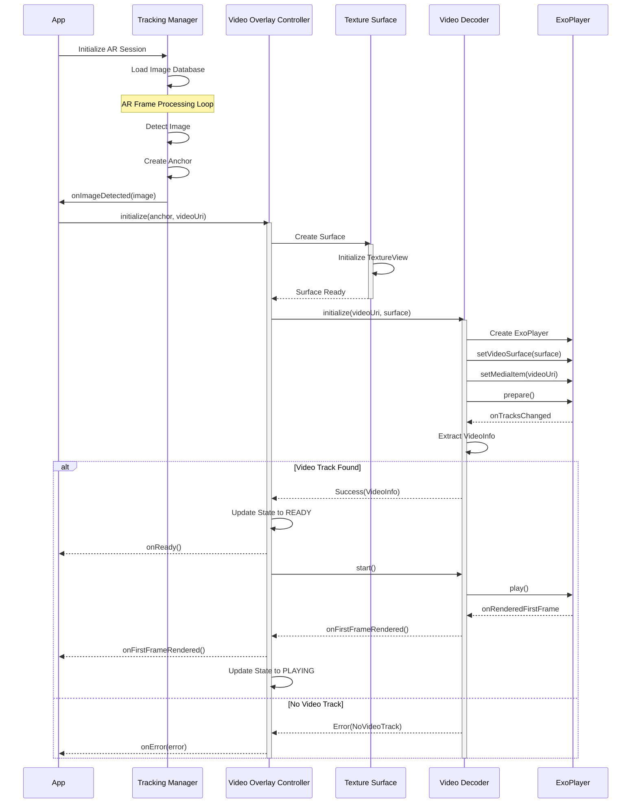
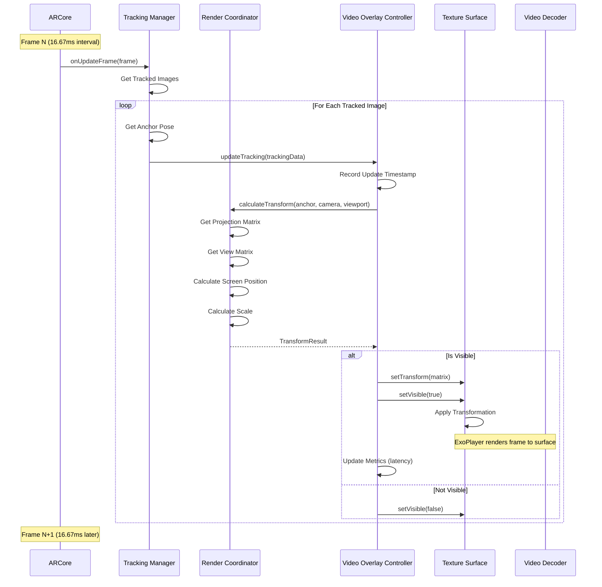
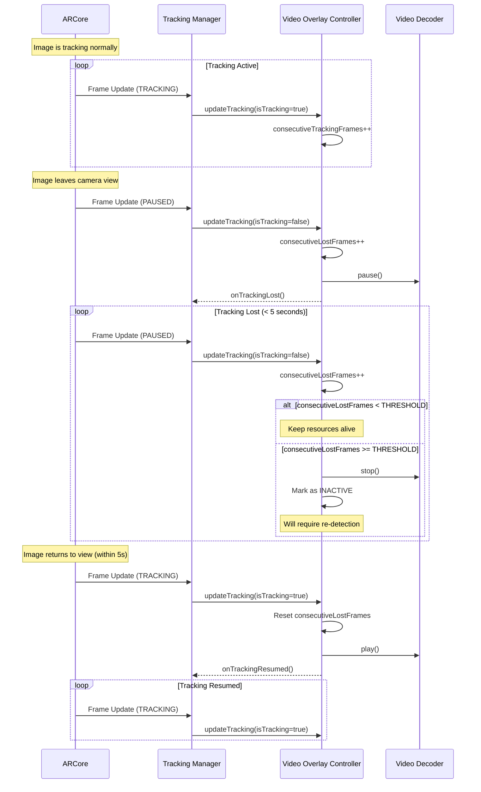
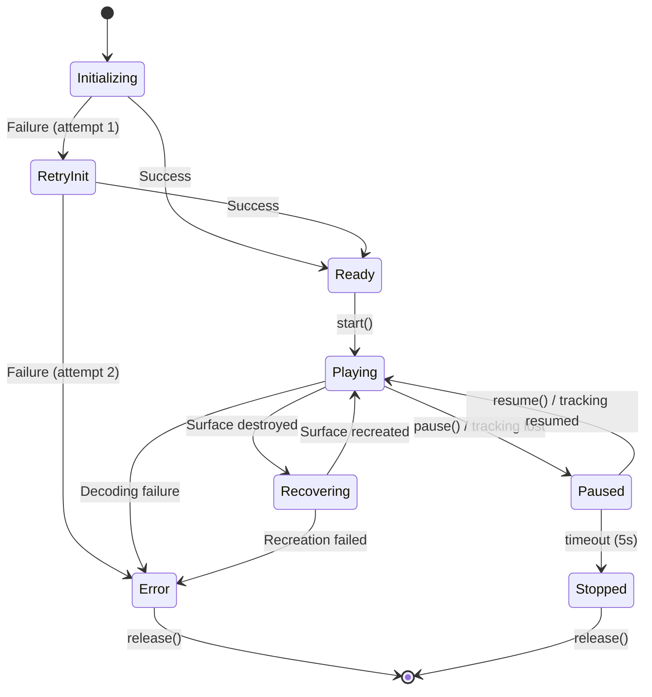

# AR Video Overlay Tracking - Technical Design

## Overview

This design addresses the critical issues preventing video frame rendering in the TalkAR AR video overlay feature. The current implementation uses ExoPlayer with PlayerView in a Compose overlay, which fails to render video frames despite successful audio playback and track detection. The core problems are:

1. **Video Dimension Detection Failure**: ExoPlayer reports 0x0 dimensions even when video tracks are detected
2. **Frame Rendering Failure**: PlayerView in Compose overlay doesn't render frames to screen
3. **AR Integration Gap**: No proper synchronization between ARCore tracking updates and video position

### Solution Approach

We will replace the PlayerView-based approach with a **TextureView + ExoPlayer** architecture that provides:

- Direct access to video frames via SurfaceTexture
- Hardware-accelerated rendering compatible with AR pipelines
- Explicit control over video surface lifecycle
- Proper integration with ARCore's 60fps tracking updates

### Key Design Decisions

**Why TextureView over PlayerView?**
- TextureView provides a Surface that ExoPlayer can render to directly
- Works reliably in Compose via AndroidView
- Allows transformation and positioning without rendering issues
- Better integration with AR rendering pipelines

**Why not SurfaceView?**
- SurfaceView creates a separate window that doesn't composite well with AR overlays
- Cannot be transformed or positioned as flexibly as TextureView
- Z-ordering issues with AR content


**Why ExoPlayer over MediaPlayer?**
- Modern Media3 API with better codec support
- Superior buffering and performance
- Better error reporting and diagnostics
- Already integrated in the project

## Architecture

### High-Level Component Diagram



### Component Interaction Flow




## Components and Interfaces

### 1. Video Overlay Controller

**Responsibility**: Orchestrates video playback lifecycle and coordinates between AR tracking and video rendering.

**Interface**:
```kotlin
interface VideoOverlayController {
    /**
     * Initializes the video overlay for a detected image anchor.
     * 
     * @param anchor ARCore image anchor with tracking data
     * @param videoUri URI of video file to play
     * @return Result indicating success or failure with error details
     */
    suspend fun initialize(anchor: Anchor, videoUri: Uri): Result<Unit>
    
    /**
     * Updates overlay position based on latest tracking data.
     * Called every frame (60fps).
     * 
     * @param trackingData Current position and orientation from ARCore
     */
    fun updateTracking(trackingData: TrackingData)
    
    /**
     * Controls video playback state.
     */
    fun play()
    fun pause()
    fun stop()
    
    /**
     * Gets current playback state.
     */
    fun getState(): PlaybackState
    
    /**
     * Releases all resources.
     */
    fun release()
    
    /**
     * Registers callbacks for lifecycle events.
     */
    fun setCallbacks(callbacks: VideoOverlayCallbacks)
}

data class TrackingData(
    val position: Vector3,
    val rotation: Quaternion,
    val scale: Vector2,
    val isTracking: Boolean,
    val timestamp: Long
)

enum class PlaybackState {
    IDLE,
    INITIALIZING,
    READY,
    PLAYING,
    PAUSED,
    STOPPED,
    ERROR
}

interface VideoOverlayCallbacks {
    fun onReady()
    fun onFirstFrameRendered()
    fun onPlaybackComplete()
    fun onError(error: VideoError)
    fun onTrackingLost()
    fun onTrackingResumed()
}
```

**Implementation Details**:
- Manages lifecycle of VideoDecoder and TextureSurface
- Maintains state machine for playback states
- Coordinates timing between tracking updates and frame rendering
- Handles anchor tracking state changes (active/inactive)


### 2. Video Decoder

**Responsibility**: Decodes video files using ExoPlayer and renders frames to a Surface.

**Interface**:
```kotlin
interface VideoDecoder {
    /**
     * Initializes decoder with video source and output surface.
     * 
     * @param videoUri Video file URI (res/raw or external)
     * @param surface Target surface for rendering
     * @return VideoInfo with dimensions and codec details
     */
    suspend fun initialize(videoUri: Uri, surface: Surface): Result<VideoInfo>
    
    /**
     * Starts video decoding and playback.
     */
    fun start()
    
    /**
     * Pauses playback without releasing resources.
     */
    fun pause()
    
    /**
     * Stops playback and resets to beginning.
     */
    fun stop()
    
    /**
     * Seeks to specific timestamp.
     */
    fun seekTo(positionMs: Long)
    
    /**
     * Gets video information.
     */
    fun getVideoInfo(): VideoInfo?
    
    /**
     * Gets current playback position.
     */
    fun getCurrentPosition(): Long
    
    /**
     * Checks if video is currently playing.
     */
    fun isPlaying(): Boolean
    
    /**
     * Sets volume (0.0 to 1.0).
     */
    fun setVolume(volume: Float)
    
    /**
     * Enables/disables looping.
     */
    fun setLooping(enabled: Boolean)
    
    /**
     * Releases decoder resources.
     */
    fun release()
    
    /**
     * Registers listener for decoder events.
     */
    fun setListener(listener: VideoDecoderListener)
}

data class VideoInfo(
    val width: Int,
    val height: Int,
    val durationMs: Long,
    val frameRate: Float,
    val codec: String,
    val hasAudioTrack: Boolean,
    val hasVideoTrack: Boolean
)

interface VideoDecoderListener {
    fun onReady(info: VideoInfo)
    fun onFirstFrameRendered()
    fun onPlaybackStateChanged(state: Int)
    fun onVideoSizeChanged(width: Int, height: Int)
    fun onError(error: PlaybackException)
}
```

**Implementation Details**:
- Uses ExoPlayer with explicit Surface configuration
- Extracts video dimensions from MediaFormat after track selection
- Implements retry logic for decoder initialization
- Monitors frame rendering via onRenderedFirstFrame callback
- Handles codec compatibility and fallback to software decoding


### 3. Texture Surface

**Responsibility**: Provides a hardware-accelerated rendering surface for video frames with transformation support.

**Interface**:
```kotlin
interface TextureSurface {
    /**
     * Creates and returns a Surface for video rendering.
     * 
     * @return Surface that can be passed to ExoPlayer
     */
    fun getSurface(): Surface?
    
    /**
     * Applies transformation matrix for positioning and scaling.
     * 
     * @param matrix 4x4 transformation matrix from AR tracking
     */
    fun setTransform(matrix: Matrix4)
    
    /**
     * Sets the size of the texture surface.
     * 
     * @param width Width in pixels
     * @param height Height in pixels
     */
    fun setSize(width: Int, height: Int)
    
    /**
     * Sets visibility of the surface.
     */
    fun setVisible(visible: Boolean)
    
    /**
     * Gets current surface state.
     */
    fun isAvailable(): Boolean
    
    /**
     * Releases surface resources.
     */
    fun release()
    
    /**
     * Registers listener for surface lifecycle events.
     */
    fun setListener(listener: TextureSurfaceListener)
}

interface TextureSurfaceListener {
    fun onSurfaceAvailable(surface: Surface, width: Int, height: Int)
    fun onSurfaceSizeChanged(surface: Surface, width: Int, height: Int)
    fun onSurfaceDestroyed(surface: Surface)
}
```

**Implementation Details**:
- Wraps Android TextureView with SurfaceTexture
- Implements SurfaceTextureListener for lifecycle management
- Provides Composable wrapper via AndroidView
- Handles surface recreation on configuration changes
- Applies transformations via Matrix operations

**Composable Implementation**:
```kotlin
@Composable
fun VideoTextureSurface(
    modifier: Modifier = Modifier,
    onSurfaceAvailable: (Surface) -> Unit,
    onSurfaceDestroyed: () -> Unit
) {
    AndroidView(
        modifier = modifier,
        factory = { context ->
            TextureView(context).apply {
                surfaceTextureListener = object : TextureView.SurfaceTextureListener {
                    override fun onSurfaceTextureAvailable(
                        surface: SurfaceTexture,
                        width: Int,
                        height: Int
                    ) {
                        onSurfaceAvailable(Surface(surface))
                    }
                    
                    override fun onSurfaceTextureDestroyed(
                        surface: SurfaceTexture
                    ): Boolean {
                        onSurfaceDestroyed()
                        return true
                    }
                    
                    override fun onSurfaceTextureSizeChanged(
                        surface: SurfaceTexture,
                        width: Int,
                        height: Int
                    ) {
                        // Handle size changes
                    }
                    
                    override fun onSurfaceTextureUpdated(
                        surface: SurfaceTexture
                    ) {
                        // Frame rendered
                    }
                }
            }
        }
    )
}
```


### 4. Render Coordinator

**Responsibility**: Synchronizes AR tracking updates with video rendering at 60fps.

**Interface**:
```kotlin
interface RenderCoordinator {
    /**
     * Calculates transformation matrix from AR anchor to screen space.
     * 
     * @param anchor ARCore anchor with 3D position
     * @param camera AR camera with projection matrix
     * @param viewportSize Screen dimensions
     * @return Transformation matrix for video overlay
     */
    fun calculateTransform(
        anchor: Anchor,
        camera: Camera,
        viewportSize: Size
    ): TransformResult
    
    /**
     * Registers for frame callbacks synchronized with AR rendering.
     * 
     * @param callback Called every frame with timing info
     */
    fun registerFrameCallback(callback: (FrameTime) -> Unit)
    
    /**
     * Unregisters frame callback.
     */
    fun unregisterFrameCallback()
}

data class TransformResult(
    val matrix: Matrix4,
    val screenPosition: Vector2,
    val screenSize: Vector2,
    val isVisible: Boolean,
    val distanceFromCamera: Float
)

data class FrameTime(
    val timestampNs: Long,
    val deltaTimeMs: Float
)
```

**Implementation Details**:
- Uses ARCore's Camera.getProjectionMatrix() and Camera.getViewMatrix()
- Converts 3D anchor pose to 2D screen coordinates
- Calculates appropriate scale based on distance from camera
- Implements frustum culling to hide overlays outside view
- Synchronizes with Choreographer for 60fps callbacks


### 5. AR Tracking Manager

**Responsibility**: Manages ARCore image detection and anchor lifecycle.

**Interface**:
```kotlin
interface ARTrackingManager {
    /**
     * Initializes AR session with image database.
     * 
     * @param images List of reference images to detect
     */
    suspend fun initialize(images: List<ReferenceImage>): Result<Unit>
    
    /**
     * Processes AR frame and detects images.
     * Called every frame.
     * 
     * @param frame Current AR frame
     * @return List of detected/tracked images
     */
    fun processFrame(frame: Frame): List<TrackedImage>
    
    /**
     * Gets anchor for a tracked image.
     * 
     * @param imageId Unique identifier for the image
     * @return Anchor if image is being tracked, null otherwise
     */
    fun getAnchor(imageId: String): Anchor?
    
    /**
     * Registers listener for tracking events.
     */
    fun setListener(listener: TrackingListener)
    
    /**
     * Releases AR resources.
     */
    fun release()
}

data class TrackedImage(
    val id: String,
    val name: String,
    val anchor: Anchor,
    val trackingState: TrackingState,
    val extentX: Float,  // Physical width in meters
    val extentZ: Float   // Physical height in meters
)

interface TrackingListener {
    fun onImageDetected(image: TrackedImage)
    fun onImageTracking(image: TrackedImage)
    fun onImageLost(imageId: String)
}
```

**Implementation Details**:
- Wraps ARCore AugmentedImageDatabase
- Manages anchor creation and lifecycle
- Filters tracking updates to prevent duplicate events
- Implements timeout for lost tracking (5 seconds per requirements)
- Maintains map of active anchors


## Data Models

### Video Configuration

```kotlin
data class VideoConfiguration(
    val uri: Uri,
    val autoPlay: Boolean = true,
    val looping: Boolean = true,
    val volume: Float = 1.0f,
    val startPositionMs: Long = 0L
)
```

### Tracking State

```kotlin
data class OverlayTrackingState(
    val imageId: String,
    val anchorId: String,
    val isTracking: Boolean,
    val lastUpdateTimestamp: Long,
    val consecutiveTrackingFrames: Int,
    val consecutiveLostFrames: Int
) {
    companion object {
        const val TRACKING_LOST_THRESHOLD = 300  // 5 seconds at 60fps
        const val TRACKING_STABLE_THRESHOLD = 30  // 0.5 seconds at 60fps
    }
    
    fun shouldDeactivate(): Boolean {
        return !isTracking && consecutiveLostFrames >= TRACKING_LOST_THRESHOLD
    }
    
    fun isStable(): Boolean {
        return isTracking && consecutiveTrackingFrames >= TRACKING_STABLE_THRESHOLD
    }
}
```

### Video Metrics

```kotlin
data class VideoMetrics(
    val sessionId: String,
    val videoUri: String,
    val initializationTimeMs: Long,
    val firstFrameTimeMs: Long,
    val totalFramesRendered: Long,
    val droppedFrames: Long,
    val averageFps: Float,
    val trackingUpdateLatencyMs: FloatArray,  // Rolling window
    val playbackDurationMs: Long
) {
    fun getDroppedFramePercentage(): Float {
        val total = totalFramesRendered + droppedFrames
        return if (total > 0) (droppedFrames.toFloat() / total) * 100f else 0f
    }
    
    fun getAverageLatency(): Float {
        return trackingUpdateLatencyMs.average().toFloat()
    }
}
```

### Error Types

```kotlin
sealed class VideoError(val message: String, val code: Int) {
    class DecoderInitializationFailed(message: String) : 
        VideoError(message, ERROR_DECODER_INIT)
    
    class SurfaceCreationFailed(message: String) : 
        VideoError(message, ERROR_SURFACE_CREATION)
    
    class VideoLoadFailed(message: String, val uri: Uri) : 
        VideoError(message, ERROR_VIDEO_LOAD)
    
    class UnsupportedCodec(val codec: String) : 
        VideoError("Codec not supported: $codec", ERROR_UNSUPPORTED_CODEC)
    
    class RenderingFailed(message: String) : 
        VideoError(message, ERROR_RENDERING)
    
    class TrackingLost(val imageId: String) : 
        VideoError("Tracking lost for image: $imageId", ERROR_TRACKING_LOST)
    
    companion object {
        const val ERROR_DECODER_INIT = 1001
        const val ERROR_SURFACE_CREATION = 1002
        const val ERROR_VIDEO_LOAD = 1003
        const val ERROR_UNSUPPORTED_CODEC = 1004
        const val ERROR_RENDERING = 1005
        const val ERROR_TRACKING_LOST = 1006
    }
}
```


## Detailed Sequence Diagrams

### Video Initialization Sequence




### Tracking Update Sequence (60fps Loop)



### Tracking Loss and Recovery




## Solving the Core Problems

### Problem 1: Video Dimensions 0x0

**Root Cause**: Querying video dimensions too early, before ExoPlayer has selected and prepared video tracks.

**Solution**:
1. Wait for `onTracksChanged` callback before extracting dimensions
2. Use `player.videoSize` property after STATE_READY
3. Fallback to MediaMetadataRetriever if ExoPlayer fails:

```kotlin
private suspend fun extractVideoDimensions(uri: Uri): VideoInfo {
    return withContext(Dispatchers.IO) {
        try {
            val retriever = MediaMetadataRetriever()
            retriever.setDataSource(context, uri)
            
            val width = retriever.extractMetadata(
                MediaMetadataRetriever.METADATA_KEY_VIDEO_WIDTH
            )?.toIntOrNull() ?: 0
            
            val height = retriever.extractMetadata(
                MediaMetadataRetriever.METADATA_KEY_VIDEO_HEIGHT
            )?.toIntOrNull() ?: 0
            
            val duration = retriever.extractMetadata(
                MediaMetadataRetriever.METADATA_KEY_DURATION
            )?.toLongOrNull() ?: 0L
            
            retriever.release()
            
            VideoInfo(
                width = width,
                height = height,
                durationMs = duration,
                // ... other fields
            )
        } catch (e: Exception) {
            throw VideoError.VideoLoadFailed("Failed to extract dimensions", uri)
        }
    }
}
```

### Problem 2: Frame Rendering Failure

**Root Cause**: PlayerView in Compose overlay doesn't properly connect to ExoPlayer's rendering pipeline.

**Solution**: Use TextureView with explicit Surface management:

```kotlin
@Composable
fun VideoOverlayComposable(
    controller: VideoOverlayController,
    modifier: Modifier = Modifier
) {
    var surface by remember { mutableStateOf<Surface?>(null) }
    
    Box(modifier = modifier) {
        AndroidView(
            factory = { context ->
                TextureView(context).apply {
                    surfaceTextureListener = object : TextureView.SurfaceTextureListener {
                        override fun onSurfaceTextureAvailable(
                            surfaceTexture: SurfaceTexture,
                            width: Int,
                            height: Int
                        ) {
                            val newSurface = Surface(surfaceTexture)
                            surface = newSurface
                            controller.onSurfaceAvailable(newSurface, width, height)
                        }
                        
                        override fun onSurfaceTextureDestroyed(
                            surfaceTexture: SurfaceTexture
                        ): Boolean {
                            controller.onSurfaceDestroyed()
                            surface = null
                            return true
                        }
                        
                        override fun onSurfaceTextureSizeChanged(
                            surfaceTexture: SurfaceTexture,
                            width: Int,
                            height: Int
                        ) {
                            controller.onSurfaceSizeChanged(width, height)
                        }
                        
                        override fun onSurfaceTextureUpdated(
                            surfaceTexture: SurfaceTexture
                        ) {
                            // Frame rendered successfully
                        }
                    }
                }
            },
            modifier = Modifier.fillMaxSize()
        )
    }
}
```

**Key Points**:
- TextureView provides direct Surface access
- ExoPlayer.setVideoSurface() connects decoder output to surface
- onSurfaceTextureUpdated confirms frames are rendering
- Hardware acceleration works automatically


### Problem 3: AR Tracking Integration

**Root Cause**: No synchronization between ARCore's 60fps tracking updates and video position updates.

**Solution**: Use Choreographer for frame-synchronized updates:

```kotlin
class RenderCoordinatorImpl : RenderCoordinator {
    private val choreographer = Choreographer.getInstance()
    private var frameCallback: ((FrameTime) -> Unit)? = null
    private var lastFrameTimeNs = 0L
    
    override fun registerFrameCallback(callback: (FrameTime) -> Unit) {
        frameCallback = callback
        scheduleNextFrame()
    }
    
    private fun scheduleNextFrame() {
        choreographer.postFrameCallback { frameTimeNs ->
            val deltaMs = if (lastFrameTimeNs > 0) {
                (frameTimeNs - lastFrameTimeNs) / 1_000_000f
            } else {
                16.67f  // First frame
            }
            
            lastFrameTimeNs = frameTimeNs
            
            frameCallback?.invoke(FrameTime(frameTimeNs, deltaMs))
            
            // Schedule next frame
            scheduleNextFrame()
        }
    }
    
    override fun calculateTransform(
        anchor: Anchor,
        camera: Camera,
        viewportSize: Size
    ): TransformResult {
        // Get anchor pose in world space
        val anchorPose = anchor.pose
        
        // Get camera matrices
        val projectionMatrix = FloatArray(16)
        val viewMatrix = FloatArray(16)
        camera.getProjectionMatrix(projectionMatrix, 0, 0.1f, 100f)
        camera.getViewMatrix(viewMatrix, 0)
        
        // Calculate MVP matrix
        val vpMatrix = FloatArray(16)
        Matrix.multiplyMM(vpMatrix, 0, projectionMatrix, 0, viewMatrix, 0)
        
        // Transform anchor position to clip space
        val anchorPosition = floatArrayOf(
            anchorPose.tx(), anchorPose.ty(), anchorPose.tz(), 1f
        )
        val clipSpace = FloatArray(4)
        Matrix.multiplyMV(clipSpace, 0, vpMatrix, 0, anchorPosition, 0)
        
        // Perspective divide to NDC
        val w = clipSpace[3]
        if (w <= 0) {
            // Behind camera
            return TransformResult(
                matrix = Matrix4.identity(),
                screenPosition = Vector2.zero(),
                screenSize = Vector2.zero(),
                isVisible = false,
                distanceFromCamera = 0f
            )
        }
        
        val ndcX = clipSpace[0] / w
        val ndcY = clipSpace[1] / w
        
        // Check if in view frustum
        if (ndcX < -1f || ndcX > 1f || ndcY < -1f || ndcY > 1f) {
            return TransformResult(
                matrix = Matrix4.identity(),
                screenPosition = Vector2.zero(),
                screenSize = Vector2.zero(),
                isVisible = false,
                distanceFromCamera = 0f
            )
        }
        
        // Convert NDC to screen space
        val screenX = (ndcX + 1f) * 0.5f * viewportSize.width
        val screenY = (1f - ndcY) * 0.5f * viewportSize.height  // Flip Y
        
        // Calculate distance for scaling
        val distance = sqrt(
            (anchorPose.tx() - camera.pose.tx()).pow(2) +
            (anchorPose.ty() - camera.pose.ty()).pow(2) +
            (anchorPose.tz() - camera.pose.tz()).pow(2)
        )
        
        // Scale based on distance (perspective scaling)
        val baseScale = 400f  // pixels per meter at 1m distance
        val scale = baseScale / distance
        
        // Get image physical dimensions
        val imageWidth = (anchor as? AugmentedImageAnchor)?.image?.extentX ?: 0.2f
        val imageHeight = (anchor as? AugmentedImageAnchor)?.image?.extentZ ?: 0.2f
        
        val screenWidth = imageWidth * scale
        val screenHeight = imageHeight * scale
        
        // Build transformation matrix
        val transform = Matrix4.identity()
            .translate(screenX, screenY, 0f)
            .scale(screenWidth, screenHeight, 1f)
        
        return TransformResult(
            matrix = transform,
            screenPosition = Vector2(screenX, screenY),
            screenSize = Vector2(screenWidth, screenHeight),
            isVisible = true,
            distanceFromCamera = distance
        )
    }
}
```

**Key Points**:
- Choreographer ensures updates happen on vsync (60fps)
- Proper matrix math converts 3D anchor pose to 2D screen position
- Frustum culling prevents rendering off-screen overlays
- Distance-based scaling maintains correct perspective


## Correctness Properties

*A property is a characteristic or behavior that should hold true across all valid executions of a system—essentially, a formal statement about what the system should do. Properties serve as the bridge between human-readable specifications and machine-verifiable correctness guarantees.*

### Property Reflection

After analyzing all acceptance criteria, I identified the following redundancies and consolidations:

**Redundancy Analysis**:
- Properties 4.1, 4.2, 4.3, and 4.5 all relate to transform calculation and can be combined into a single comprehensive "transform correctness" property
- Properties 3.3 and 12.1 both address dimension preservation and can be consolidated
- Properties 11.1, 11.2, 11.3, and 11.5 are all about metrics collection and can be combined
- Properties 2.2 and 2.3 both address video metadata extraction and overlap significantly
- Property 6.2 is subsumed by the combination of 6.1 and 6.3 (pause/resume behavior)

**Consolidated Properties**:
The following properties represent unique, non-redundant validation requirements:


### Property 1: Anchor Creation Completeness

*For any* detected reference image, when the AR system detects it, an image anchor with valid position and orientation data must be created.

**Validates: Requirements 1.2**

### Property 2: Tracking Timeout Deactivation

*For any* image anchor that loses tracking, if tracking remains lost for more than 5 seconds (300 frames at 60fps), the anchor must be marked as inactive.

**Validates: Requirements 1.4**

### Property 3: Tracking Resume Preservation

*For any* inactive image anchor, when its reference image reappears and tracking resumes, the system must restore tracking state without requiring re-detection.

**Validates: Requirements 1.5**

### Property 4: Video Loading Trigger

*For any* image anchor that is created, the video overlay must initiate loading of the associated video file.

**Validates: Requirements 2.1**

### Property 5: Video Metadata Extraction

*For any* valid video file loaded by the decoder, the system must extract and report non-zero video dimensions, codec information, and track details.

**Validates: Requirements 2.2, 2.3**

### Property 6: Video Loading Error Reporting

*For any* video loading failure, the system must log the error with codec and file information included.

**Validates: Requirements 2.5**

### Property 7: Multi-Track Rendering

*For any* video file containing both video and audio tracks, the render surface must activate and render both tracks.

**Validates: Requirements 3.2**

### Property 8: Aspect Ratio Preservation

*For any* video frame rendered, the render surface must maintain the original video aspect ratio without distortion.

**Validates: Requirements 3.3, 12.1**

### Property 9: Transform Calculation Correctness

*For any* tracking update received, the video overlay must calculate a transform that correctly positions the video center at the anchor center, scales to match physical image dimensions, and applies rotation to align with image orientation.

**Validates: Requirements 4.1, 4.2, 4.3, 4.5**

### Property 10: Playback Pause on Tracking Loss

*For any* image anchor that becomes inactive, the video overlay must pause video playback.

**Validates: Requirements 6.1**

### Property 11: Playback Resume from Position

*For any* video overlay that is paused and then resumed, playback must continue from the paused position, not from the beginning.

**Validates: Requirements 6.2**

### Property 12: Video Looping

*For any* video that reaches the end of playback, the video overlay must automatically loop back to the beginning and continue playing.

**Validates: Requirements 6.3**

### Property 13: Lifecycle Resource Cleanup

*For any* video overlay that loses app focus, the system must pause playback and release decoder resources.

**Validates: Requirements 6.5**

### Property 14: Software Decoding Fallback

*For any* device where hardware decoding is unavailable, the video overlay must fall back to software decoding without failing.

**Validates: Requirements 7.2**

### Property 15: Codec Support

*For any* video file using H.264 or H.265 codec, the video overlay must successfully decode and play the video.

**Validates: Requirements 7.3**

### Property 16: Resource Release on Disposal

*For any* video overlay that is disposed or no longer needed, the system must release all video decoder and render surface resources.

**Validates: Requirements 8.1**

### Property 17: Decoder Reuse Optimization

*For any* sequence of video switches where consecutive videos use the same codec, the system must reuse the decoder instance rather than creating a new one.

**Validates: Requirements 8.2**

### Property 18: Decoding Error Handling

*For any* video decoding failure, the system must log the error and display an error placeholder without crashing.

**Validates: Requirements 9.1**

### Property 19: Surface Recreation Recovery

*For any* render surface that becomes invalid, the video overlay must recreate the surface and resume playback automatically.

**Validates: Requirements 9.3**

### Property 20: Frame Rendering Error Recovery

*For any* frame rendering failure, the system must skip the failed frame and continue rendering subsequent frames without stopping playback.

**Validates: Requirements 9.4**

### Property 21: Error Callback Provision

*For any* error that occurs in the video overlay system, error callbacks must be invoked with specific error codes for debugging.

**Validates: Requirements 9.5**

### Property 22: MP4 Format Support

*For any* video file in MP4 container format, the video overlay must successfully load and decode the file.

**Validates: Requirements 10.1**

### Property 23: Resolution Range Support

*For any* video file with resolution between 480p and 1080p, the video decoder must successfully decode the video.

**Validates: Requirements 10.2**

### Property 24: Frame Rate Support

*For any* video file with frame rate of 24fps, 30fps, or 60fps, the video overlay must play the video at the correct frame rate.

**Validates: Requirements 10.3**

### Property 25: Orientation Support

*For any* video file in portrait or landscape orientation, the video overlay must correctly handle and display the video in its native orientation.

**Validates: Requirements 10.4**

### Property 26: Unsupported Parameter Reporting

*For any* video file with unsupported parameters, the system must log specific details about which parameters are unsupported.

**Validates: Requirements 10.5**

### Property 27: Performance Metrics Collection

*For any* video playback session, the system must collect and log metrics including achieved frame rate, dropped frame count, tracking update latency, decoder initialization time, and first frame render time.

**Validates: Requirements 11.1, 11.2, 11.3, 11.5**

### Property 28: Frame Dimension Preservation

*For any* video frame decoded and rendered, the system must preserve the original frame dimensions throughout the decode-render pipeline.

**Validates: Requirements 12.1**

### Property 29: Color Space Preservation

*For any* video frame rendered, the render surface must maintain the color space of the source video without color shifts.

**Validates: Requirements 12.2**

### Property 30: Frame Timestamp Consistency

*For any* video frame that is decoded and rendered, the system must verify that frame timestamps are consistent and monotonically increasing.

**Validates: Requirements 12.3**

### Property 31: Decoder Configuration Round-Trip

*For any* video file, the sequence of loading, unloading, and reloading must produce identical decoder configuration parameters.

**Validates: Requirements 12.5**


## Error Handling

### Error Categories

**1. Initialization Errors**
- Decoder creation failure
- Surface creation failure
- Video file not found
- Invalid video URI

**Strategy**: Retry once after 500ms, then fail with detailed error. Provide fallback to error placeholder display.

**2. Decoding Errors**
- Unsupported codec
- Corrupted video data
- Insufficient memory
- Hardware decoder unavailable

**Strategy**: Attempt software decoding fallback. If that fails, log detailed error and display placeholder. Never crash the app.

**3. Rendering Errors**
- Surface destroyed unexpectedly
- Frame rendering failure
- OpenGL context loss

**Strategy**: Recreate surface automatically. Skip failed frames. If recreation fails multiple times, disable overlay and log error.

**4. Tracking Errors**
- Anchor lost
- Tracking quality degraded
- ARCore session interrupted

**Strategy**: Pause playback on tracking loss. Resume when tracking returns. Release resources after 5-second timeout.

**5. Resource Errors**
- Out of memory
- Too many concurrent overlays
- Decoder resource exhaustion

**Strategy**: Enforce maximum 3 concurrent overlays. Release least-recently-used overlay if limit exceeded. Respond to memory pressure callbacks.

### Error Recovery Flow



### Error Logging Strategy

All errors must be logged with:
- Error code (from VideoError sealed class)
- Timestamp
- Component that generated the error
- Contextual information (video URI, anchor ID, etc.)
- Stack trace for exceptions

Example:
```kotlin
Log.e(TAG, """
    ❌ Video Error
    Code: ${error.code}
    Message: ${error.message}
    Component: VideoDecoder
    Video URI: $videoUri
    Anchor ID: $anchorId
    Timestamp: ${System.currentTimeMillis()}
""".trimIndent(), exception)
```

### User-Facing Error Handling

- Never show technical error messages to users
- Display simple error placeholder with retry option
- Log detailed technical information for debugging
- Provide error callbacks to app layer for custom handling


## Testing Strategy

### Dual Testing Approach

This feature requires both unit tests and property-based tests for comprehensive coverage:

**Unit Tests**: Focus on specific examples, edge cases, and integration points
**Property Tests**: Verify universal properties across all inputs with randomized data

Together, these approaches provide comprehensive coverage where unit tests catch concrete bugs and property tests verify general correctness.

### Property-Based Testing

**Framework**: Use [Kotest Property Testing](https://kotest.io/docs/proptest/property-based-testing.html) for Kotlin

**Configuration**:
- Minimum 100 iterations per property test (due to randomization)
- Each test must reference its design document property
- Tag format: `Feature: ar-video-overlay-tracking, Property {number}: {property_text}`

**Example Property Test**:
```kotlin
class VideoOverlayPropertyTests : StringSpec({
    "Property 5: Video Metadata Extraction" {
        // Feature: ar-video-overlay-tracking, Property 5
        checkAll(100, Arb.videoFile()) { videoFile ->
            val decoder = VideoDecoder(context)
            val surface = mockSurface()
            
            val result = decoder.initialize(videoFile.uri, surface)
            
            result.shouldBeSuccess()
            val info = result.getOrThrow()
            
            info.width shouldBeGreaterThan 0
            info.height shouldBeGreaterThan 0
            info.codec.shouldNotBeEmpty()
            (info.hasVideoTrack || info.hasAudioTrack) shouldBe true
        }
    }
    
    "Property 8: Aspect Ratio Preservation" {
        // Feature: ar-video-overlay-tracking, Property 8
        checkAll(100, Arb.videoFile(), Arb.renderSize()) { videoFile, renderSize ->
            val decoder = VideoDecoder(context)
            val surface = TextureSurface(renderSize.width, renderSize.height)
            
            decoder.initialize(videoFile.uri, surface.getSurface()!!)
            val info = decoder.getVideoInfo()!!
            
            val originalAspect = info.width.toFloat() / info.height.toFloat()
            val renderedAspect = surface.getRenderedWidth().toFloat() / 
                                surface.getRenderedHeight().toFloat()
            
            renderedAspect shouldBe (originalAspect plusOrMinus 0.01f)
        }
    }
    
    "Property 31: Decoder Configuration Round-Trip" {
        // Feature: ar-video-overlay-tracking, Property 31
        checkAll(100, Arb.videoFile()) { videoFile ->
            val decoder = VideoDecoder(context)
            val surface = mockSurface()
            
            // Load
            val result1 = decoder.initialize(videoFile.uri, surface)
            val config1 = decoder.getConfiguration()
            decoder.release()
            
            // Unload (implicit in release)
            
            // Reload
            val result2 = decoder.initialize(videoFile.uri, surface)
            val config2 = decoder.getConfiguration()
            decoder.release()
            
            config1 shouldBe config2
        }
    }
})
```

**Custom Generators**:
```kotlin
fun Arb.Companion.videoFile(): Arb<VideoFile> = arbitrary {
    val resolutions = listOf(
        Pair(854, 480),   // 480p
        Pair(1280, 720),  // 720p
        Pair(1920, 1080)  // 1080p
    )
    val frameRates = listOf(24f, 30f, 60f)
    val codecs = listOf("h264", "h265")
    val orientations = listOf("portrait", "landscape")
    
    VideoFile(
        resolution = resolutions.random(),
        frameRate = frameRates.random(),
        codec = codecs.random(),
        orientation = orientations.random()
    )
}

fun Arb.Companion.trackingData(): Arb<TrackingData> = arbitrary {
    TrackingData(
        position = Vector3(
            Arb.float(-10f, 10f).bind(),
            Arb.float(-10f, 10f).bind(),
            Arb.float(0.5f, 5f).bind()
        ),
        rotation = Quaternion.random(),
        scale = Vector2(
            Arb.float(0.1f, 2f).bind(),
            Arb.float(0.1f, 2f).bind()
        ),
        isTracking = Arb.bool().bind(),
        timestamp = System.currentTimeMillis()
    )
}
```


### Unit Testing

**Focus Areas**:
1. Specific edge cases (empty video files, corrupted data)
2. Integration between components
3. Lifecycle management
4. Error conditions
5. Concrete examples from requirements

**Example Unit Tests**:
```kotlin
class VideoOverlayControllerTest : StringSpec({
    "should create anchor with valid position when image detected" {
        val controller = VideoOverlayController(context)
        val anchor = mockAnchor(
            position = Vector3(0f, 0f, -1f),
            rotation = Quaternion.identity()
        )
        
        val result = controller.initialize(anchor, testVideoUri)
        
        result.shouldBeSuccess()
        controller.getState() shouldBe PlaybackState.READY
    }
    
    "should pause playback when anchor becomes inactive" {
        val controller = VideoOverlayController(context)
        controller.initialize(testAnchor, testVideoUri)
        controller.play()
        
        controller.updateTracking(TrackingData(isTracking = false))
        
        controller.getState() shouldBe PlaybackState.PAUSED
    }
    
    "should limit concurrent overlays to 3" {
        val manager = VideoOverlayManager(context)
        
        val overlay1 = manager.createOverlay(anchor1, video1)
        val overlay2 = manager.createOverlay(anchor2, video2)
        val overlay3 = manager.createOverlay(anchor3, video3)
        
        overlay1.shouldBeSuccess()
        overlay2.shouldBeSuccess()
        overlay3.shouldBeSuccess()
        
        val overlay4 = manager.createOverlay(anchor4, video4)
        overlay4.shouldBeFailure()
        overlay4.exceptionOrNull() shouldBe instanceOf<TooManyOverlaysException>()
    }
    
    "should retry decoder initialization once on failure" {
        val decoder = VideoDecoder(context)
        var initAttempts = 0
        
        decoder.setInitializationCallback {
            initAttempts++
            if (initAttempts == 1) throw Exception("First attempt fails")
        }
        
        decoder.initialize(testVideoUri, mockSurface())
        
        initAttempts shouldBe 2
    }
    
    "should log performance warning when FPS drops below 45 for 2 seconds" {
        val overlay = VideoOverlayController(context)
        val logger = TestLogger()
        overlay.setLogger(logger)
        
        // Simulate 120 frames at 30fps (2 seconds)
        repeat(120) {
            overlay.recordFrameTime(33.33f) // 30fps
        }
        
        logger.warnings.shouldContain { it.contains("Performance warning") }
    }
})
```

### Integration Testing

**Test Scenarios**:
1. End-to-end flow: Image detection → Video load → Playback → Tracking
2. Multi-overlay scenarios with different videos
3. Rapid tracking loss and recovery
4. App lifecycle transitions (background/foreground)
5. Device rotation and configuration changes

**Example Integration Test**:
```kotlin
@RunWith(AndroidJUnit4::class)
class ARVideoIntegrationTest {
    @Test
    fun testCompleteVideoOverlayFlow() {
        // Setup AR session
        val arSession = createARSession()
        val trackingManager = ARTrackingManager(arSession)
        
        // Setup video overlay system
        val overlayManager = VideoOverlayManager(context)
        
        // Simulate image detection
        val testImage = createTestReferenceImage()
        arSession.addImage(testImage)
        
        // Process frames until detection
        var detected = false
        repeat(120) { // 2 seconds at 60fps
            val frame = arSession.update()
            val trackedImages = trackingManager.processFrame(frame)
            
            if (trackedImages.isNotEmpty()) {
                detected = true
                val image = trackedImages.first()
                
                // Create overlay
                val overlay = overlayManager.createOverlay(
                    image.anchor,
                    testVideoUri
                )
                
                overlay.shouldBeSuccess()
                
                // Verify video starts playing
                eventually(2.seconds) {
                    overlay.getOrThrow().getState() shouldBe PlaybackState.PLAYING
                }
                
                return@repeat
            }
        }
        
        detected shouldBe true
    }
}
```

### Performance Testing

**Metrics to Monitor**:
- Frame rate (target: 60fps)
- Frame drop percentage (target: <1%)
- Tracking update latency (target: <33ms)
- Memory usage per overlay
- Decoder initialization time (target: <500ms)
- First frame render time (target: <500ms)

**Performance Test Example**:
```kotlin
@Test
fun testTrackingUpdateLatency() {
    val overlay = VideoOverlayController(context)
    overlay.initialize(testAnchor, testVideoUri)
    
    val latencies = mutableListOf<Float>()
    
    repeat(600) { // 10 seconds at 60fps
        val startTime = System.nanoTime()
        
        overlay.updateTracking(generateRandomTrackingData())
        
        val endTime = System.nanoTime()
        val latencyMs = (endTime - startTime) / 1_000_000f
        latencies.add(latencyMs)
    }
    
    val averageLatency = latencies.average()
    val maxLatency = latencies.maxOrNull()!!
    
    averageLatency shouldBeLessThan 16.67f  // One frame at 60fps
    maxLatency shouldBeLessThan 33.33f      // Two frames at 60fps
}
```

### Test Coverage Goals

- Unit test coverage: >80% of code
- Property test coverage: All 31 correctness properties
- Integration test coverage: All major user flows
- Performance test coverage: All critical metrics

### Continuous Testing

- Run unit tests on every commit
- Run property tests nightly (due to longer execution time)
- Run integration tests before releases
- Run performance tests weekly and track trends


## Performance Optimization

### Video Decoding Optimization

**Hardware Acceleration**:
```kotlin
private fun createExoPlayer(): ExoPlayer {
    return ExoPlayer.Builder(context)
        .setRenderersFactory(
            DefaultRenderersFactory(context).apply {
                // Prefer hardware decoders
                setExtensionRendererMode(
                    DefaultRenderersFactory.EXTENSION_RENDERER_MODE_PREFER
                )
                // Enable hardware acceleration
                setEnableDecoderFallback(true)
            }
        )
        .setLoadControl(
            DefaultLoadControl.Builder()
                .setBufferDurationsMs(
                    minBufferMs = 1000,
                    maxBufferMs = 3000,
                    bufferForPlaybackMs = 500,
                    bufferForPlaybackAfterRebufferMs = 1000
                )
                .build()
        )
        .build()
}
```

**Decoder Pooling**:
- Maintain pool of up to 3 decoder instances
- Reuse decoders for same codec type
- Release least-recently-used decoder when pool is full

**Buffer Management**:
- Use small buffer sizes (1-3 seconds) to reduce memory
- Prefetch next video when anchor is detected but not yet tracking
- Release buffers immediately when tracking is lost

### Rendering Optimization

**Texture Management**:
```kotlin
class OptimizedTextureSurface {
    private var textureView: TextureView? = null
    private var surfaceTexture: SurfaceTexture? = null
    
    fun initialize(width: Int, height: Int) {
        textureView = TextureView(context).apply {
            // Enable hardware acceleration
            setLayerType(View.LAYER_TYPE_HARDWARE, null)
            
            // Optimize for video
            isOpaque = true
            
            // Set fixed size to avoid relayout
            layoutParams = LayoutParams(width, height)
        }
    }
    
    fun updateTransform(matrix: Matrix) {
        // Apply transform directly to avoid relayout
        textureView?.setTransform(matrix)
    }
}
```

**Frame Skipping**:
- Skip rendering frames when overlay is not visible (off-screen)
- Reduce rendering quality when FPS drops below 45
- Implement adaptive quality based on device capabilities

### Tracking Optimization

**Update Throttling**:
```kotlin
class ThrottledTrackingUpdater(
    private val minUpdateIntervalMs: Long = 16 // ~60fps
) {
    private var lastUpdateTime = 0L
    
    fun shouldUpdate(): Boolean {
        val now = System.currentTimeMillis()
        return if (now - lastUpdateTime >= minUpdateIntervalMs) {
            lastUpdateTime = now
            true
        } else {
            false
        }
    }
}
```

**Transform Caching**:
- Cache projection and view matrices per frame
- Reuse calculations for multiple overlays in same frame
- Use dirty flags to avoid unnecessary recalculations

**Frustum Culling**:
```kotlin
fun isInViewFrustum(ndcX: Float, ndcY: Float, ndcZ: Float): Boolean {
    return ndcX >= -1f && ndcX <= 1f &&
           ndcY >= -1f && ndcY <= 1f &&
           ndcZ >= 0f && ndcZ <= 1f
}
```

### Memory Optimization

**Resource Limits**:
- Maximum 3 concurrent video overlays
- Maximum 50MB video cache per overlay
- Release resources after 5 seconds of tracking loss

**Memory Pressure Handling**:
```kotlin
class VideoOverlayManager : ComponentCallbacks2 {
    override fun onTrimMemory(level: Int) {
        when (level) {
            ComponentCallbacks2.TRIM_MEMORY_RUNNING_LOW -> {
                // Release cached frames
                overlays.forEach { it.clearFrameCache() }
            }
            ComponentCallbacks2.TRIM_MEMORY_RUNNING_CRITICAL -> {
                // Release all but active overlay
                releaseInactiveOverlays()
            }
            ComponentCallbacks2.TRIM_MEMORY_UI_HIDDEN -> {
                // App in background, release all
                releaseAllOverlays()
            }
        }
    }
}
```

### Battery Optimization

**Power-Aware Rendering**:
- Reduce frame rate to 30fps when battery is low (<20%)
- Disable video rendering when battery is critical (<10%)
- Use lower resolution textures on battery saver mode

**Wake Lock Management**:
- Only hold wake lock while video is actively playing
- Release wake lock when tracking is lost
- Use partial wake lock (CPU only, not screen)


## Implementation Notes

### Critical Implementation Details

**1. Surface Lifecycle Management**

The Surface must be created and available before initializing ExoPlayer:

```kotlin
// CORRECT ORDER:
// 1. Create TextureView
val textureView = TextureView(context)

// 2. Wait for surface to be available
textureView.surfaceTextureListener = object : SurfaceTextureListener {
    override fun onSurfaceTextureAvailable(
        surfaceTexture: SurfaceTexture,
        width: Int,
        height: Int
    ) {
        val surface = Surface(surfaceTexture)
        
        // 3. NOW create and configure ExoPlayer
        val player = ExoPlayer.Builder(context).build()
        player.setVideoSurface(surface)
        player.setMediaItem(MediaItem.fromUri(videoUri))
        player.prepare()
    }
}

// INCORRECT: Creating player before surface is available will fail
```

**2. Video Dimension Extraction**

Wait for the correct callback to extract dimensions:

```kotlin
player.addListener(object : Player.Listener {
    override fun onTracksChanged(tracks: Tracks) {
        // Extract dimensions HERE, not earlier
        val videoSize = player.videoSize
        if (videoSize.width > 0 && videoSize.height > 0) {
            onDimensionsAvailable(videoSize.width, videoSize.height)
        }
    }
    
    override fun onVideoSizeChanged(videoSize: VideoSize) {
        // Also handle dynamic size changes
        if (videoSize.width > 0 && videoSize.height > 0) {
            onDimensionsAvailable(videoSize.width, videoSize.height)
        }
    }
})
```

**3. Compose Integration**

Use AndroidView correctly to avoid recomposition issues:

```kotlin
@Composable
fun VideoOverlay(
    controller: VideoOverlayController,
    modifier: Modifier = Modifier
) {
    // Use remember to prevent recreation on recomposition
    val textureView = remember {
        TextureView(LocalContext.current)
    }
    
    DisposableEffect(controller) {
        // Setup
        controller.attachView(textureView)
        
        onDispose {
            // Cleanup
            controller.detachView()
        }
    }
    
    AndroidView(
        factory = { textureView },
        modifier = modifier,
        update = { view ->
            // Update view properties if needed
            // Avoid recreating the view here
        }
    )
}
```

**4. ARCore Integration**

Synchronize with ARCore's frame callback:

```kotlin
arSceneView.scene.addOnUpdateListener { frameTime ->
    val frame = arSceneView.arSession?.update()
    
    frame?.let {
        // Get all tracked images
        val updatedImages = frame.getUpdatedTrackables(AugmentedImage::class.java)
        
        updatedImages.forEach { image ->
            if (image.trackingState == TrackingState.TRACKING) {
                val overlay = overlays[image.name]
                overlay?.updateTracking(
                    TrackingData(
                        position = image.centerPose.translation.toVector3(),
                        rotation = image.centerPose.rotation.toQuaternion(),
                        scale = Vector2(image.extentX, image.extentZ),
                        isTracking = true,
                        timestamp = frame.timestamp
                    )
                )
            }
        }
    }
}
```

### Debugging Tips

**Enable Verbose Logging**:
```kotlin
// ExoPlayer logging
ExoPlayer.Builder(context)
    .setAnalyticsCollector(DefaultAnalyticsCollector(Clock.DEFAULT))
    .build()

// Custom logging
Log.v(TAG, "Frame rendered: ${System.currentTimeMillis()}")
```

**Check Video Track Selection**:
```kotlin
player.addListener(object : Player.Listener {
    override fun onTracksChanged(tracks: Tracks) {
        tracks.groups.forEach { group ->
            Log.d(TAG, "Track group type: ${group.type}")
            Log.d(TAG, "Track count: ${group.length}")
            for (i in 0 until group.length) {
                val format = group.getTrackFormat(i)
                Log.d(TAG, "Track $i: ${format.sampleMimeType}, " +
                          "${format.width}x${format.height}")
            }
        }
    }
})
```

**Monitor Surface State**:
```kotlin
textureView.surfaceTextureListener = object : SurfaceTextureListener {
    override fun onSurfaceTextureAvailable(...) {
        Log.d(TAG, "✅ Surface available: ${width}x${height}")
    }
    
    override fun onSurfaceTextureDestroyed(...): Boolean {
        Log.d(TAG, "❌ Surface destroyed")
        return true
    }
    
    override fun onSurfaceTextureUpdated(...) {
        Log.v(TAG, "🎬 Frame rendered")
    }
}
```

### Common Pitfalls to Avoid

1. **Don't query video dimensions before tracks are ready**
   - Wait for onTracksChanged or onVideoSizeChanged

2. **Don't use PlayerView in AR overlays**
   - Use TextureView with explicit Surface management

3. **Don't create Surface before TextureView is ready**
   - Wait for onSurfaceTextureAvailable callback

4. **Don't forget to release resources**
   - Always call player.release() and surface.release()

5. **Don't update transforms on every frame without throttling**
   - Use Choreographer for frame-synchronized updates

6. **Don't ignore tracking state changes**
   - Pause playback when tracking is lost

7. **Don't create unlimited overlays**
   - Enforce maximum of 3 concurrent overlays

### Migration from Current Implementation

**Step 1**: Replace PlayerView with TextureView
```kotlin
// OLD:
PlayerView(context).apply {
    player = exoPlayer
}

// NEW:
TextureView(context).apply {
    surfaceTextureListener = MySurfaceListener()
}
```

**Step 2**: Add explicit Surface management
```kotlin
// NEW:
override fun onSurfaceTextureAvailable(surfaceTexture: SurfaceTexture, ...) {
    val surface = Surface(surfaceTexture)
    exoPlayer.setVideoSurface(surface)
}
```

**Step 3**: Add dimension extraction
```kotlin
// NEW:
player.addListener(object : Player.Listener {
    override fun onVideoSizeChanged(videoSize: VideoSize) {
        updateOverlaySize(videoSize.width, videoSize.height)
    }
})
```

**Step 4**: Integrate with ARCore tracking
```kotlin
// NEW:
arSceneView.scene.addOnUpdateListener { frameTime ->
    updateAllOverlays(frameTime)
}
```


## Summary

This design addresses the critical video rendering issues in the TalkAR AR video overlay feature by replacing the PlayerView-based approach with a TextureView + ExoPlayer architecture. The key improvements are:

**Problem Solutions**:
1. **Video Dimensions 0x0**: Fixed by waiting for onTracksChanged callback and using MediaMetadataRetriever as fallback
2. **Frame Rendering Failure**: Solved by using TextureView with explicit Surface management instead of PlayerView
3. **AR Tracking Integration**: Implemented via Choreographer-synchronized updates and proper matrix transformations

**Architecture Highlights**:
- Clean separation of concerns across 5 main components
- Hardware-accelerated rendering with software fallback
- Robust error handling with automatic recovery
- Performance optimizations for 60fps target
- Comprehensive testing strategy with 31 correctness properties

**Implementation Priority**:
1. Implement TextureSurface component with proper lifecycle management
2. Create VideoDecoder with dimension extraction and error handling
3. Build RenderCoordinator for AR tracking synchronization
4. Integrate VideoOverlayController to orchestrate all components
5. Add comprehensive logging and metrics collection

**Success Criteria**:
- Video frames render correctly on detected AR images
- System maintains 60fps with <1% dropped frames
- Tracking updates apply within 33ms latency
- All 31 correctness properties pass property-based tests
- Zero crashes from video playback errors

This design provides a solid foundation for reliable AR video overlay functionality that integrates seamlessly with the existing ARCore tracking system.

