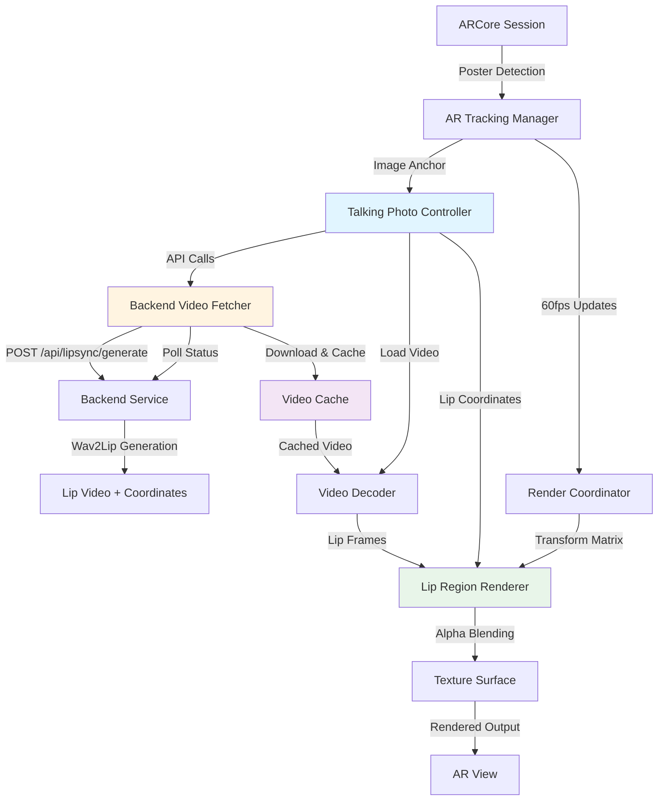
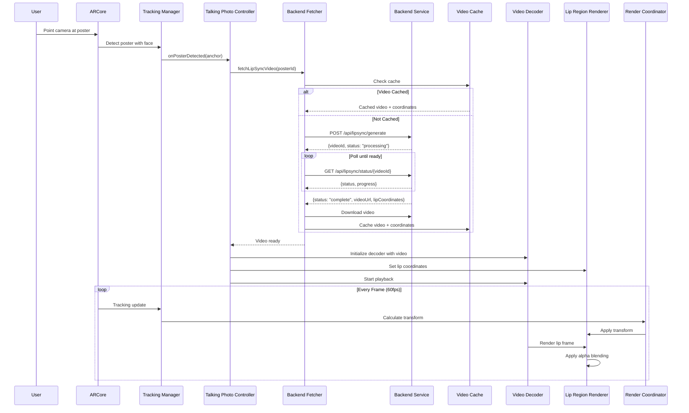
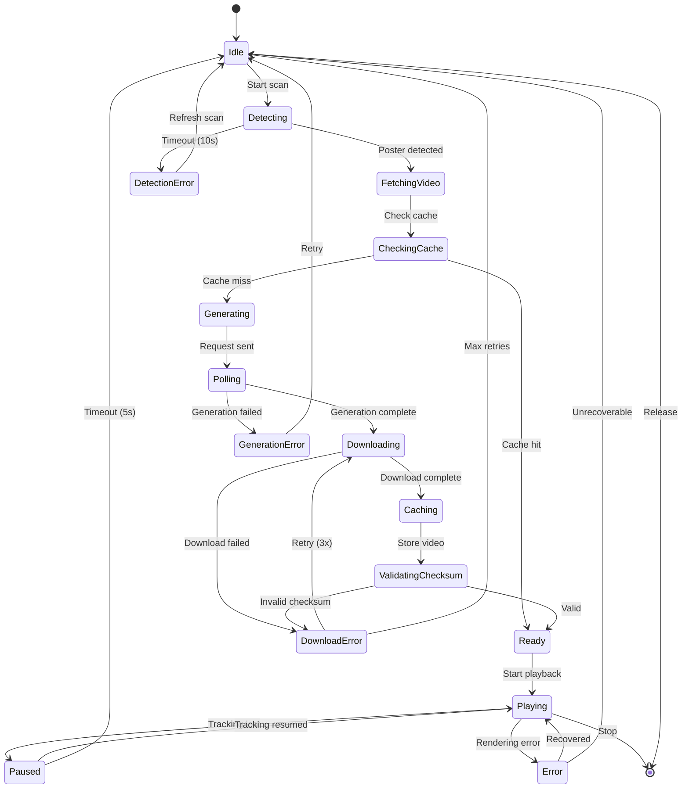
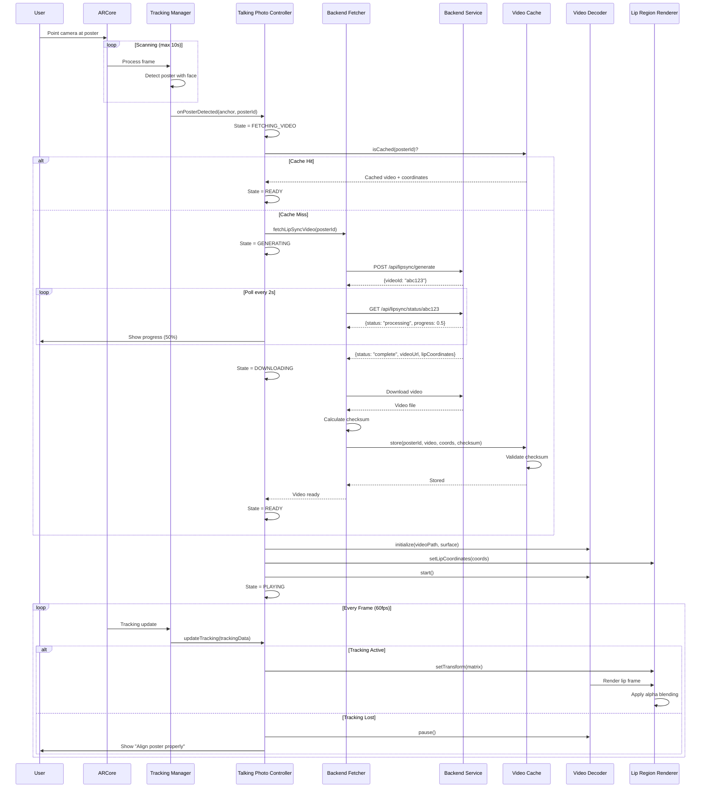
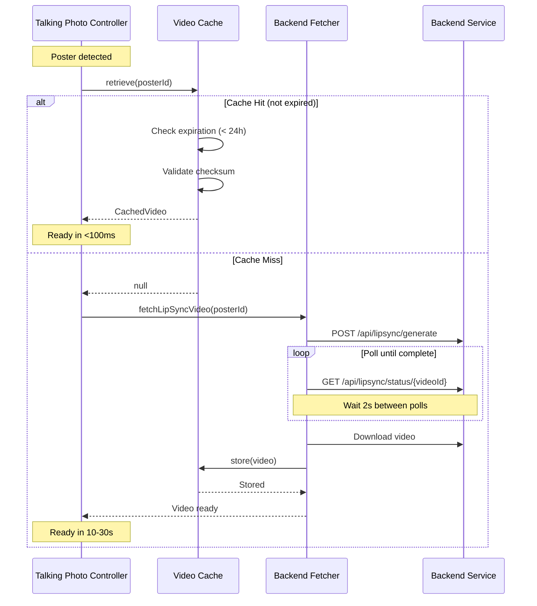
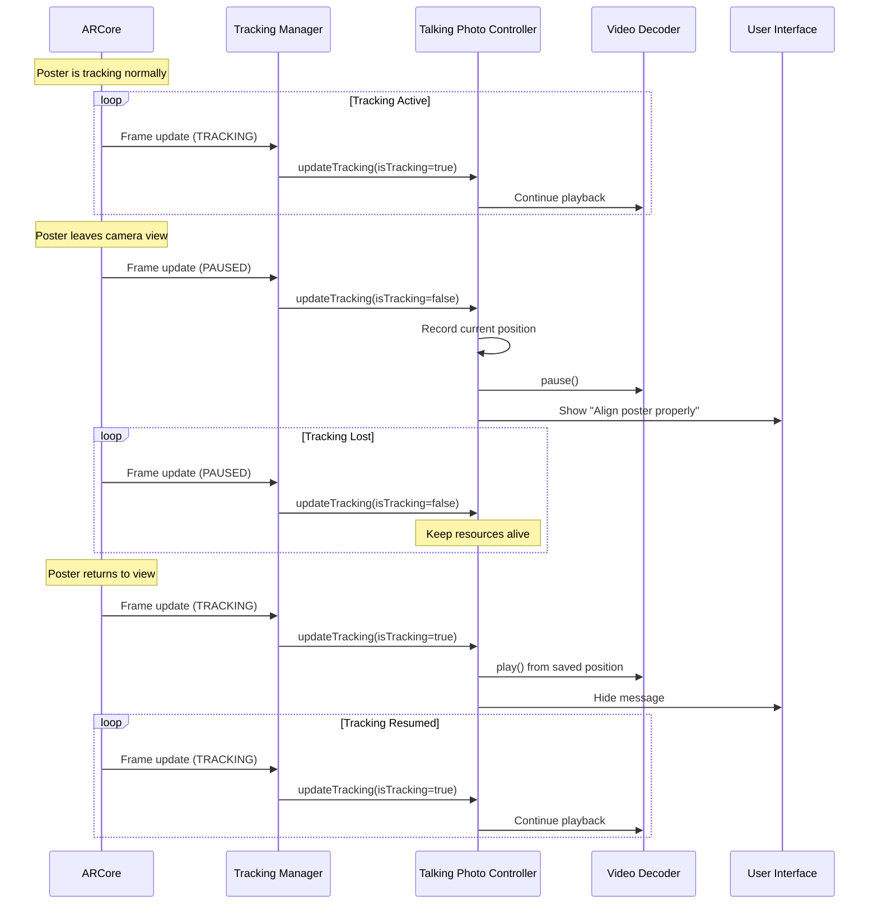
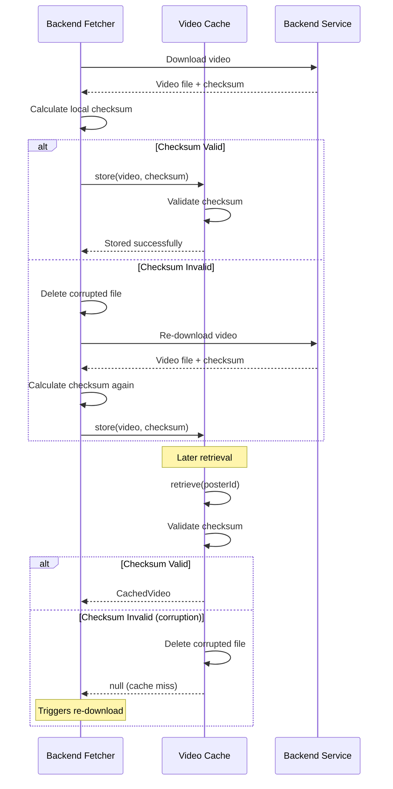

# AR Video Overlay Tracking - Technical Design

## Overview

This design implements a talking photo feature with lip-sync for the TalkAR Android application. The system creates the illusion that a static poster is talking by overlaying only the lip region with synchronized video generated by Wav2Lip. The poster remains static while only the lips move, creating a natural talking effect.

### Solution Approach

The architecture consists of three main subsystems:

1. **Backend Wav2Lip Integration**: Backend service generates lip-sync videos using Wav2Lip, crops to lip region only, and provides normalized coordinates
2. **Real-Time AR Tracking**: ARCore detects posters with human faces and provides 60fps tracking updates
3. **Alpha Blending Rendering**: Mobile app blends lip video with static poster using Gaussian blur for natural appearance

### Key Design Decisions

**Why Backend-Generated Lip Videos?**
- Wav2Lip requires significant compute resources (GPU)
- Mobile devices lack sufficient power for real-time generation
- Backend can use Google Colab (free) or Hugging Face Spaces (demo)
- Pre-generated videos can be cached for 24 hours

**Why Lip Region Only?**
- Smaller video files (faster download, less storage)
- More natural appearance (poster stays static)
- Easier to blend seamlessly with alpha blending
- Reduces bandwidth and cache requirements

**Why Normalized Coordinates?**
- Works across different poster sizes and resolutions
- Backend calculates once, mobile reuses for all scales
- Simplifies mobile rendering logic
- Consistent positioning regardless of distance from camera

**Why Alpha Blending with Gaussian Blur?**
- Creates seamless transition between lip video and poster
- 5-10px feather radius hides edge artifacts
- Natural appearance without visible seams
- Hardware-accelerated on modern Android devices


## Architecture

### High-Level Component Diagram



### Component Interaction Flow



## Components and Interfaces

### 1. Talking Photo Controller

**Responsibility**: Orchestrates the complete talking photo lifecycle from poster detection through video generation to playback.

**Interface**:
```kotlin
interface TalkingPhotoController {
    /**
     * Initializes talking photo for a detected poster.
     * 
     * @param anchor ARCore image anchor for the poster
     * @param posterId Unique identifier for the poster
     * @return Result indicating success or failure
     */
    suspend fun initialize(anchor: Anchor, posterId: String): Result<Unit>
    
    /**
     * Updates overlay position based on latest tracking data.
     * Called every frame (60fps).
     * 
     * @param trackingData Current position and orientation from ARCore
     */
    fun updateTracking(trackingData: TrackingData)
    
    /**
     * Controls playback state.
     */
    fun play()
    fun pause()
    fun stop()
    
    /**
     * Gets current state.
     */
    fun getState(): TalkingPhotoState
    
    /**
     * Releases all resources.
     */
    fun release()
    
    /**
     * Registers callbacks for lifecycle events.
     */
    fun setCallbacks(callbacks: TalkingPhotoCallbacks)
}

data class TrackingData(
    val position: Vector3,
    val rotation: Quaternion,
    val scale: Vector2,
    val isTracking: Boolean,
    val timestamp: Long
)

enum class TalkingPhotoState {
    IDLE,
    FETCHING_VIDEO,
    GENERATING,
    DOWNLOADING,
    READY,
    PLAYING,
    PAUSED,
    ERROR
}

interface TalkingPhotoCallbacks {
    fun onGenerationStarted()
    fun onGenerationProgress(progress: Float)
    fun onVideoReady()
    fun onFirstFrameRendered()
    fun onPlaybackComplete()
    fun onError(error: TalkingPhotoError)
    fun onTrackingLost()
    fun onTrackingResumed()
}
```

**Implementation Details**:
- Coordinates between BackendVideoFetcher, VideoDecoder, and LipRegionRenderer
- Manages state machine for generation and playback
- Handles tracking state changes (active/inactive)
- Enforces single poster mode
- Provides "Refresh Scan" functionality


### 2. Backend Video Fetcher

**Responsibility**: Manages communication with backend service for lip-sync video generation and download.

**Interface**:
```kotlin
interface BackendVideoFetcher {
    /**
     * Requests lip-sync video generation for a poster.
     * 
     * @param request Contains posterId, text, and voiceId
     * @return VideoId for polling status
     */
    suspend fun generateLipSync(request: TalkingPhotoRequest): Result<String>
    
    /**
     * Polls generation status.
     * 
     * @param videoId ID returned from generateLipSync
     * @return Current status and progress
     */
    suspend fun checkStatus(videoId: String): Result<GenerationStatus>
    
    /**
     * Downloads completed lip-sync video.
     * 
     * @param videoUrl URL provided by backend
     * @param onProgress Progress callback (0.0 to 1.0)
     * @return Local file path
     */
    suspend fun downloadVideo(
        videoUrl: String,
        onProgress: (Float) -> Unit
    ): Result<String>
    
    /**
     * Cancels ongoing generation or download.
     */
    fun cancel()
}

data class TalkingPhotoRequest(
    val posterId: String,
    val text: String,
    val voiceId: String
)

data class GenerationStatus(
    val status: String,  // "processing", "complete", "failed"
    val progress: Float,  // 0.0 to 1.0
    val videoUrl: String?,
    val lipCoordinates: LipCoordinates?,
    val errorMessage: String?
)

data class LipCoordinates(
    val lipX: Float,      // 0-1 normalized
    val lipY: Float,      // 0-1 normalized
    val lipWidth: Float,  // 0-1 normalized
    val lipHeight: Float  // 0-1 normalized
) {
    init {
        require(lipX in 0f..1f) { "lipX must be in range 0-1" }
        require(lipY in 0f..1f) { "lipY must be in range 0-1" }
        require(lipWidth in 0f..1f) { "lipWidth must be in range 0-1" }
        require(lipHeight in 0f..1f) { "lipHeight must be in range 0-1" }
    }
}
```

**Implementation Details**:
- Uses Retrofit for HTTP communication
- Implements exponential backoff retry (3 attempts)
- Polls status every 2 seconds during generation
- Validates lip coordinates are in 0-1 range
- Supports cancellation of ongoing operations
- Handles network errors gracefully


### 3. Video Cache

**Responsibility**: Manages local storage of downloaded lip-sync videos with 24-hour retention.

**Interface**:
```kotlin
interface VideoCache {
    /**
     * Stores video with metadata.
     * 
     * @param posterId Unique poster identifier
     * @param videoPath Local file path
     * @param lipCoordinates Lip region coordinates
     * @param checksum SHA-256 checksum for integrity
     */
    suspend fun store(
        posterId: String,
        videoPath: String,
        lipCoordinates: LipCoordinates,
        checksum: String
    ): Result<Unit>
    
    /**
     * Retrieves cached video if available and not expired.
     * 
     * @param posterId Unique poster identifier
     * @return Cached video data or null if not found/expired
     */
    suspend fun retrieve(posterId: String): CachedVideo?
    
    /**
     * Checks if video is cached and valid.
     * 
     * @param posterId Unique poster identifier
     * @return True if cached and not expired
     */
    suspend fun isCached(posterId: String): Boolean
    
    /**
     * Validates cached video integrity.
     * 
     * @param posterId Unique poster identifier
     * @return True if checksum matches
     */
    suspend fun validateIntegrity(posterId: String): Boolean
    
    /**
     * Deletes expired videos (>24 hours old).
     */
    suspend fun cleanupExpired()
    
    /**
     * Deletes oldest videos when cache exceeds 500MB.
     */
    suspend fun enforceLimit()
    
    /**
     * Clears all cached videos.
     */
    suspend fun clear()
}

data class CachedVideo(
    val posterId: String,
    val videoPath: String,
    val lipCoordinates: LipCoordinates,
    val checksum: String,
    val cachedAt: Long,
    val sizeBytes: Long
) {
    fun isExpired(): Boolean {
        val ageMs = System.currentTimeMillis() - cachedAt
        return ageMs > 24 * 60 * 60 * 1000  // 24 hours
    }
}
```

**Implementation Details**:
- Uses Android internal storage for cache directory
- Stores metadata in SQLite database
- Implements LRU eviction when 500MB limit reached
- Runs cleanup on app startup and periodically
- Validates checksums before returning cached videos
- Deletes corrupted files automatically


### 4. Video Decoder

**Responsibility**: Decodes lip-sync video files using ExoPlayer and provides frames for rendering.

**Interface**:
```kotlin
interface VideoDecoder {
    /**
     * Initializes decoder with video source and output surface.
     * 
     * @param videoPath Local video file path
     * @param surface Target surface for rendering
     * @return VideoInfo with dimensions and codec details
     */
    suspend fun initialize(videoPath: String, surface: Surface): Result<VideoInfo>
    
    /**
     * Starts video decoding and playback.
     */
    fun start()
    
    /**
     * Pauses playback without releasing resources.
     */
    fun pause()
    
    /**
     * Stops playback and resets to beginning.
     */
    fun stop()
    
    /**
     * Gets video information.
     */
    fun getVideoInfo(): VideoInfo?
    
    /**
     * Gets current playback position.
     */
    fun getCurrentPosition(): Long
    
    /**
     * Checks if video is currently playing.
     */
    fun isPlaying(): Boolean
    
    /**
     * Sets volume (0.0 to 1.0).
     */
    fun setVolume(volume: Float)
    
    /**
     * Enables/disables looping.
     */
    fun setLooping(enabled: Boolean)
    
    /**
     * Releases decoder resources.
     */
    fun release()
    
    /**
     * Registers listener for decoder events.
     */
    fun setListener(listener: VideoDecoderListener)
}

data class VideoInfo(
    val width: Int,
    val height: Int,
    val durationMs: Long,
    val frameRate: Float,
    val codec: String
)

interface VideoDecoderListener {
    fun onReady(info: VideoInfo)
    fun onFirstFrameRendered()
    fun onPlaybackComplete()
    fun onError(error: PlaybackException)
}
```

**Implementation Details**:
- Uses ExoPlayer with explicit Surface configuration
- Supports H.264 and H.265 codecs
- Handles 25fps+ frame rates
- Implements looping for continuous playback
- Releases resources when paused for >5 seconds
- Provides frame timing information


### 5. Lip Region Renderer

**Responsibility**: Renders lip video with alpha blending to create seamless integration with static poster.

**Interface**:
```kotlin
interface LipRegionRenderer {
    /**
     * Sets lip region coordinates from backend.
     * 
     * @param coordinates Normalized lip coordinates (0-1 range)
     */
    fun setLipCoordinates(coordinates: LipCoordinates)
    
    /**
     * Sets the poster dimensions for coordinate conversion.
     * 
     * @param width Poster width in pixels
     * @param height Poster height in pixels
     */
    fun setPosterDimensions(width: Int, height: Int)
    
    /**
     * Applies transformation matrix from AR tracking.
     * 
     * @param matrix 4x4 transformation matrix
     */
    fun setTransform(matrix: Matrix4)
    
    /**
     * Configures alpha blending parameters.
     * 
     * @param featherRadius Gaussian blur radius (5-10 pixels)
     */
    fun setBlendingParameters(featherRadius: Float)
    
    /**
     * Creates and returns a Surface for video rendering.
     * 
     * @return Surface that can be passed to VideoDecoder
     */
    fun getSurface(): Surface?
    
    /**
     * Sets visibility of the lip overlay.
     */
    fun setVisible(visible: Boolean)
    
    /**
     * Releases rendering resources.
     */
    fun release()
}
```

**Implementation Details**:
- Uses TextureView with SurfaceTexture for video frames
- Converts normalized coordinates to pixel coordinates
- Applies Gaussian blur shader for edge feathering
- Blends lip video with static poster background
- Maintains 60fps rendering performance
- Uses hardware acceleration for blur operations

**Alpha Blending Shader**:
```glsl
#version 300 es
precision mediump float;

uniform sampler2D lipTexture;
uniform sampler2D posterTexture;
uniform float featherRadius;
uniform vec4 lipRegion;  // x, y, width, height in normalized coords

in vec2 texCoord;
out vec4 fragColor;

void main() {
    vec2 lipCenter = lipRegion.xy + lipRegion.zw * 0.5;
    float distToEdge = min(
        min(texCoord.x - lipRegion.x, lipRegion.x + lipRegion.z - texCoord.x),
        min(texCoord.y - lipRegion.y, lipRegion.y + lipRegion.w - texCoord.y)
    );
    
    float alpha = smoothstep(0.0, featherRadius, distToEdge);
    
    vec4 lipColor = texture(lipTexture, texCoord);
    vec4 posterColor = texture(posterTexture, texCoord);
    
    fragColor = mix(posterColor, lipColor, alpha * lipColor.a);
}
```


### 6. Render Coordinator

**Responsibility**: Synchronizes AR tracking updates with video rendering at 60fps.

**Interface**:
```kotlin
interface RenderCoordinator {
    /**
     * Calculates transformation matrix from AR anchor to screen space.
     * 
     * @param anchor ARCore anchor with 3D position
     * @param camera AR camera with projection matrix
     * @param viewportSize Screen dimensions
     * @return Transformation matrix for lip overlay
     */
    fun calculateTransform(
        anchor: Anchor,
        camera: Camera,
        viewportSize: Size
    ): TransformResult
    
    /**
     * Registers for frame callbacks synchronized with AR rendering.
     * 
     * @param callback Called every frame with timing info
     */
    fun registerFrameCallback(callback: (FrameTime) -> Unit)
    
    /**
     * Unregisters frame callback.
     */
    fun unregisterFrameCallback()
}

data class TransformResult(
    val matrix: Matrix4,
    val screenPosition: Vector2,
    val screenSize: Vector2,
    val isVisible: Boolean,
    val distanceFromCamera: Float
)

data class FrameTime(
    val timestampNs: Long,
    val deltaTimeMs: Float
)
```

**Implementation Details**:
- Uses ARCore's Camera.getProjectionMatrix() and Camera.getViewMatrix()
- Converts 3D anchor pose to 2D screen coordinates
- Calculates appropriate scale based on distance from camera
- Implements frustum culling to hide overlays outside view
- Synchronizes with Choreographer for 60fps callbacks
- Provides sub-pixel positioning accuracy


### 7. AR Tracking Manager

**Responsibility**: Manages ARCore poster detection and tracking with single poster mode.

**Interface**:
```kotlin
interface ARTrackingManager {
    /**
     * Initializes AR session with poster database.
     * 
     * @param posters List of reference posters to detect
     */
    suspend fun initialize(posters: List<ReferencePoster>): Result<Unit>
    
    /**
     * Processes AR frame and detects posters.
     * Called every frame.
     * 
     * @param frame Current AR frame
     * @return Detected poster if any
     */
    fun processFrame(frame: Frame): TrackedPoster?
    
    /**
     * Gets anchor for the currently tracked poster.
     * 
     * @return Anchor if poster is being tracked, null otherwise
     */
    fun getCurrentAnchor(): Anchor?
    
    /**
     * Clears current poster and allows scanning a new one.
     */
    fun refreshScan()
    
    /**
     * Registers listener for tracking events.
     */
    fun setListener(listener: TrackingListener)
    
    /**
     * Releases AR resources.
     */
    fun release()
}

data class ReferencePoster(
    val id: String,
    val name: String,
    val imageData: ByteArray,
    val physicalWidthMeters: Float
)

data class TrackedPoster(
    val id: String,
    val name: String,
    val anchor: Anchor,
    val trackingState: TrackingState,
    val extentX: Float,  // Physical width in meters
    val extentZ: Float   // Physical height in meters
)

interface TrackingListener {
    fun onPosterDetected(poster: TrackedPoster)
    fun onPosterTracking(poster: TrackedPoster)
    fun onPosterLost(posterId: String)
}
```

**Implementation Details**:
- Wraps ARCore AugmentedImageDatabase
- Enforces single poster mode (only tracks one at a time)
- Filters posters to only those with human faces
- Provides "Refresh Scan" button functionality
- Detects posters within 2 seconds
- Provides 60fps tracking updates
- Handles out-of-frame detection


## Data Models

### Talking Photo State

```kotlin
data class TalkingPhotoSession(
    val posterId: String,
    val anchorId: String,
    val state: TalkingPhotoState,
    val lipCoordinates: LipCoordinates?,
    val videoPath: String?,
    val isTracking: Boolean,
    val lastUpdateTimestamp: Long,
    val consecutiveTrackingFrames: Int,
    val consecutiveLostFrames: Int
) {
    companion object {
        const val TRACKING_LOST_THRESHOLD = 300  // 5 seconds at 60fps
    }
    
    fun shouldPause(): Boolean {
        return !isTracking
    }
    
    fun shouldResume(): Boolean {
        return isTracking && consecutiveTrackingFrames > 0
    }
}
```

### Backend API Models

```kotlin
// POST /api/lipsync/generate request
data class GenerateRequest(
    val posterId: String,
    val text: String,
    val voiceId: String
)

// POST /api/lipsync/generate response
data class GenerateResponse(
    val videoId: String,
    val status: String  // "processing"
)

// GET /api/lipsync/status/{videoId} response
data class StatusResponse(
    val videoId: String,
    val status: String,  // "processing", "complete", "failed"
    val progress: Float,  // 0.0 to 1.0
    val videoUrl: String?,
    val lipCoordinates: LipCoordinatesDto?,
    val errorMessage: String?
)

data class LipCoordinatesDto(
    val lipX: Float,
    val lipY: Float,
    val lipWidth: Float,
    val lipHeight: Float
)
```

### Error Types

```kotlin
sealed class TalkingPhotoError(val message: String, val code: Int) {
    class PosterNotDetected(message: String) : 
        TalkingPhotoError(message, ERROR_POSTER_NOT_DETECTED)
    
    class BackendUnavailable(message: String) : 
        TalkingPhotoError(message, ERROR_BACKEND_UNAVAILABLE)
    
    class GenerationFailed(message: String) : 
        TalkingPhotoError(message, ERROR_GENERATION_FAILED)
    
    class DownloadFailed(message: String, val url: String) : 
        TalkingPhotoError(message, ERROR_DOWNLOAD_FAILED)
    
    class InvalidCoordinates(message: String) : 
        TalkingPhotoError(message, ERROR_INVALID_COORDINATES)
    
    class CacheCorrupted(val posterId: String) : 
        TalkingPhotoError("Cached video corrupted: $posterId", ERROR_CACHE_CORRUPTED)
    
    class NoHumanFace(message: String) : 
        TalkingPhotoError(message, ERROR_NO_HUMAN_FACE)
    
    companion object {
        const val ERROR_POSTER_NOT_DETECTED = 2001
        const val ERROR_BACKEND_UNAVAILABLE = 2002
        const val ERROR_GENERATION_FAILED = 2003
        const val ERROR_DOWNLOAD_FAILED = 2004
        const val ERROR_INVALID_COORDINATES = 2005
        const val ERROR_CACHE_CORRUPTED = 2006
        const val ERROR_NO_HUMAN_FACE = 2007
    }
}
```


## Correctness Properties

*A property is a characteristic or behavior that should hold true across all valid executions of a system—essentially, a formal statement about what the system should do. Properties serve as the bridge between human-readable specifications and machine-verifiable correctness guarantees.*

### Property Reflection

After analyzing all acceptance criteria, I identified the following redundancies and consolidations:

**Redundancy Analysis**:
- Properties 4.1, 4.3, and 4.5 all test coordinate validation and can be combined into one comprehensive property
- Properties 5.3 and 5.5 both test offline capability and are redundant
- Properties 6.1 and 6.5 both test single poster mode and are identical
- Properties 3.3 and 11.4 both test that coordinates are included in backend response
- Properties 16.2, 16.3, and 16.4 all relate to checksum validation and can be combined

**Consolidated Properties**:
The following properties represent unique, non-redundant validation requirements:


### Property 1: Human Face Detection Filter

*For any* image presented to the AR system, only images containing human faces should be detected as valid posters, while products and mascots should be rejected.

**Validates: Requirements 1.2**

### Property 2: Anchor Creation on Detection

*For any* detected poster, the AR system must create an image anchor with valid (non-zero) position and orientation data.

**Validates: Requirements 1.3**

### Property 3: Backend Request on Detection

*For any* poster detected by the AR system, a backend API request must be initiated to fetch or generate the lip-sync video.

**Validates: Requirements 2.1**

### Property 4: Cropped Video Dimensions

*For any* lip video received from the backend, the video dimensions should be smaller than the full poster dimensions, confirming it contains only the lip region.

**Validates: Requirements 3.2**

### Property 5: Normalized Coordinate Completeness and Range

*For any* backend response containing lip coordinates, all four values (lipX, lipY, lipWidth, lipHeight) must be present and each must be in the range 0-1.

**Validates: Requirements 3.3, 4.1, 4.3, 4.5, 11.4**

### Property 6: Coordinate Scaling Consistency

*For any* normalized lip coordinates and any poster dimensions, converting the normalized coordinates to pixel coordinates and back to normalized coordinates should produce the original values.

**Validates: Requirements 4.4**

### Property 7: Video Caching on Download

*For any* lip video downloaded from the backend, the video must appear in the cache immediately after download completes.

**Validates: Requirements 5.1**

### Property 8: Cache Expiration

*For any* cached video, if more than 24 hours have elapsed since caching, the video should not be returned by cache retrieval and should be marked for deletion.

**Validates: Requirements 5.2, 5.4**

### Property 9: Offline Cache Retrieval

*For any* cached video that is not expired, retrieving it from the cache must not trigger any network requests.

**Validates: Requirements 5.3, 5.5**

### Property 10: Single Poster Tracking

*For any* AR session, when multiple posters are visible in the camera view, the system must track at most one poster at any given time.

**Validates: Requirements 6.1, 6.5**

### Property 11: Poster Replacement

*For any* tracked poster, when a new poster is scanned, the system must stop tracking the previous poster and begin tracking the new one.

**Validates: Requirements 6.4**

### Property 12: Coordinate to Pixel Conversion

*For any* normalized lip coordinates and poster dimensions, the calculated pixel position must be within the poster bounds and proportional to the normalized values.

**Validates: Requirements 7.2**

### Property 13: Transform Application

*For any* tracking update with rotation and perspective data, the applied transformation matrix must correctly position and orient the lip region to match the poster's 3D pose.

**Validates: Requirements 7.3**

### Property 14: Playback Pause on Tracking Loss

*For any* tracked poster, when the poster leaves the camera view (tracking lost), video playback must be paused immediately.

**Validates: Requirements 8.1**

### Property 15: Playback Resume from Position

*For any* paused video, when playback resumes after tracking is restored, playback must continue from the paused position, not from the beginning.

**Validates: Requirements 8.3**

### Property 16: Alpha Blending Application

*For any* rendered lip region, edge pixels must have alpha values between 0 and 1, confirming that alpha blending is applied.

**Validates: Requirements 9.1**

### Property 17: Feather Radius Range

*For any* alpha blending configuration, the Gaussian blur feather radius must be between 5 and 10 pixels.

**Validates: Requirements 9.2**

### Property 18: Lip Region Only Rendering

*For any* rendered frame, the overlay area must match the lip region coordinates and not extend to the full face.

**Validates: Requirements 10.1**

### Property 19: Poster Visibility During Playback

*For any* frame during video playback, the static poster must remain visible beneath the lip overlay.

**Validates: Requirements 10.2**

### Property 20: Lip Region Layering

*For any* rendered frame, the lip region must be rendered with higher z-order than the poster, ensuring it appears on top.

**Validates: Requirements 10.4**

### Property 21: Status Polling Until Complete

*For any* video generation request, the system must continue polling the status endpoint until the status changes to "complete" or "failed".

**Validates: Requirements 11.2**

### Property 22: API Retry with Exponential Backoff

*For any* failed API call, the system must retry up to 3 times with exponentially increasing delays between attempts.

**Validates: Requirements 11.5, 14.3**

### Property 23: API Interface Consistency

*For any* backend environment (development or demo), the API endpoints and response formats must be identical.

**Validates: Requirements 12.4**

### Property 24: Video Format Validation

*For any* downloaded lip video, the file must be in MP4 format with H.264 codec.

**Validates: Requirements 13.1**

### Property 25: Minimum Frame Rate

*For any* downloaded lip video, the frame rate must be at least 25fps.

**Validates: Requirements 13.2**

### Property 26: Audio-Video Synchronization

*For any* lip video with audio, the frame timestamps must align with audio timestamps within 50ms accuracy.

**Validates: Requirements 13.4**

### Property 27: Cache Size Limit

*For any* state of the video cache, the total size of all cached videos must not exceed 500MB.

**Validates: Requirements 15.1**

### Property 28: LRU Eviction Order

*For any* cache eviction triggered by memory pressure, the oldest (least recently used) videos must be deleted first.

**Validates: Requirements 15.2**

### Property 29: Resource Release on Pause

*For any* video playback that is paused, the video decoder resources must be released.

**Validates: Requirements 15.3**

### Property 30: Background Resource Release

*For any* app lifecycle transition to background, video playback must be paused and camera resources must be released.

**Validates: Requirements 15.5**

### Property 31: Video Cache Round-Trip

*For any* lip video, the sequence of downloading, caching, and retrieving must produce identical video data (verified by checksum).

**Validates: Requirements 16.1**

### Property 32: Checksum Validation and Recovery

*For any* cached video, checksums must be validated before storage and before playback, and corrupted files must trigger automatic re-download.

**Validates: Requirements 16.2, 16.3, 16.4, 16.5**


## Error Handling

### Error Categories

**1. Poster Detection Errors**
- No poster detected within timeout
- Poster without human face
- Multiple posters visible (single mode violation)

**Strategy**: Display clear user guidance ("No poster detected. Try better lighting." or "Please scan a poster with a human face"). Provide "Refresh Scan" button to retry.

**2. Backend Communication Errors**
- Backend service unavailable
- Network timeout
- API rate limiting

**Strategy**: Retry up to 3 times with exponential backoff (1s, 2s, 4s). Display "Service unavailable. Please try again later." if all retries fail. Check cache for previously generated video.

**3. Video Generation Errors**
- Generation failed on backend
- Invalid lip coordinates received
- Video format unsupported

**Strategy**: Display error message with retry option. Log detailed error for debugging. Fall back to cached video if available.

**4. Download Errors**
- Network interruption during download
- Insufficient storage space
- Corrupted download

**Strategy**: Retry download up to 3 times. Validate checksum after download. Delete corrupted files and retry. Display progress indicator during download.

**5. Cache Errors**
- Cache corrupted
- Checksum validation failed
- Storage full

**Strategy**: Delete corrupted files automatically. Trigger re-download. Enforce 500MB cache limit with LRU eviction. Display storage warning if device space is low.

**6. Tracking Errors**
- Poster out of frame
- Tracking quality degraded
- ARCore session interrupted

**Strategy**: Pause playback immediately. Display "Align poster properly" message. Resume playback when tracking restored. Maintain state for seamless resume.

**7. Rendering Errors**
- Alpha blending shader failure
- Surface creation failed
- Frame rendering timeout

**Strategy**: Fall back to non-blended rendering if shader fails. Recreate surface on failure. Skip failed frames and continue playback. Log errors for debugging.


### Error Recovery Flow



### Error Logging Strategy

All errors must be logged with:
- Error code (from TalkingPhotoError sealed class)
- Timestamp
- Component that generated the error
- Contextual information (poster ID, video URL, etc.)
- Stack trace for exceptions

Example:
```kotlin
Log.e(TAG, """
    ❌ Talking Photo Error
    Code: ${error.code}
    Message: ${error.message}
    Component: BackendVideoFetcher
    Poster ID: $posterId
    Video URL: $videoUrl
    Timestamp: ${System.currentTimeMillis()}
""".trimIndent(), exception)
```

### User-Facing Error Messages

| Error Condition | User Message | Action |
|----------------|--------------|--------|
| No poster detected (10s) | "No poster detected. Try better lighting." | Retry scan |
| No human face | "Please scan a poster with a human face" | Scan different poster |
| Backend unavailable | "Service unavailable. Please try again later." | Retry or use cache |
| Download failed | "Download failed. Retrying..." | Automatic retry |
| Cache corrupted | "Video corrupted. Re-downloading..." | Automatic re-download |
| Out of frame | "Align poster properly" | Reposition camera |
| Storage full | "Storage full. Clear some space." | Free up storage |


## Testing Strategy

### Dual Testing Approach

This feature requires both unit tests and property-based tests for comprehensive coverage:

**Unit Tests**: Focus on specific examples, edge cases, and integration points
**Property Tests**: Verify universal properties across all inputs with randomized data

Together, these approaches provide comprehensive coverage where unit tests catch concrete bugs and property tests verify general correctness.

### Property-Based Testing

**Framework**: Use [Kotest Property Testing](https://kotest.io/docs/proptest/property-based-testing.html) for Kotlin

**Configuration**:
- Minimum 100 iterations per property test (due to randomization)
- Each test must reference its design document property
- Tag format: `Feature: ar-video-overlay-tracking, Property {number}: {property_text}`

**Example Property Tests**:

```kotlin
class TalkingPhotoPropertyTests : StringSpec({
    "Property 5: Normalized Coordinate Completeness and Range" {
        // Feature: ar-video-overlay-tracking, Property 5
        checkAll(100, Arb.lipCoordinates()) { coords ->
            coords.lipX shouldBeInRange 0f..1f
            coords.lipY shouldBeInRange 0f..1f
            coords.lipWidth shouldBeInRange 0f..1f
            coords.lipHeight shouldBeInRange 0f..1f
        }
    }
    
    "Property 6: Coordinate Scaling Consistency" {
        // Feature: ar-video-overlay-tracking, Property 6
        checkAll(100, Arb.lipCoordinates(), Arb.posterDimensions()) { coords, dimensions ->
            // Convert to pixels
            val pixelX = coords.lipX * dimensions.width
            val pixelY = coords.lipY * dimensions.height
            val pixelWidth = coords.lipWidth * dimensions.width
            val pixelHeight = coords.lipHeight * dimensions.height
            
            // Convert back to normalized
            val normalizedX = pixelX / dimensions.width
            val normalizedY = pixelY / dimensions.height
            val normalizedWidth = pixelWidth / dimensions.width
            val normalizedHeight = pixelHeight / dimensions.height
            
            normalizedX shouldBe (coords.lipX plusOrMinus 0.001f)
            normalizedY shouldBe (coords.lipY plusOrMinus 0.001f)
            normalizedWidth shouldBe (coords.lipWidth plusOrMinus 0.001f)
            normalizedHeight shouldBe (coords.lipHeight plusOrMinus 0.001f)
        }
    }
    
    "Property 9: Offline Cache Retrieval" {
        // Feature: ar-video-overlay-tracking, Property 9
        checkAll(100, Arb.cachedVideo()) { video ->
            val networkMonitor = TestNetworkMonitor()
            val cache = VideoCache(context, networkMonitor)
            
            // Store video
            cache.store(video.posterId, video.videoPath, video.lipCoordinates, video.checksum)
            
            // Disable network
            networkMonitor.setNetworkAvailable(false)
            
            // Retrieve from cache
            val retrieved = cache.retrieve(video.posterId)
            
            retrieved.shouldNotBeNull()
            networkMonitor.getRequestCount() shouldBe 0
        }
    }
    
    "Property 10: Single Poster Tracking" {
        // Feature: ar-video-overlay-tracking, Property 10
        checkAll(100, Arb.list(Arb.poster(), 2..5)) { posters ->
            val trackingManager = ARTrackingManager(arSession)
            trackingManager.initialize(posters)
            
            // Simulate all posters visible
            val frame = createFrameWithPosters(posters)
            val tracked = trackingManager.processFrame(frame)
            
            // Should track at most one
            tracked.shouldNotBeNull()
            val trackedCount = if (tracked != null) 1 else 0
            trackedCount shouldBeLessThanOrEqual 1
        }
    }
    
    "Property 15: Playback Resume from Position" {
        // Feature: ar-video-overlay-tracking, Property 15
        checkAll(100, Arb.long(1000L..10000L)) { pausePosition ->
            val controller = TalkingPhotoController(context)
            controller.initialize(testAnchor, testPosterId)
            controller.play()
            
            // Seek to position and pause
            controller.seekTo(pausePosition)
            controller.pause()
            val pausedAt = controller.getCurrentPosition()
            
            // Resume
            controller.play()
            Thread.sleep(100)  // Let it play a bit
            val resumedFrom = controller.getCurrentPosition()
            
            // Should resume near paused position, not from beginning
            resumedFrom shouldBeGreaterThan (pausedAt - 100)
            resumedFrom shouldBeLessThan (pausedAt + 500)
        }
    }
    
    "Property 22: API Retry with Exponential Backoff" {
        // Feature: ar-video-overlay-tracking, Property 22
        checkAll(100, Arb.apiError()) { error ->
            val mockBackend = MockBackendService(error)
            val fetcher = BackendVideoFetcher(mockBackend)
            
            val startTime = System.currentTimeMillis()
            fetcher.generateLipSync(testRequest)
            val endTime = System.currentTimeMillis()
            
            // Should have retried 3 times
            mockBackend.getCallCount() shouldBe 4  // Initial + 3 retries
            
            // Should have exponential delays: 1s, 2s, 4s = 7s total
            val totalTime = endTime - startTime
            totalTime shouldBeGreaterThan 7000L
            totalTime shouldBeLessThan 8000L
        }
    }
    
    "Property 31: Video Cache Round-Trip" {
        // Feature: ar-video-overlay-tracking, Property 31
        checkAll(100, Arb.videoFile()) { videoFile ->
            val cache = VideoCache(context)
            val originalChecksum = calculateChecksum(videoFile.path)
            
            // Download, cache, retrieve
            cache.store(
                posterId = "test",
                videoPath = videoFile.path,
                lipCoordinates = testCoordinates,
                checksum = originalChecksum
            )
            
            val retrieved = cache.retrieve("test")
            retrieved.shouldNotBeNull()
            
            val retrievedChecksum = calculateChecksum(retrieved.videoPath)
            retrievedChecksum shouldBe originalChecksum
        }
    }
})
```

**Custom Generators**:

```kotlin
fun Arb.Companion.lipCoordinates(): Arb<LipCoordinates> = arbitrary {
    LipCoordinates(
        lipX = Arb.float(0f, 1f).bind(),
        lipY = Arb.float(0f, 1f).bind(),
        lipWidth = Arb.float(0.05f, 0.3f).bind(),  // Reasonable lip width
        lipHeight = Arb.float(0.03f, 0.15f).bind()  // Reasonable lip height
    )
}

fun Arb.Companion.posterDimensions(): Arb<Size> = arbitrary {
    Size(
        width = Arb.int(800, 2000).bind(),
        height = Arb.int(1000, 3000).bind()
    )
}

fun Arb.Companion.cachedVideo(): Arb<CachedVideo> = arbitrary {
    CachedVideo(
        posterId = Arb.string(10..20).bind(),
        videoPath = "/cache/video_${Arb.string(10)}.mp4",
        lipCoordinates = Arb.lipCoordinates().bind(),
        checksum = Arb.string(64).bind(),  // SHA-256
        cachedAt = System.currentTimeMillis() - Arb.long(0L, 20 * 60 * 60 * 1000L).bind(),
        sizeBytes = Arb.long(1_000_000L, 50_000_000L).bind()
    )
}

fun Arb.Companion.poster(): Arb<ReferencePoster> = arbitrary {
    ReferencePoster(
        id = Arb.string(10..20).bind(),
        name = Arb.string(5..15).bind(),
        imageData = ByteArray(1000),
        physicalWidthMeters = Arb.float(0.2f, 1.0f).bind()
    )
}

fun Arb.Companion.apiError(): Arb<Exception> = arbitrary {
    listOf(
        IOException("Network error"),
        SocketTimeoutException("Timeout"),
        HttpException(503, "Service unavailable")
    ).random()
}
```


### Unit Testing

**Focus Areas**:
1. Specific edge cases (empty responses, corrupted data)
2. Integration between components
3. Lifecycle management
4. Error conditions
5. Concrete examples from requirements

**Example Unit Tests**:

```kotlin
class TalkingPhotoControllerTest : StringSpec({
    "should create anchor with valid position when poster detected" {
        val controller = TalkingPhotoController(context)
        val anchor = mockAnchor(
            position = Vector3(0f, 0f, -1f),
            rotation = Quaternion.identity()
        )
        
        val result = controller.initialize(anchor, "poster_123")
        
        result.shouldBeSuccess()
        controller.getState() shouldBe TalkingPhotoState.FETCHING_VIDEO
    }
    
    "should pause playback when poster goes out of frame" {
        val controller = TalkingPhotoController(context)
        controller.initialize(testAnchor, testPosterId)
        controller.play()
        
        controller.updateTracking(TrackingData(isTracking = false))
        
        controller.getState() shouldBe TalkingPhotoState.PAUSED
    }
    
    "should display 'Align poster properly' when out of frame" {
        val ui = TalkingPhotoUI(context)
        val controller = TalkingPhotoController(context)
        
        controller.setCallbacks(object : TalkingPhotoCallbacks {
            override fun onTrackingLost() {
                ui.showMessage("Align poster properly")
            }
        })
        
        controller.updateTracking(TrackingData(isTracking = false))
        
        ui.getCurrentMessage() shouldBe "Align poster properly"
    }
    
    "should retry API call 3 times on failure" {
        val mockBackend = MockBackendService()
        mockBackend.setFailureCount(3)
        val fetcher = BackendVideoFetcher(mockBackend)
        
        fetcher.generateLipSync(testRequest)
        
        mockBackend.getCallCount() shouldBe 4  // Initial + 3 retries
    }
    
    "should validate checksum before caching video" {
        val cache = VideoCache(context)
        val videoPath = "/tmp/video.mp4"
        val wrongChecksum = "invalid_checksum"
        
        val result = cache.store(
            posterId = "test",
            videoPath = videoPath,
            lipCoordinates = testCoordinates,
            checksum = wrongChecksum
        )
        
        result.shouldBeFailure()
        cache.isCached("test") shouldBe false
    }
    
    "should delete oldest videos when cache exceeds 500MB" {
        val cache = VideoCache(context)
        
        // Fill cache to 490MB
        val oldVideo = createVideo(size = 490_000_000L, age = 10_000_000L)
        cache.store("old", oldVideo.path, testCoordinates, oldVideo.checksum)
        
        // Add 20MB video (exceeds limit)
        val newVideo = createVideo(size = 20_000_000L, age = 1000L)
        cache.store("new", newVideo.path, testCoordinates, newVideo.checksum)
        
        // Old video should be evicted
        cache.isCached("old") shouldBe false
        cache.isCached("new") shouldBe true
    }
    
    "should enforce single poster mode" {
        val trackingManager = ARTrackingManager(arSession)
        val poster1 = createPoster("poster1")
        val poster2 = createPoster("poster2")
        
        trackingManager.initialize(listOf(poster1, poster2))
        
        // Detect first poster
        val frame1 = createFrameWithPoster(poster1)
        val tracked1 = trackingManager.processFrame(frame1)
        tracked1.shouldNotBeNull()
        tracked1.id shouldBe "poster1"
        
        // Try to detect second poster (should be ignored)
        val frame2 = createFrameWithPosters(listOf(poster1, poster2))
        val tracked2 = trackingManager.processFrame(frame2)
        tracked2.shouldNotBeNull()
        tracked2.id shouldBe "poster1"  // Still tracking first
    }
    
    "should apply alpha blending with 5-10px feather radius" {
        val renderer = LipRegionRenderer(context)
        
        renderer.setBlendingParameters(featherRadius = 7.5f)
        
        val params = renderer.getBlendingParameters()
        params.featherRadius shouldBeInRange 5f..10f
    }
})
```

### Integration Testing

**Test Scenarios**:
1. End-to-end flow: Poster detection → Backend generation → Download → Cache → Playback
2. Cache hit scenario: Detect poster → Retrieve from cache → Playback
3. Tracking loss and recovery: Play → Out of frame → Back in frame → Resume
4. Refresh scan: Track poster → Refresh → Scan new poster
5. Network failure recovery: API failure → Retry → Success
6. Checksum validation: Download → Corrupt → Detect → Re-download

**Example Integration Test**:

```kotlin
@RunWith(AndroidJUnit4::class)
class TalkingPhotoIntegrationTest {
    @Test
    fun testCompleteTalkingPhotoFlow() = runBlocking {
        // Setup AR session
        val arSession = createARSession()
        val trackingManager = ARTrackingManager(arSession)
        
        // Setup talking photo system
        val controller = TalkingPhotoController(context)
        val backend = BackendVideoFetcher(realBackendUrl)
        val cache = VideoCache(context)
        
        // Add test poster
        val testPoster = createTestPoster()
        trackingManager.initialize(listOf(testPoster))
        
        // Simulate poster detection
        var detected = false
        repeat(120) { // 2 seconds at 60fps
            val frame = arSession.update()
            val tracked = trackingManager.processFrame(frame)
            
            if (tracked != null) {
                detected = true
                
                // Initialize talking photo
                val result = controller.initialize(tracked.anchor, tracked.id)
                result.shouldBeSuccess()
                
                // Wait for video generation
                eventually(30.seconds) {
                    controller.getState() shouldBe TalkingPhotoState.READY
                }
                
                // Start playback
                controller.play()
                
                eventually(2.seconds) {
                    controller.getState() shouldBe TalkingPhotoState.PLAYING
                }
                
                // Verify video is cached
                cache.isCached(tracked.id) shouldBe true
                
                return@repeat
            }
        }
        
        detected shouldBe true
    }
    
    @Test
    fun testCacheHitScenario() = runBlocking {
        val posterId = "cached_poster"
        val cache = VideoCache(context)
        
        // Pre-populate cache
        cache.store(
            posterId = posterId,
            videoPath = testVideoPath,
            lipCoordinates = testCoordinates,
            checksum = testChecksum
        )
        
        // Detect poster
        val controller = TalkingPhotoController(context)
        val startTime = System.currentTimeMillis()
        
        controller.initialize(testAnchor, posterId)
        
        // Should be ready immediately (no generation)
        eventually(1.seconds) {
            controller.getState() shouldBe TalkingPhotoState.READY
        }
        
        val elapsedTime = System.currentTimeMillis() - startTime
        elapsedTime shouldBeLessThan 2000L  // Much faster than generation
    }
}
```

### Performance Testing

**Metrics to Monitor**:
- Poster detection time (target: <2 seconds)
- Video generation time (backend, informational only)
- Download time (network-dependent, informational only)
- Cache retrieval time (target: <100ms)
- Frame rate during playback (target: 60fps)
- Tracking update latency (target: <16ms per frame)
- Alpha blending performance (target: no frame drops)

**Performance Test Example**:

```kotlin
@Test
fun testTrackingUpdateLatency() {
    val controller = TalkingPhotoController(context)
    controller.initialize(testAnchor, testPosterId)
    
    val latencies = mutableListOf<Float>()
    
    repeat(600) { // 10 seconds at 60fps
        val startTime = System.nanoTime()
        
        controller.updateTracking(generateRandomTrackingData())
        
        val endTime = System.nanoTime()
        val latencyMs = (endTime - startTime) / 1_000_000f
        latencies.add(latencyMs)
    }
    
    val averageLatency = latencies.average()
    val maxLatency = latencies.maxOrNull()!!
    
    averageLatency shouldBeLessThan 16.67f  // One frame at 60fps
    maxLatency shouldBeLessThan 33.33f      // Two frames at 60fps
}

@Test
fun testCacheRetrievalPerformance() = runBlocking {
    val cache = VideoCache(context)
    
    // Store test video
    cache.store(
        posterId = "test",
        videoPath = testVideoPath,
        lipCoordinates = testCoordinates,
        checksum = testChecksum
    )
    
    // Measure retrieval time
    val startTime = System.currentTimeMillis()
    val retrieved = cache.retrieve("test")
    val endTime = System.currentTimeMillis()
    
    retrieved.shouldNotBeNull()
    val retrievalTime = endTime - startTime
    retrievalTime shouldBeLessThan 100L  // Target: <100ms
}
```

### Test Coverage Goals

- Unit test coverage: >80% of code
- Property test coverage: All 32 correctness properties
- Integration test coverage: All major user flows
- Performance test coverage: All critical metrics

### Continuous Testing

- Run unit tests on every commit
- Run property tests nightly (due to longer execution time)
- Run integration tests before releases
- Run performance tests weekly and track trends


## Detailed Sequence Diagrams

### Complete Talking Photo Flow



### Cache Hit vs Cache Miss Flow



### Tracking Loss and Recovery



### Checksum Validation and Recovery




## Backend API Specification

### Base URL

- **Development**: `https://<ngrok-id>.ngrok.io` (Google Colab + ngrok)
- **Demo**: `https://huggingface.co/spaces/<username>/<space-name>` (Hugging Face Spaces)

### Authentication

No authentication required for development and demo environments.

### Endpoints

#### 1. Generate Lip-Sync Video

**Request**:
```http
POST /api/lipsync/generate
Content-Type: application/json

{
  "posterId": "poster_abc123",
  "text": "Hello, welcome to TalkAR!",
  "voiceId": "en-US-male-1"
}
```

**Response** (202 Accepted):
```json
{
  "videoId": "video_xyz789",
  "status": "processing",
  "estimatedTimeSeconds": 15
}
```

**Error Response** (400 Bad Request):
```json
{
  "error": "InvalidRequest",
  "message": "Poster not found or does not contain a human face"
}
```

**Error Response** (503 Service Unavailable):
```json
{
  "error": "ServiceUnavailable",
  "message": "Backend service is temporarily unavailable"
}
```

#### 2. Check Generation Status

**Request**:
```http
GET /api/lipsync/status/{videoId}
```

**Response** (Processing):
```json
{
  "videoId": "video_xyz789",
  "status": "processing",
  "progress": 0.65,
  "estimatedTimeRemaining": 5
}
```

**Response** (Complete):
```json
{
  "videoId": "video_xyz789",
  "status": "complete",
  "videoUrl": "https://storage.example.com/videos/video_xyz789.mp4",
  "lipCoordinates": {
    "lipX": 0.42,
    "lipY": 0.58,
    "lipWidth": 0.16,
    "lipHeight": 0.08
  },
  "checksum": "sha256:a1b2c3d4e5f6...",
  "durationMs": 3500,
  "sizeBytes": 1250000
}
```

**Response** (Failed):
```json
{
  "videoId": "video_xyz789",
  "status": "failed",
  "error": "GenerationFailed",
  "message": "Wav2Lip generation failed: insufficient GPU memory"
}
```

#### 3. Download Video

**Request**:
```http
GET {videoUrl}
```

**Response**:
- Content-Type: `video/mp4`
- Binary video data
- Headers include `Content-Length` and `ETag`

### Rate Limiting

- **Development (Colab)**: 10 requests per minute per IP
- **Demo (HF Spaces)**: 5 requests per minute per IP

### Retry Strategy

Mobile app should implement:
- Exponential backoff: 1s, 2s, 4s
- Maximum 3 retries
- Respect `Retry-After` header if present

### Checksum Format

- Algorithm: SHA-256
- Format: `sha256:<hex_string>`
- Example: `sha256:a1b2c3d4e5f6789...`


## Implementation Notes

### Critical Implementation Details

**1. Normalized Coordinate Conversion**

Convert normalized coordinates (0-1) to pixel coordinates:

```kotlin
fun convertToPixelCoordinates(
    lipCoords: LipCoordinates,
    posterWidth: Int,
    posterHeight: Int
): Rect {
    val pixelX = (lipCoords.lipX * posterWidth).toInt()
    val pixelY = (lipCoords.lipY * posterHeight).toInt()
    val pixelWidth = (lipCoords.lipWidth * posterWidth).toInt()
    val pixelHeight = (lipCoords.lipHeight * posterHeight).toInt()
    
    return Rect(pixelX, pixelY, pixelX + pixelWidth, pixelY + pixelHeight)
}
```

**2. Alpha Blending Shader Setup**

Configure OpenGL shader for Gaussian blur:

```kotlin
class AlphaBlendingShader {
    private val vertexShader = """
        #version 300 es
        in vec4 position;
        in vec2 texCoord;
        out vec2 vTexCoord;
        uniform mat4 mvpMatrix;
        
        void main() {
            gl_Position = mvpMatrix * position;
            vTexCoord = texCoord;
        }
    """.trimIndent()
    
    private val fragmentShader = """
        #version 300 es
        precision mediump float;
        
        uniform sampler2D lipTexture;
        uniform sampler2D posterTexture;
        uniform float featherRadius;
        uniform vec4 lipRegion;
        
        in vec2 vTexCoord;
        out vec4 fragColor;
        
        void main() {
            // Calculate distance to lip region edge
            vec2 lipCenter = lipRegion.xy + lipRegion.zw * 0.5;
            float distToEdge = min(
                min(vTexCoord.x - lipRegion.x, lipRegion.x + lipRegion.z - vTexCoord.x),
                min(vTexCoord.y - lipRegion.y, lipRegion.y + lipRegion.w - vTexCoord.y)
            );
            
            // Apply Gaussian blur for feathering
            float alpha = smoothstep(0.0, featherRadius / 1000.0, distToEdge);
            
            // Sample both textures
            vec4 lipColor = texture(lipTexture, vTexCoord);
            vec4 posterColor = texture(posterTexture, vTexCoord);
            
            // Blend with alpha
            fragColor = mix(posterColor, lipColor, alpha * lipColor.a);
        }
    """.trimIndent()
    
    fun compile(): Int {
        // Compile and link shaders
        // Return program ID
    }
}
```

**3. ARCore Tracking Integration**

Synchronize with ARCore frame updates:

```kotlin
arSceneView.scene.addOnUpdateListener { frameTime ->
    val frame = arSceneView.arSession?.update() ?: return@addOnUpdateListener
    
    // Get tracked poster
    val trackedPoster = trackingManager.processFrame(frame)
    
    if (trackedPoster != null && trackedPoster.trackingState == TrackingState.TRACKING) {
        // Calculate transform
        val transform = renderCoordinator.calculateTransform(
            anchor = trackedPoster.anchor,
            camera = frame.camera,
            viewportSize = Size(view.width, view.height)
        )
        
        // Update lip region position
        if (transform.isVisible) {
            talkingPhotoController.updateTracking(TrackingData(
                position = transform.screenPosition.toVector3(),
                rotation = trackedPoster.anchor.pose.rotation.toQuaternion(),
                scale = Vector2(transform.screenSize.x, transform.screenSize.y),
                isTracking = true,
                timestamp = frame.timestamp
            ))
        } else {
            talkingPhotoController.updateTracking(TrackingData(
                isTracking = false,
                timestamp = frame.timestamp
            ))
        }
    }
}
```

**4. Video Cache Implementation**

Use SQLite for metadata and file system for videos:

```kotlin
class VideoCacheImpl(context: Context) : VideoCache {
    private val cacheDir = File(context.cacheDir, "lip_videos")
    private val db = VideoCacheDatabase.getInstance(context)
    
    override suspend fun store(
        posterId: String,
        videoPath: String,
        lipCoordinates: LipCoordinates,
        checksum: String
    ): Result<Unit> = withContext(Dispatchers.IO) {
        try {
            // Validate checksum
            val actualChecksum = calculateChecksum(videoPath)
            if (actualChecksum != checksum) {
                return@withContext Result.failure(
                    TalkingPhotoError.CacheCorrupted(posterId)
                )
            }
            
            // Copy to cache directory
            val cacheFile = File(cacheDir, "$posterId.mp4")
            File(videoPath).copyTo(cacheFile, overwrite = true)
            
            // Store metadata in database
            db.cacheDao().insert(CacheEntry(
                posterId = posterId,
                videoPath = cacheFile.absolutePath,
                lipX = lipCoordinates.lipX,
                lipY = lipCoordinates.lipY,
                lipWidth = lipCoordinates.lipWidth,
                lipHeight = lipCoordinates.lipHeight,
                checksum = checksum,
                cachedAt = System.currentTimeMillis(),
                sizeBytes = cacheFile.length()
            ))
            
            // Enforce cache limit
            enforceLimit()
            
            Result.success(Unit)
        } catch (e: Exception) {
            Result.failure(e)
        }
    }
    
    override suspend fun retrieve(posterId: String): CachedVideo? = 
        withContext(Dispatchers.IO) {
            val entry = db.cacheDao().get(posterId) ?: return@withContext null
            
            // Check expiration
            if (entry.isExpired()) {
                db.cacheDao().delete(posterId)
                File(entry.videoPath).delete()
                return@withContext null
            }
            
            // Validate checksum
            val actualChecksum = calculateChecksum(entry.videoPath)
            if (actualChecksum != entry.checksum) {
                // Corrupted, delete and return null
                db.cacheDao().delete(posterId)
                File(entry.videoPath).delete()
                return@withContext null
            }
            
            entry.toCachedVideo()
        }
    
    override suspend fun enforceLimit() = withContext(Dispatchers.IO) {
        val entries = db.cacheDao().getAll()
        val totalSize = entries.sumOf { it.sizeBytes }
        
        if (totalSize > 500_000_000L) {  // 500MB
            // Delete oldest entries until under limit
            val sorted = entries.sortedBy { it.cachedAt }
            var currentSize = totalSize
            
            for (entry in sorted) {
                if (currentSize <= 500_000_000L) break
                
                db.cacheDao().delete(entry.posterId)
                File(entry.videoPath).delete()
                currentSize -= entry.sizeBytes
            }
        }
    }
    
    private fun calculateChecksum(filePath: String): String {
        val digest = MessageDigest.getInstance("SHA-256")
        File(filePath).inputStream().use { input ->
            val buffer = ByteArray(8192)
            var bytesRead = input.read(buffer)
            while (bytesRead != -1) {
                digest.update(buffer, 0, bytesRead)
                bytesRead = input.read(buffer)
            }
        }
        return "sha256:" + digest.digest().joinToString("") { "%02x".format(it) }
    }
}
```

**5. Exponential Backoff Retry**

Implement retry logic with exponential delays:

```kotlin
suspend fun <T> retryWithExponentialBackoff(
    maxRetries: Int = 3,
    initialDelayMs: Long = 1000L,
    block: suspend () -> T
): Result<T> {
    var currentDelay = initialDelayMs
    var lastException: Exception? = null
    
    repeat(maxRetries + 1) { attempt ->
        try {
            return Result.success(block())
        } catch (e: Exception) {
            lastException = e
            
            if (attempt < maxRetries) {
                Log.w(TAG, "Attempt ${attempt + 1} failed, retrying in ${currentDelay}ms", e)
                delay(currentDelay)
                currentDelay *= 2  // Exponential backoff
            }
        }
    }
    
    return Result.failure(lastException ?: Exception("Unknown error"))
}

// Usage
val result = retryWithExponentialBackoff {
    backendService.generateLipSync(request)
}
```


**6. Single Poster Mode Implementation**

Enforce single poster tracking:

```kotlin
class ARTrackingManagerImpl(
    private val arSession: Session
) : ARTrackingManager {
    private var currentTrackedPoster: TrackedPoster? = null
    private var isRefreshRequested = false
    
    override fun processFrame(frame: Frame): TrackedPoster? {
        // If refresh requested, clear current tracking
        if (isRefreshRequested) {
            currentTrackedPoster = null
            isRefreshRequested = false
        }
        
        // Get all augmented images
        val updatedImages = frame.getUpdatedTrackables(AugmentedImage::class.java)
        
        // If already tracking a poster, only update that one
        currentTrackedPoster?.let { current ->
            val updatedCurrent = updatedImages.find { it.name == current.id }
            
            if (updatedCurrent != null && 
                updatedCurrent.trackingState == TrackingState.TRACKING) {
                // Update existing tracking
                return TrackedPoster(
                    id = updatedCurrent.name,
                    name = updatedCurrent.name,
                    anchor = updatedCurrent.createAnchor(updatedCurrent.centerPose),
                    trackingState = updatedCurrent.trackingState,
                    extentX = updatedCurrent.extentX,
                    extentZ = updatedCurrent.extentZ
                )
            } else {
                // Lost tracking
                listener?.onPosterLost(current.id)
                currentTrackedPoster = null
                return null
            }
        }
        
        // Not tracking anything, look for new poster
        val trackingImage = updatedImages.firstOrNull { 
            it.trackingState == TrackingState.TRACKING &&
            hasHumanFace(it)  // Filter for human faces only
        }
        
        if (trackingImage != null) {
            val tracked = TrackedPoster(
                id = trackingImage.name,
                name = trackingImage.name,
                anchor = trackingImage.createAnchor(trackingImage.centerPose),
                trackingState = trackingImage.trackingState,
                extentX = trackingImage.extentX,
                extentZ = trackingImage.extentZ
            )
            
            currentTrackedPoster = tracked
            listener?.onPosterDetected(tracked)
            return tracked
        }
        
        return null
    }
    
    override fun refreshScan() {
        isRefreshRequested = true
    }
    
    private fun hasHumanFace(image: AugmentedImage): Boolean {
        // Check if poster metadata indicates human face
        // This would be set during poster registration
        return posterDatabase.hasHumanFace(image.name)
    }
}
```

**7. Compose UI Integration**

Integrate with Jetpack Compose:

```kotlin
@Composable
fun TalkingPhotoScreen(
    viewModel: TalkingPhotoViewModel
) {
    val state by viewModel.state.collectAsState()
    
    Box(modifier = Modifier.fillMaxSize()) {
        // AR View
        AndroidView(
            factory = { context ->
                ArSceneView(context).apply {
                    // Setup ARCore
                }
            },
            modifier = Modifier.fillMaxSize()
        )
        
        // Lip Region Overlay
        if (state is TalkingPhotoState.PLAYING) {
            LipRegionOverlay(
                lipCoordinates = state.lipCoordinates,
                transform = state.transform,
                videoDecoder = viewModel.videoDecoder
            )
        }
        
        // UI Overlays
        Column(
            modifier = Modifier
                .align(Alignment.TopCenter)
                .padding(16.dp)
        ) {
            when (state) {
                is TalkingPhotoState.IDLE -> {
                    Text("Point camera at a poster with a human face")
                }
                is TalkingPhotoState.GENERATING -> {
                    GeneratingIndicator(progress = state.progress)
                }
                is TalkingPhotoState.DOWNLOADING -> {
                    DownloadingIndicator(progress = state.downloadProgress)
                }
                is TalkingPhotoState.PAUSED -> {
                    if (!state.isTracking) {
                        OutOfFrameMessage()
                    }
                }
                is TalkingPhotoState.ERROR -> {
                    ErrorMessage(error = state.error)
                }
            }
        }
        
        // Refresh Scan Button
        if (state is TalkingPhotoState.PLAYING || state is TalkingPhotoState.PAUSED) {
            Button(
                onClick = { viewModel.refreshScan() },
                modifier = Modifier
                    .align(Alignment.BottomCenter)
                    .padding(16.dp)
            ) {
                Text("Refresh Scan")
            }
        }
    }
}

@Composable
fun OutOfFrameMessage() {
    Card(
        modifier = Modifier
            .fillMaxWidth()
            .padding(16.dp),
        colors = CardDefaults.cardColors(
            containerColor = MaterialTheme.colorScheme.errorContainer
        )
    ) {
        Row(
            modifier = Modifier.padding(16.dp),
            verticalAlignment = Alignment.CenterVertically
        ) {
            Icon(
                imageVector = Icons.Default.Warning,
                contentDescription = null,
                tint = MaterialTheme.colorScheme.error
            )
            Spacer(modifier = Modifier.width(8.dp))
            Text(
                text = "Align poster properly",
                style = MaterialTheme.typography.bodyLarge,
                color = MaterialTheme.colorScheme.onErrorContainer
            )
        }
    }
}

@Composable
fun GeneratingIndicator(progress: Float) {
    Card(
        modifier = Modifier
            .fillMaxWidth()
            .padding(16.dp)
    ) {
        Column(
            modifier = Modifier.padding(16.dp),
            horizontalAlignment = Alignment.CenterHorizontally
        ) {
            CircularProgressIndicator(progress = progress)
            Spacer(modifier = Modifier.height(8.dp))
            Text(
                text = "Generating lip-sync video... ${(progress * 100).toInt()}%",
                style = MaterialTheme.typography.bodyMedium
            )
        }
    }
}
```

### Debugging Tips

**Enable Verbose Logging**:
```kotlin
// ARCore logging
arSession.config.apply {
    updateMode = Config.UpdateMode.LATEST_CAMERA_IMAGE
    planeFindingMode = Config.PlaneFindingMode.DISABLED
    lightEstimationMode = Config.LightEstimationMode.DISABLED
}

// Custom logging
Log.v(TAG, "Poster detected: $posterId")
Log.v(TAG, "Lip coordinates: $lipCoordinates")
Log.v(TAG, "Frame rendered at: ${System.currentTimeMillis()}")
```

**Monitor Backend Communication**:
```kotlin
val loggingInterceptor = HttpLoggingInterceptor().apply {
    level = HttpLoggingInterceptor.Level.BODY
}

val okHttpClient = OkHttpClient.Builder()
    .addInterceptor(loggingInterceptor)
    .build()
```

**Check Video Decoder State**:
```kotlin
videoDecoder.setListener(object : VideoDecoderListener {
    override fun onReady(info: VideoInfo) {
        Log.d(TAG, "✅ Video ready: ${info.width}x${info.height}, ${info.frameRate}fps")
    }
    
    override fun onFirstFrameRendered() {
        Log.d(TAG, "🎬 First frame rendered")
    }
    
    override fun onError(error: PlaybackException) {
        Log.e(TAG, "❌ Decoder error: ${error.message}", error)
    }
})
```

### Common Pitfalls to Avoid

1. **Don't forget to validate normalized coordinates**
   - Always check that values are in 0-1 range
   - Handle invalid coordinates gracefully

2. **Don't skip checksum validation**
   - Always validate checksums before caching
   - Re-download if validation fails

3. **Don't block the main thread**
   - Use coroutines for all network and I/O operations
   - Keep UI responsive during generation

4. **Don't forget to release resources**
   - Release video decoder when paused
   - Release camera when app goes to background
   - Clean up expired cache entries

5. **Don't ignore tracking state changes**
   - Pause immediately when tracking is lost
   - Resume from correct position when tracking returns

6. **Don't exceed cache limits**
   - Enforce 500MB limit strictly
   - Use LRU eviction for old videos

7. **Don't retry indefinitely**
   - Limit retries to 3 attempts
   - Use exponential backoff
   - Display error after max retries

### Performance Optimization Tips

**1. Preload Poster Database**
```kotlin
// Load poster database at app startup
lifecycleScope.launch {
    posterDatabase.preload()
}
```

**2. Use Hardware Acceleration**
```kotlin
// Enable hardware acceleration for TextureView
textureView.setLayerType(View.LAYER_TYPE_HARDWARE, null)
```

**3. Optimize Alpha Blending**
```kotlin
// Use lower precision for blur on low-end devices
val precision = if (isLowEndDevice()) "lowp" else "mediump"
val fragmentShader = """
    #version 300 es
    precision $precision float;
    ...
""".trimIndent()
```

**4. Cache Transform Calculations**
```kotlin
// Cache projection and view matrices per frame
private var cachedProjectionMatrix: FloatArray? = null
private var cachedFrameTimestamp: Long = 0

fun getProjectionMatrix(frame: Frame): FloatArray {
    if (frame.timestamp != cachedFrameTimestamp) {
        cachedProjectionMatrix = FloatArray(16).also {
            frame.camera.getProjectionMatrix(it, 0, 0.1f, 100f)
        }
        cachedFrameTimestamp = frame.timestamp
    }
    return cachedProjectionMatrix!!
}
```

**5. Batch Cache Cleanup**
```kotlin
// Run cleanup in background, not on critical path
lifecycleScope.launch(Dispatchers.IO) {
    videoCache.cleanupExpired()
}
```

## Summary

This design implements a talking photo feature with lip-sync by:

1. **Backend Integration**: Using Wav2Lip on Google Colab/Hugging Face Spaces for video generation
2. **Efficient Caching**: 24-hour cache with checksum validation and LRU eviction
3. **Real-Time Tracking**: 60fps ARCore tracking with single poster mode
4. **Seamless Blending**: Alpha blending with Gaussian blur for natural appearance
5. **Robust Error Handling**: Retry logic, checksum validation, and graceful degradation
6. **Comprehensive Testing**: Property-based tests for all 32 correctness properties

The architecture prioritizes user experience with fast cache retrieval, clear error messages, and smooth 60fps rendering while maintaining resource efficiency through proper lifecycle management and cache limits.
