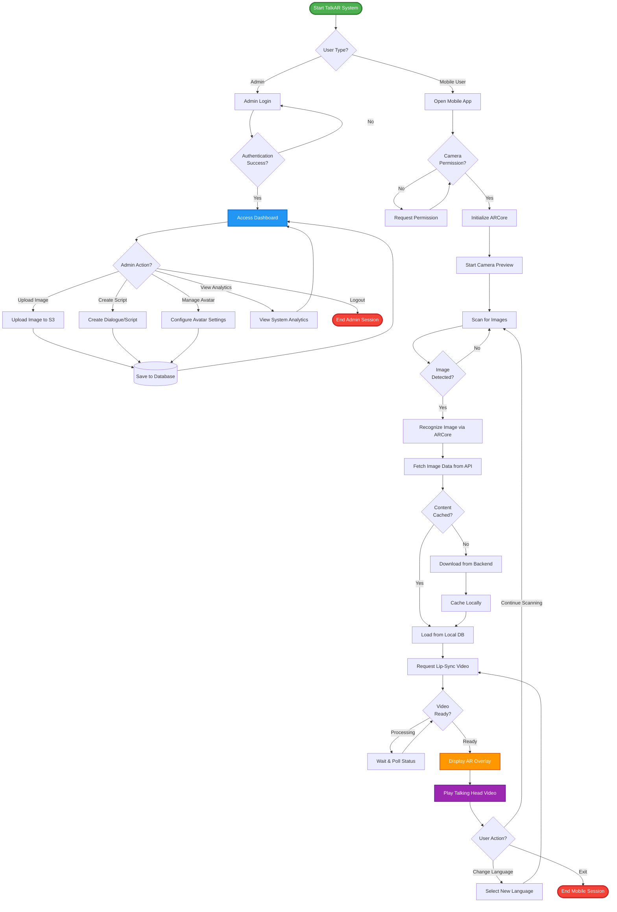
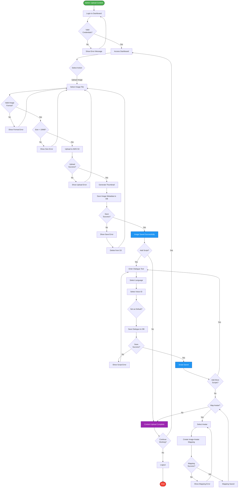
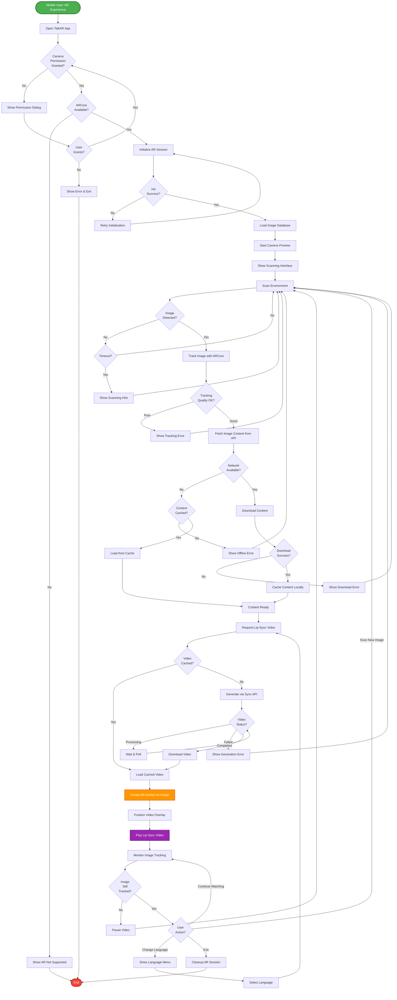
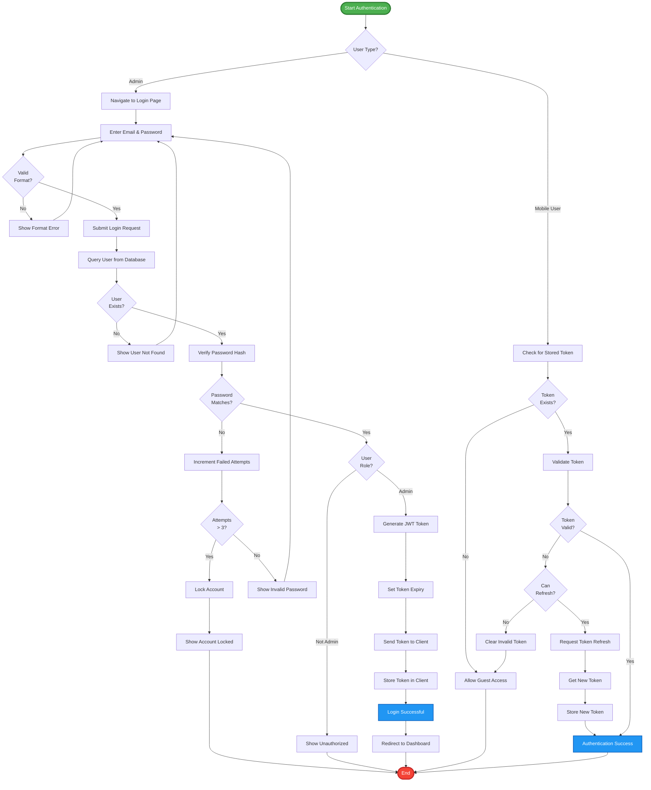
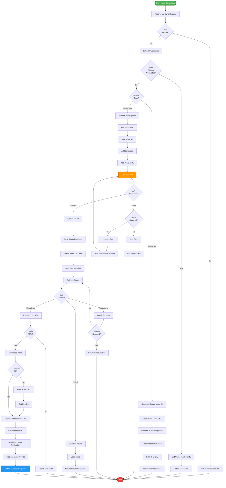
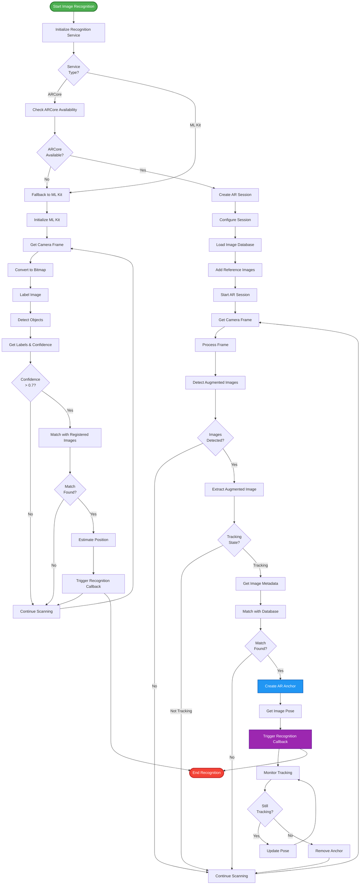
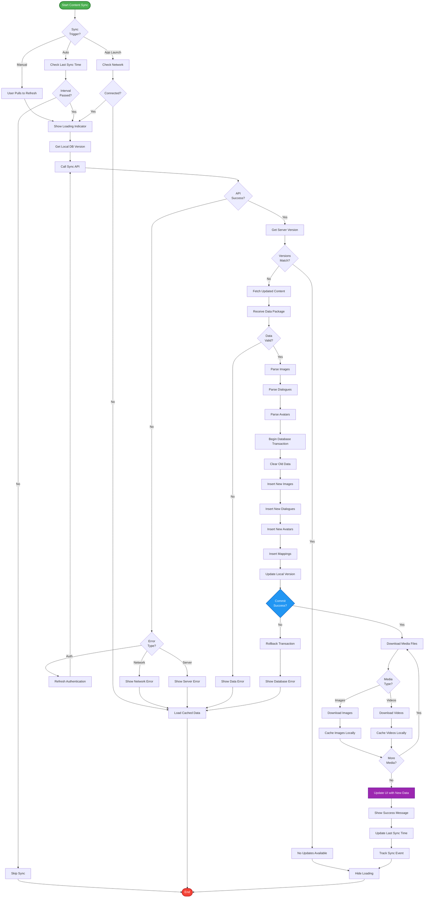

# TalkAR - UML Activity Diagrams

## Table of Contents
1. [Main System Activity Diagram](#1-main-system-activity-diagram)
2. [Admin Content Upload Activity](#2-admin-content-upload-activity)
3. [Mobile AR Experience Activity](#3-mobile-ar-experience-activity)
4. [Authentication Activity](#4-authentication-activity)
5. [Video Generation Activity](#5-video-generation-activity)
6. [Image Recognition Activity](#6-image-recognition-activity)
7. [Content Synchronization Activity](#7-content-synchronization-activity)

---

## 1. Main System Activity Diagram



---

## 2. Admin Content Upload Activity



---

## 3. Mobile AR Experience Activity



---

## 4. Authentication Activity



---

## 5. Video Generation Activity



---

## 6. Image Recognition Activity



---

## 7. Content Synchronization Activity



---

## Activity Diagram Summary

### Overview Table

| Diagram # | Name | Purpose | Key Activities |
|-----------|------|---------|----------------|
| 1 | **Main System** | Overall system flow | Admin & Mobile user paths |
| 2 | **Admin Upload** | Content management | Upload image, create script, map avatar |
| 3 | **Mobile AR** | AR experience | Scan, recognize, display, play video |
| 4 | **Authentication** | User login & security | Login, verify, generate token |
| 5 | **Video Generation** | Lip-sync creation | Request, process, cache video |
| 6 | **Image Recognition** | AR detection | ARCore + ML Kit recognition |
| 7 | **Content Sync** | Data synchronization | Fetch, parse, cache content |

---

## Activity Diagram Legend

### Shapes Explained

| Shape | Symbol | Meaning |
|-------|--------|---------|
| **Start/End** | `([...])` | Activity start or end point |
| **Activity** | `[...]` | An action or process step |
| **Decision** | `{...?}` | Conditional branch (if/else) |
| **Process** | `[...]` | Standard process/action |
| **Database** | `[(...)]` | Database operation |

### Decision Outcomes

```
{Decision?} -->|Yes| NextStep
{Decision?} -->|No| OtherStep
```

---

## How to Use These Diagrams

### 🚀 Quick View (Mermaid Live):
1. Visit: https://mermaid.live
2. Copy any diagram code
3. Paste and view
4. Export as PNG/SVG

### 📂 GitHub:
```bash
git add ACTIVITY_DIAGRAMS.md
git commit -m "Add UML activity diagrams"
git push
# Auto-renders on GitHub!
```

### 💻 VS Code:
1. Install "Markdown Preview Mermaid Support"
2. Open `ACTIVITY_DIAGRAMS.md`
3. Press `Ctrl+Shift+V`

---

## Best Practices Shown

✅ **Clear Flow** - Top to bottom, left to right  
✅ **Decision Points** - Diamond shapes for choices  
✅ **Error Handling** - Alternative paths for failures  
✅ **Loops** - Retry and polling mechanisms  
✅ **Parallel Activities** - Concurrent operations  
✅ **Color Coding** - Visual hierarchy  
✅ **Comprehensive** - All major scenarios covered  

---

**Created**: October 8, 2025  
**Diagrams**: 7 comprehensive activity flows  
**Standard**: UML 2.0 Activity Diagram notation  
**Format**: Mermaid graph syntax
