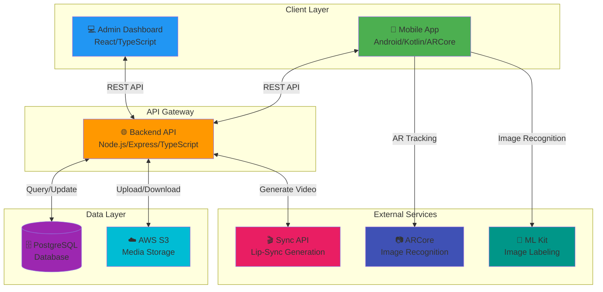
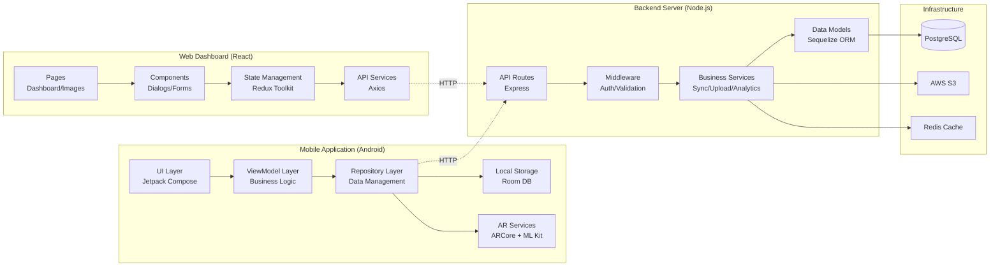
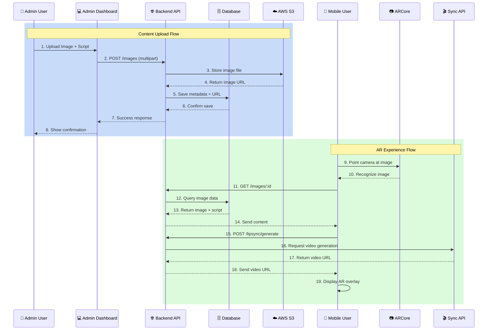
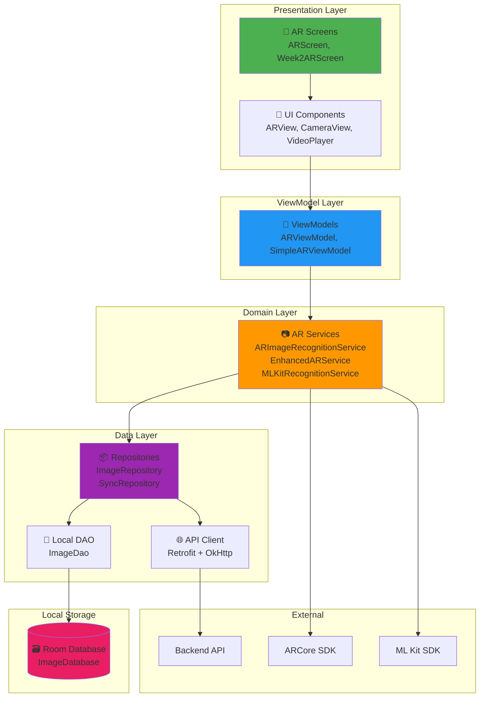
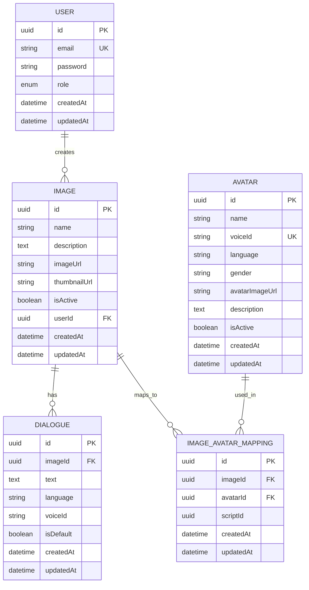
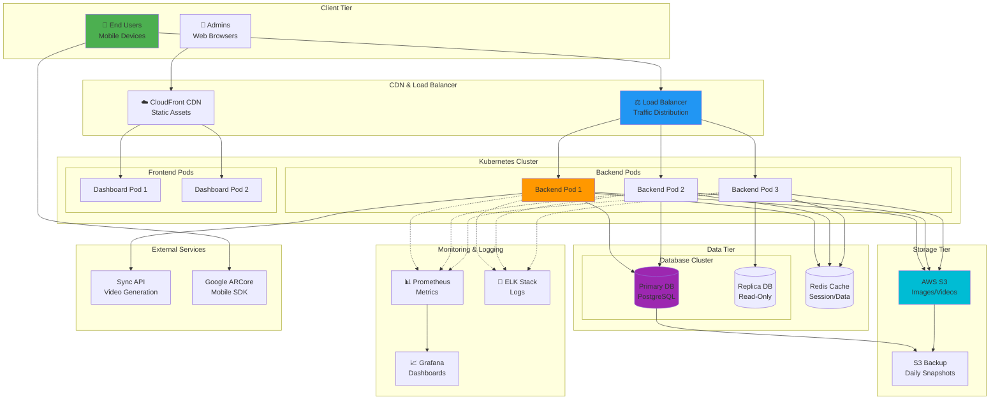
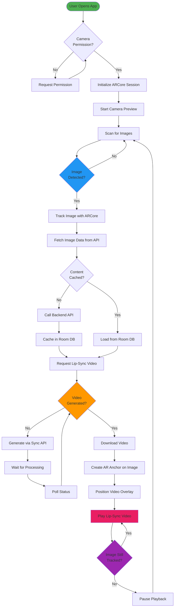
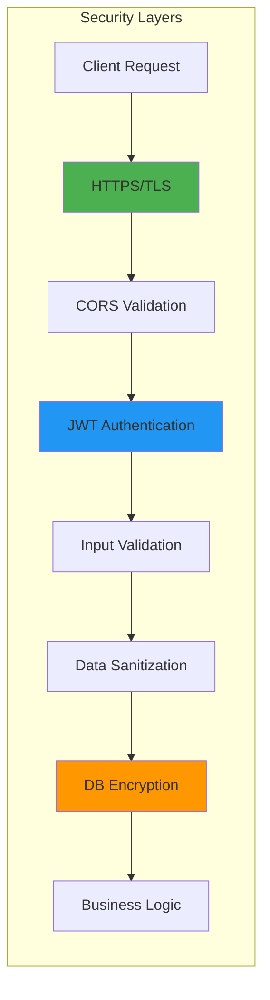

# TalkAR Architecture Diagrams

## Table of Contents
1. [System Overview Architecture](#1-system-overview-architecture)
2. [High-Level Component Diagram](#2-high-level-component-diagram)
3. [Data Flow Architecture](#3-data-flow-architecture)
4. [Mobile App Architecture](#4-mobile-app-architecture)
5. [Backend API Architecture](#5-backend-api-architecture)
6. [Database Schema Diagram](#6-database-schema-diagram)
7. [Deployment Architecture](#7-deployment-architecture)
8. [AR Experience Flow](#8-ar-experience-flow)

---

## 1. System Overview Architecture



---

## 2. High-Level Component Diagram



---

## 3. Data Flow Architecture



---

## 4. Mobile App Architecture



---

## 5. Backend API Architecture

```mermaid
graph TB
    subgraph "API Gateway Layer"
        EXPRESS[Express.js Server]
        HELMET[Security: Helmet]
        CORS[CORS Protection]
        MORGAN[Logging: Morgan]
    end
    
    subgraph "Routing Layer"
        AUTH_ROUTE[/auth Routes]
        IMAGE_ROUTE[/images Routes]
        AVATAR_ROUTE[/avatars Routes]
        SYNC_ROUTE[/sync Routes]
        LIPSYNC_ROUTE[/lipsync Routes]
        ENHANCED_ROUTE[/enhanced-lipsync Routes]
        ANALYTICS_ROUTE[/analytics Routes]
        SCRIPT_ROUTE[/scripts Routes]
    end
    
    subgraph "Middleware Layer"
        AUTH_MW[🔐 Authentication<br/>JWT Verification]
        VALID_MW[✅ Validation<br/>Joi Schemas]
        ERROR_MW[⚠️ Error Handler<br/>Global Error Handling]
    end
    
    subgraph "Service Layer"
        AUTH_SVC[🔑 Auth Service<br/>Login/Register]
        SYNC_SVC[🎬 Sync Service<br/>Video Generation]
        UPLOAD_SVC[📤 Upload Service<br/>File Processing]
        LIPSYNC_SVC[💋 Enhanced LipSync<br/>Mock/Real Service]
        ANALYTICS_SVC[📊 Analytics Service<br/>Usage Tracking]
    end
    
    subgraph "Data Layer"
        IMAGE_MODEL[Image Model]
        AVATAR_MODEL[Avatar Model]
        USER_MODEL[User Model]
        DIALOGUE_MODEL[Dialogue Model]
        MAPPING_MODEL[ImageAvatarMapping]
        ASSOC[Associations]
    end
    
    subgraph "External Integration"
        DB[(PostgreSQL)]
        S3[AWS S3]
        SYNC_API[Sync API]
    end
    
    EXPRESS --> HELMET
    EXPRESS --> CORS
    EXPRESS --> MORGAN
    EXPRESS --> AUTH_ROUTE
    EXPRESS --> IMAGE_ROUTE
    EXPRESS --> AVATAR_ROUTE
    EXPRESS --> SYNC_ROUTE
    EXPRESS --> LIPSYNC_ROUTE
    EXPRESS --> ENHANCED_ROUTE
    EXPRESS --> ANALYTICS_ROUTE
    EXPRESS --> SCRIPT_ROUTE
    
    AUTH_ROUTE --> AUTH_MW
    IMAGE_ROUTE --> AUTH_MW
    AVATAR_ROUTE --> AUTH_MW
    
    AUTH_MW --> VALID_MW
    VALID_MW --> ERROR_MW
    
    ERROR_MW --> AUTH_SVC
    ERROR_MW --> SYNC_SVC
    ERROR_MW --> UPLOAD_SVC
    ERROR_MW --> LIPSYNC_SVC
    ERROR_MW --> ANALYTICS_SVC
    
    AUTH_SVC --> USER_MODEL
    SYNC_SVC --> IMAGE_MODEL
    UPLOAD_SVC --> IMAGE_MODEL
    LIPSYNC_SVC --> AVATAR_MODEL
    
    IMAGE_MODEL --> ASSOC
    AVATAR_MODEL --> ASSOC
    DIALOGUE_MODEL --> ASSOC
    MAPPING_MODEL --> ASSOC
    
    ASSOC --> DB
    UPLOAD_SVC --> S3
    SYNC_SVC --> SYNC_API
    
    style EXPRESS fill:#4CAF50
    style AUTH_MW fill:#2196F3
    style SYNC_SVC fill:#FF9800
    style DB fill:#9C27B0
```

---

## 6. Database Schema Diagram



---

## 7. Deployment Architecture



---

## 8. AR Experience Flow



---

## Component Interaction Matrix

| Component | Mobile App | Backend API | Admin Dashboard | PostgreSQL | AWS S3 | Sync API | ARCore |
|-----------|-----------|-------------|-----------------|------------|---------|----------|--------|
| **Mobile App** | - | REST API | - | - | - | - | ✓ |
| **Backend API** | ✓ | - | ✓ | ✓ | ✓ | ✓ | - |
| **Admin Dashboard** | - | ✓ | - | - | - | - | - |
| **PostgreSQL** | - | ✓ | - | - | - | - | - |
| **AWS S3** | - | ✓ | - | - | - | - | - |
| **Sync API** | - | ✓ | - | - | - | - | - |
| **ARCore** | ✓ | - | - | - | - | - | - |

---

## Technology Stack Summary

### Mobile Application (Android)
```
┌─────────────────────────────┐
│   Jetpack Compose (UI)      │
├─────────────────────────────┤
│   ViewModel (MVVM)          │
├─────────────────────────────┤
│   Repository Pattern        │
├─────────────────────────────┤
│   ARCore + ML Kit          │
├─────────────────────────────┤
│   Room DB + Retrofit       │
└─────────────────────────────┘
```

### Backend API (Node.js)
```
┌─────────────────────────────┐
│   Express.js Middleware     │
├─────────────────────────────┤
│   API Routes               │
├─────────────────────────────┤
│   Business Services        │
├─────────────────────────────┤
│   Sequelize ORM            │
├─────────────────────────────┤
│   PostgreSQL Database      │
└─────────────────────────────┘
```

### Admin Dashboard (React)
```
┌─────────────────────────────┐
│   Material-UI Components    │
├─────────────────────────────┤
│   React Pages              │
├─────────────────────────────┤
│   Redux Toolkit Store      │
├─────────────────────────────┤
│   Axios API Client         │
└─────────────────────────────┘
```

---

## Network Architecture

```
                    ┌──────────────┐
                    │   Internet   │
                    └──────┬───────┘
                           │
                    ┌──────▼───────┐
                    │ Load Balancer│
                    │   (HTTPS)    │
                    └──────┬───────┘
                           │
            ┌──────────────┴──────────────┐
            │                             │
     ┌──────▼─────┐              ┌───────▼────┐
     │  Backend   │              │   Admin    │
     │   API      │              │  Dashboard │
     │  Port 3000 │              │  Port 3001 │
     └──────┬─────┘              └────────────┘
            │
     ┌──────┴─────────────────────┐
     │                            │
┌────▼─────┐              ┌──────▼──────┐
│PostgreSQL│              │   AWS S3    │
│Port 5432 │              │   Storage   │
└──────────┘              └─────────────┘
```

---

## Security Architecture



---

## How to Use These Diagrams

### For GitHub/GitLab
These Mermaid diagrams will automatically render in:
- GitHub README files
- GitLab documentation
- Most modern markdown viewers

### For Documentation Tools
Import this file into:
- **Confluence**: Use Mermaid macro
- **Notion**: Use code blocks with mermaid language
- **Draw.io/Diagrams.net**: Import Mermaid syntax
- **VS Code**: Use Mermaid Preview extension

### For Presentations
1. Copy diagram code to [Mermaid Live Editor](https://mermaid.live)
2. Export as PNG/SVG
3. Use in PowerPoint/Google Slides

### For Development
- Reference these diagrams in code reviews
- Use as onboarding material for new developers
- Include in technical documentation
- Share with stakeholders for system understanding

---

**Last Updated**: October 8, 2025  
**Diagram Version**: 1.0
