# TalkAR - UML Class Diagram

## Complete System Class Diagram

```mermaid
classDiagram
    %% ============================================
    %% BACKEND MODELS (Database Entities)
    %% ============================================
    
    class User {
        -UUID id
        -String email
        -String password
        -Enum role
        -DateTime createdAt
        -DateTime updatedAt
        +login(email, password) Boolean
        +register(userData) User
        +hashPassword(password) String
        +verifyPassword(password) Boolean
        +generateToken() String
    }
    
    class Image {
        -UUID id
        -String name
        -String description
        -String imageUrl
        -String thumbnailUrl
        -Boolean isActive
        -UUID userId
        -DateTime createdAt
        -DateTime updatedAt
        +upload(file) String
        +getDialogues() Dialogue[]
        +getAvatarMappings() ImageAvatarMapping[]
        +delete() Boolean
        +update(data) Image
    }
    
    class Dialogue {
        -UUID id
        -UUID imageId
        -String text
        -String language
        -String voiceId
        -Boolean isDefault
        -DateTime createdAt
        -DateTime updatedAt
        +create(dialogueData) Dialogue
        +translate(language) String
        +getImage() Image
        +delete() Boolean
    }
    
    class Avatar {
        -UUID id
        -String name
        -String voiceId
        -String language
        -String gender
        -String avatarImageUrl
        -String description
        -Boolean isActive
        -DateTime createdAt
        -DateTime updatedAt
        +create(avatarData) Avatar
        +getMappings() ImageAvatarMapping[]
        +update(data) Avatar
        +delete() Boolean
    }
    
    class ImageAvatarMapping {
        -UUID id
        -UUID imageId
        -UUID avatarId
        -UUID scriptId
        -DateTime createdAt
        -DateTime updatedAt
        +create(mappingData) ImageAvatarMapping
        +getImage() Image
        +getAvatar() Avatar
        +delete() Boolean
    }
    
    %% ============================================
    %% BACKEND SERVICES
    %% ============================================
    
    class AuthService {
        -JWTSecret String
        +login(email, password) Token
        +register(userData) User
        +verifyToken(token) Boolean
        +refreshToken(oldToken) Token
        +resetPassword(email) Boolean
    }
    
    class SyncService {
        -String apiUrl
        -String apiKey
        +generateVideo(request) SyncResponse
        +getStatus(jobId) SyncStatus
        +getAvailableVoices() Voice[]
        +getTalkingHeadVideo(imageId) String
    }
    
    class EnhancedLipSyncService {
        -Map~String,VideoStorage~ videoStorage
        +generateLipSyncVideo(request) LipSyncResponse
        +getVideoStatus(videoId) LipSyncResponse
        +getVideosForImage(imageId) VideoStorage[]
        +cleanupExpiredVideos() Number
        +getAnalytics() AnalyticsData
    }
    
    class UploadService {
        -S3Client s3Client
        -String bucketName
        +uploadImage(file) String
        +uploadVideo(file) String
        +deleteFile(key) Boolean
        +generateThumbnail(imageUrl) String
        +getSignedUrl(key) String
    }
    
    class AnalyticsService {
        +getOverview() AnalyticsOverview
        +getUsageStats() UsageStats
        +getVideoMetrics() VideoMetrics
        +trackEvent(event) Boolean
    }
    
    %% ============================================
    %% MOBILE APP - DATA MODELS
    %% ============================================
    
    class ImageRecognition {
        -String id
        -String name
        -String description
        -String imageUrl
        -String thumbnailUrl
        -List~Dialogue~ dialogues
        -Boolean isActive
        +fromJson(json) ImageRecognition
        +toJson() Map
    }
    
    class BackendImage {
        -String id
        -String name
        -String imageUrl
        -List~Script~ scripts
        -List~Avatar~ avatars
        +fromJson(json) BackendImage
        +toJson() Map
    }
    
    class AvatarModel {
        -String id
        -String name
        -String voiceId
        -String avatarImageUrl
        -String language
        -String gender
        +fromJson(json) AvatarModel
        +toJson() Map
    }
    
    %% ============================================
    %% MOBILE APP - VIEWMODELS
    %% ============================================
    
    class ARViewModel {
        -ImageRepository imageRepository
        -SyncRepository syncRepository
        -MutableState~UIState~ uiState
        -List~ImageRecognition~ recognizedImages
        +onImageRecognized(imageData) void
        +generateSyncVideo(imageId) void
        +updateUIState(state) void
        +clearError() void
    }
    
    class SimpleARViewModel {
        -MutableState~String~ statusText
        -MutableState~Boolean~ isScanning
        +startScanning() void
        +stopScanning() void
        +updateStatus(message) void
    }
    
    class EnhancedARViewModel {
        -ImageRepository imageRepository
        -MutableState~List~BackendImage~~ images
        -MutableState~String~ selectedImageId
        -MutableState~String~ videoUrl
        +loadImages() void
        +selectImage(imageId) void
        +generateVideo(imageId, scriptId) void
        +playVideo(videoUrl) void
    }
    
    %% ============================================
    %% MOBILE APP - REPOSITORIES
    %% ============================================
    
    class ImageRepository {
        -ApiService apiService
        -ImageDao imageDao
        +getImages() Flow~List~ImageRecognition~~
        +getImageById(id) ImageRecognition
        +syncImages() void
        +cacheImage(image) void
        +getCachedImages() List~ImageRecognition~
    }
    
    class SyncRepository {
        -ApiService apiService
        +generateVideo(request) SyncResponse
        +getVideoStatus(jobId) SyncStatus
        +getAvailableVoices() List~Voice~
    }
    
    %% ============================================
    %% MOBILE APP - SERVICES
    %% ============================================
    
    class ARImageRecognitionService {
        -Session arSession
        -AugmentedImageDatabase imageDatabase
        +initialize() void
        +startRecognition() void
        +stopRecognition() void
        +onImageDetected(image) void
        +trackImage(augmentedImage) void
    }
    
    class EnhancedARService {
        -Context context
        -Session arSession
        +setupARSession() void
        +loadImages(images) void
        +recognizeImage() AugmentedImage
        +createAnchor(image) Anchor
        +cleanup() void
    }
    
    class MLKitRecognitionService {
        -ImageLabeler imageLabeler
        -ObjectDetector objectDetector
        +labelImage(bitmap) List~ImageLabel~
        +detectObjects(bitmap) List~DetectedObject~
        +close() void
    }
    
    %% ============================================
    %% MOBILE APP - DATA ACCESS
    %% ============================================
    
    class ImageDao {
        +getAll() Flow~List~ImageRecognition~~
        +getById(id) ImageRecognition
        +insert(image) void
        +update(image) void
        +delete(image) void
        +deleteAll() void
    }
    
    class ImageDatabase {
        -ImageDao imageDao
        +getDatabase(context) ImageDatabase
        +imageDao() ImageDao
    }
    
    class ApiClient {
        -Retrofit retrofit
        -OkHttpClient httpClient
        -String baseUrl
        +create() ApiService
        +setAuthToken(token) void
    }
    
    %% ============================================
    %% INTERFACES
    %% ============================================
    
    class ApiService {
        <<interface>>
        +getImages() Response~List~ImageRecognition~~
        +getImageById(id) Response~ImageRecognition~
        +generateLipSync(request) Response~LipSyncResponse~
        +getVideoStatus(videoId) Response~VideoStatus~
    }
    
    %% ============================================
    %% DATA TRANSFER OBJECTS
    %% ============================================
    
    class LipSyncRequest {
        -String text
        -String voiceId
        -String language
        -String imageId
        -String scriptId
        +validate() Boolean
    }
    
    class LipSyncResponse {
        -Boolean success
        -String videoId
        -String videoUrl
        -String status
        -String message
        -Number processingTime
    }
    
    class SyncResponse {
        -String jobId
        -String status
        -String videoUrl
        -String message
    }
    
    class VideoStorage {
        -String videoId
        -String imageId
        -String scriptId
        -String text
        -String voiceId
        -String videoUrl
        -String status
        -DateTime createdAt
        -DateTime expiresAt
        -Number processingTime
    }
    
    %% ============================================
    %% RELATIONSHIPS - DATABASE MODELS
    %% ============================================
    
    User "1" --> "*" Image : creates
    Image "1" --> "*" Dialogue : has
    Image "1" --> "*" ImageAvatarMapping : maps to
    Avatar "1" --> "*" ImageAvatarMapping : used in
    
    %% ============================================
    %% RELATIONSHIPS - BACKEND SERVICES
    %% ============================================
    
    AuthService ..> User : authenticates
    SyncService ..> Image : generates video for
    EnhancedLipSyncService ..> VideoStorage : manages
    UploadService ..> Image : uploads
    AnalyticsService ..> Image : tracks
    AnalyticsService ..> Dialogue : analyzes
    
    %% ============================================
    %% RELATIONSHIPS - MOBILE VIEWMODELS
    %% ============================================
    
    ARViewModel --> ImageRepository : uses
    ARViewModel --> SyncRepository : uses
    EnhancedARViewModel --> ImageRepository : uses
    
    %% ============================================
    %% RELATIONSHIPS - MOBILE REPOSITORIES
    %% ============================================
    
    ImageRepository --> ApiClient : uses
    ImageRepository --> ImageDao : uses
    ImageRepository --> ImageRecognition : manages
    SyncRepository --> ApiClient : uses
    
    %% ============================================
    %% RELATIONSHIPS - MOBILE SERVICES
    %% ============================================
    
    ARImageRecognitionService ..> ImageRecognition : recognizes
    EnhancedARService ..> BackendImage : processes
    MLKitRecognitionService ..> ImageRecognition : labels
    
    %% ============================================
    %% RELATIONSHIPS - DATA ACCESS
    %% ============================================
    
    ImageDatabase *-- ImageDao : contains
    ApiClient ..|> ApiService : implements
    
    %% ============================================
    %% RELATIONSHIPS - DTOs
    %% ============================================
    
    SyncService ..> LipSyncRequest : receives
    SyncService ..> LipSyncResponse : returns
    EnhancedLipSyncService ..> LipSyncRequest : receives
    EnhancedLipSyncService ..> LipSyncResponse : returns
    EnhancedLipSyncService --> VideoStorage : stores
```



---

## Class Diagram - Backend Only (Simplified)


---

## Class Diagram - Mobile App Only (Simplified)


---

## Class Diagram - Architecture Layers


---

## Detailed Class Descriptions

### 📦 Backend Models

| Class | Purpose | Key Methods |
|-------|---------|-------------|
| **User** | User authentication and management | login(), register(), generateToken() |
| **Image** | Store image metadata and URLs | upload(), getDialogues(), delete() |
| **Dialogue** | Store scripts/dialogues for images | create(), translate(), getImage() |
| **Avatar** | Avatar configuration with voice | create(), getMappings(), update() |
| **ImageAvatarMapping** | Many-to-many relationship | create(), getImage(), getAvatar() |

### 🔧 Backend Services

| Class | Purpose | Key Methods |
|-------|---------|-------------|
| **AuthService** | JWT authentication | login(), verifyToken(), refreshToken() |
| **SyncService** | Sync API integration | generateVideo(), getStatus() |
| **EnhancedLipSyncService** | Advanced lip-sync processing | generateLipSyncVideo(), getAnalytics() |
| **UploadService** | AWS S3 file management | uploadImage(), generateThumbnail() |
| **AnalyticsService** | Usage tracking | getOverview(), trackEvent() |

### 📱 Mobile ViewModels (MVVM Pattern)

| Class | Purpose | Key Methods |
|-------|---------|-------------|
| **ARViewModel** | Main AR screen logic | onImageRecognized(), generateSyncVideo() |
| **SimpleARViewModel** | Basic AR functionality | startScanning(), updateStatus() |
| **EnhancedARViewModel** | Advanced AR features | loadImages(), generateVideo() |

### 📊 Mobile Repositories

| Class | Purpose | Key Methods |
|-------|---------|-------------|
| **ImageRepository** | Image data management | getImages(), syncImages(), cacheImage() |
| **SyncRepository** | Sync API communication | generateVideo(), getVideoStatus() |

### 🎯 Mobile Services

| Class | Purpose | Key Methods |
|-------|---------|-------------|
| **ARImageRecognitionService** | ARCore image recognition | initialize(), startRecognition() |
| **EnhancedARService** | Advanced AR operations | setupARSession(), createAnchor() |
| **MLKitRecognitionService** | ML-based recognition | labelImage(), detectObjects() |

---

## Relationship Types Explained

### 🔗 Association (-->)
```
User "1" --> "*" Image : creates
```
- One User creates many Images
- Standard association relationship

### 🔗 Dependency (..>)
```
AuthService ..> User : authenticates
```
- AuthService depends on User class
- Temporary, weaker relationship

### 🔗 Composition (*--)
```
ImageDatabase *-- ImageDao : contains
```
- ImageDatabase owns ImageDao
- Dao cannot exist without Database

### 🔗 Implementation (..|>)
```
ApiClient ..|> ApiService : implements
```
- ApiClient implements ApiService interface
- Interface realization

---

## Design Patterns Used

### 1. **MVVM Pattern (Mobile App)**
```
View (Composable) → ViewModel → Repository → Data Source
```

### 2. **Repository Pattern**
```
Repository abstracts data sources (API + Local DB)
```

### 3. **Singleton Pattern**
```
ImageDatabase, ApiClient
```

### 4. **Service Layer Pattern**
```
Business logic separated into service classes
```

### 5. **DAO Pattern**
```
ImageDao provides data access abstraction
```

---

## Class Multiplicities

| Relationship | Multiplicity | Meaning |
|--------------|--------------|---------|
| User → Image | 1 to * | One user creates many images |
| Image → Dialogue | 1 to * | One image has many dialogues |
| Image → ImageAvatarMapping | 1 to * | One image maps to many avatars |
| Avatar → ImageAvatarMapping | 1 to * | One avatar used in many mappings |

---

## Access Modifiers

| Modifier | Symbol | Visibility |
|----------|--------|------------|
| Private | - | Class only |
| Public | + | All classes |
| Protected | # | Class and subclasses |
| Package | ~ | Same package |

---

## Key Interfaces

### Backend
- No explicit interfaces shown (TypeScript uses structural typing)

### Mobile (Kotlin)
- **ApiService** - REST API interface
- **ImageDao** - Room database interface

---

## Technology Mapping

| Layer | Backend | Mobile |
|-------|---------|--------|
| **Models** | Sequelize Models | Kotlin Data Classes |
| **Services** | TypeScript Classes | Kotlin Services |
| **Data Access** | Sequelize ORM | Room + Retrofit |
| **View** | React Components | Jetpack Compose |
| **State** | Redux | MutableState/Flow |

---

## How to Use These Diagrams

### For Development:
- Reference class structure when coding
- Understand relationships before implementation
- Plan database migrations

### For Documentation:
- Include in technical specifications
- Use for developer onboarding
- Share with team members

### For Architecture Review:
- Validate design decisions
- Identify missing relationships
- Plan refactoring

---

## Rendering Instructions

### Quick View:
1. **Go to**: https://mermaid.live
2. **Copy** any diagram from above
3. **Paste** and view instantly
4. **Export** as PNG/SVG

### In GitHub:
```bash
git add CLASS_DIAGRAM.md
git commit -m "Add UML class diagram"
git push
# Auto-renders on GitHub!
```

### In VS Code:
1. Install "Markdown Preview Mermaid Support"
2. Open CLASS_DIAGRAM.md
3. Press Ctrl+Shift+V

---

**Diagram Version**: 1.0  
**Last Updated**: October 8, 2025  
**Total Classes**: 35+  
**Total Relationships**: 40+
