# TalkAR - UML Class Diagram with Responsibilities

## Complete Class Diagram with Responsibilities

```mermaid
classDiagram
    %% ============================================
    %% BACKEND - DATABASE MODELS
    %% ============================================
    
    class User {
        <<Entity>>
        -UUID id
        -String email
        -String password
        -String role
        -DateTime createdAt
        -DateTime updatedAt
        +login(email, password)
        +register(userData)
        +hashPassword(password)
        +verifyPassword(password)
        +generateToken()
    }
    note for User "Responsibility: Manages user authentication and authorization.\nTasks: Store user credentials, validate login, generate JWT tokens,\nmanage user roles (admin/user)"
    
    class Image {
        <<Entity>>
        -UUID id
        -String name
        -String description
        -String imageUrl
        -String thumbnailUrl
        -Boolean isActive
        -UUID userId
        -DateTime createdAt
        -DateTime updatedAt
        +upload(file)
        +delete()
        +update(data)
        +getDialogues()
    }
    note for Image "Responsibility: Manages AR target images and metadata.\nTasks: Store image URLs (S3), track image ownership,\nmanage active/inactive status, link to dialogues and avatars"
    
    class Dialogue {
        <<Entity>>
        -UUID id
        -UUID imageId
        -String text
        -String language
        -String voiceId
        -Boolean isDefault
        -DateTime createdAt
        -DateTime updatedAt
        +create(data)
        +translate(language)
        +getImage()
    }
    note for Dialogue "Responsibility: Stores scripts and dialogues for images.\nTasks: Manage multi-language text content, associate scripts with images,\ntrack default dialogue, store voice ID for TTS"
    
    class Avatar {
        <<Entity>>
        -UUID id
        -String name
        -String voiceId
        -String language
        -String gender
        -String avatarImageUrl
        -String description
        -Boolean isActive
        -DateTime createdAt
        -DateTime updatedAt
        +create(data)
        +update(data)
        +getMappings()
    }
    note for Avatar "Responsibility: Manages avatar configurations and voice settings.\nTasks: Store avatar metadata, configure voice parameters,\nmanage avatar-image mappings, track active avatars"
    
    class ImageAvatarMapping {
        <<Entity>>
        -UUID id
        -UUID imageId
        -UUID avatarId
        -UUID scriptId
        -DateTime createdAt
        -DateTime updatedAt
        +create(mapping)
        +delete()
    }
    note for ImageAvatarMapping "Responsibility: Links images with avatars (many-to-many).\nTasks: Create image-avatar associations, manage script mappings,\nallow multiple avatars per image"
    
    %% ============================================
    %% BACKEND - SERVICES
    %% ============================================
    
    class AuthService {
        <<Service>>
        -String jwtSecret
        +login(email, password)
        +register(userData)
        +verifyToken(token)
        +refreshToken(oldToken)
        +resetPassword(email)
    }
    note for AuthService "Responsibility: Handles authentication and authorization.\nTasks: Validate credentials, generate/verify JWT tokens,\nmanage user sessions, handle password resets"
    
    class SyncService {
        <<Service>>
        -String apiUrl
        -String apiKey
        +generateVideo(request)
        +getStatus(jobId)
        +getAvailableVoices()
    }
    note for SyncService "Responsibility: Integrates with Sync API for video generation.\nTasks: Request lip-sync videos, poll generation status,\nmanage voice options, handle API communication"
    
    class UploadService {
        <<Service>>
        -S3Client s3Client
        -String bucketName
        +uploadImage(file)
        +uploadVideo(file)
        +deleteFile(key)
        +generateThumbnail(url)
    }
    note for UploadService "Responsibility: Manages file uploads to cloud storage.\nTasks: Upload files to AWS S3, generate thumbnails,\ndelete files, manage S3 bucket operations"
    
    class AnalyticsService {
        <<Service>>
        +getOverview()
        +getUsageStats()
        +trackEvent(event)
    }
    note for AnalyticsService "Responsibility: Tracks and reports system analytics.\nTasks: Collect usage metrics, generate reports,\ntrack user interactions, provide dashboard statistics"
    
    %% ============================================
    %% MOBILE - VIEWMODELS (MVVM)
    %% ============================================
    
    class ARViewModel {
        <<ViewModel>>
        -ImageRepository repository
        -MutableState uiState
        -List~Image~ images
        +onImageRecognized(imageId)
        +generateVideo(imageId)
        +updateState(state)
    }
    note for ARViewModel "Responsibility: Manages AR screen business logic (MVVM pattern).\nTasks: Handle image recognition events, coordinate video generation,\nmanage UI state, communicate with repositories"
    
    class EnhancedARViewModel {
        <<ViewModel>>
        -ImageRepository repository
        -MutableState~List~ images
        -String selectedImageId
        +loadImages()
        +selectImage(imageId)
        +generateVideo(imageId, scriptId)
    }
    note for EnhancedARViewModel "Responsibility: Advanced AR features and state management.\nTasks: Load and manage multiple images, handle image selection,\ncoordinate enhanced AR features, manage video playback"
    
    %% ============================================
    %% MOBILE - REPOSITORIES
    %% ============================================
    
    class ImageRepository {
        <<Repository>>
        -ApiClient apiClient
        -ImageDao imageDao
        +getImages()
        +syncImages()
        +cacheImage(image)
        +getCachedImages()
    }
    note for ImageRepository "Responsibility: Abstracts image data sources (API + Local DB).\nTasks: Fetch images from API, cache data locally,\nsync remote and local data, manage offline access"
    
    class SyncRepository {
        <<Repository>>
        -ApiClient apiClient
        +generateVideo(request)
        +getVideoStatus(jobId)
        +getAvailableVoices()
    }
    note for SyncRepository "Responsibility: Manages video generation requests.\nTasks: Request lip-sync videos, poll video status,\nhandle API communication, manage video data"
    
    %% ============================================
    %% MOBILE - AR SERVICES
    %% ============================================
    
    class ARImageRecognitionService {
        <<Service>>
        -Session arSession
        -AugmentedImageDatabase imageDb
        +initialize()
        +startRecognition()
        +stopRecognition()
        +trackImage(image)
    }
    note for ARImageRecognitionService "Responsibility: Handles ARCore image recognition.\nTasks: Initialize ARCore session, detect images,\ntrack image positions, manage AR anchors"
    
    class EnhancedARService {
        <<Service>>
        -Session arSession
        +setupARSession()
        +loadImages(images)
        +recognizeImage()
        +createAnchor(image)
    }
    note for EnhancedARService "Responsibility: Provides advanced AR functionality.\nTasks: Configure AR sessions, load image databases,\ncreate AR anchors, manage AR overlays"
    
    class MLKitRecognitionService {
        <<Service>>
        -ImageLabeler imageLabeler
        -ObjectDetector objectDetector
        +labelImage(bitmap)
        +detectObjects(bitmap)
    }
    note for MLKitRecognitionService "Responsibility: ML-based image recognition (fallback).\nTasks: Label images using ML Kit, detect objects,\nprovide alternative recognition when ARCore unavailable"
    
    %% ============================================
    %% MOBILE - DATA ACCESS
    %% ============================================
    
    class ImageDao {
        <<DAO>>
        +getAll()
        +getById(id)
        +insert(image)
        +update(image)
        +delete(image)
    }
    note for ImageDao "Responsibility: Provides database access for images (Room).\nTasks: CRUD operations on local database,\nquery cached images, manage offline data"
    
    class ImageDatabase {
        <<Database>>
        -ImageDao imageDao
        +getDatabase(context)
        +imageDao()
    }
    note for ImageDatabase "Responsibility: Room database instance manager.\nTasks: Provide database singleton, manage DAO instances,\nhandle database migrations"
    
    class ApiClient {
        <<Client>>
        -Retrofit retrofit
        -String baseUrl
        +create()
        +setAuthToken(token)
    }
    note for ApiClient "Responsibility: HTTP client for API communication.\nTasks: Configure Retrofit, manage HTTP requests,\nhandle authentication headers, parse responses"
    
    %% ============================================
    %% ADMIN DASHBOARD - COMPONENTS
    %% ============================================
    
    class ImagesPage {
        <<Component>>
        -List~Image~ images
        -Boolean loading
        +loadImages()
        +uploadImage(file)
        +deleteImage(id)
    }
    note for ImagesPage "Responsibility: Admin UI for image management.\nTasks: Display image list, handle file uploads,\ndelete images, manage image metadata"
    
    class ReduxStore {
        <<Store>>
        -AuthState authState
        -ImageState imageState
        +dispatch(action)
        +getState()
    }
    note for ReduxStore "Responsibility: Global state management (Redux).\nTasks: Manage application state, dispatch actions,\nnotify components of state changes"
    
    class ImageService {
        <<Service>>
        -AxiosClient axios
        +fetchImages()
        +uploadImage(formData)
        +deleteImage(id)
        +updateImage(id, data)
    }
    note for ImageService "Responsibility: Dashboard API integration.\nTasks: Call backend APIs, handle HTTP requests,\nmanage image CRUD operations via REST"
    
    %% ============================================
    %% EXTERNAL SERVICES
    %% ============================================
    
    class SyncAPI {
        <<External Service>>
        +generateLipSyncVideo(params)
        +getJobStatus(jobId)
    }
    note for SyncAPI "Responsibility: Third-party lip-sync video generation.\nTasks: Generate photorealistic talking head videos,\nprovide multiple voice options, process text-to-speech"
    
    class ARCoreSDK {
        <<External SDK>>
        +detectImage(frame)
        +trackImage(augmentedImage)
        +createAnchor(pose)
    }
    note for ARCoreSDK "Responsibility: Google's AR framework.\nTasks: Provide AR capabilities, detect/track images,\nmanage AR sessions, create anchors"
    
    class PostgreSQL {
        <<Database>>
        +query(sql)
        +insert(table, data)
        +update(table, data)
    }
    note for PostgreSQL "Responsibility: Primary data storage.\nTasks: Store all application data, handle queries,\nmanage transactions, ensure data integrity"
    
    class AWSS3 {
        <<Cloud Storage>>
        +upload(file)
        +download(key)
        +delete(key)
    }
    note for AWSS3 "Responsibility: Cloud file storage.\nTasks: Store images and videos, provide CDN access,\nmanage file lifecycle, ensure availability"
    
    %% ============================================
    %% RELATIONSHIPS
    %% ============================================
    
    User "1" --> "0..*" Image : creates
    Image "1" --> "0..*" Dialogue : contains
    Image "0..*" --> "0..*" Avatar : maps via
    Avatar "1" --> "0..*" ImageAvatarMapping : used in
    Image "1" --> "0..*" ImageAvatarMapping : has
    
    AuthService ..> User : authenticates
    SyncService ..> Dialogue : uses
    UploadService ..> Image : uploads
    AnalyticsService ..> Image : tracks
    
    ARViewModel --> ImageRepository : uses
    ARViewModel --> SyncRepository : uses
    EnhancedARViewModel --> ImageRepository : uses
    
    ImageRepository --> ApiClient : calls
    ImageRepository --> ImageDao : caches
    SyncRepository --> ApiClient : calls
    
    ARImageRecognitionService ..> ARCoreSDK : uses
    EnhancedARService ..> ARCoreSDK : uses
    MLKitRecognitionService ..> Image : recognizes
    
    ImageDatabase *-- ImageDao : contains
    
    ImagesPage --> ReduxStore : dispatches
    ImagesPage --> ImageService : calls
    ImageService ..> Image : manages
    
    SyncService ..> SyncAPI : calls
    UploadService ..> AWSS3 : stores
    User ..> PostgreSQL : persisted
    Image ..> PostgreSQL : persisted
    Dialogue ..> PostgreSQL : persisted
    Avatar ..> PostgreSQL : persisted
```



---

## Detailed Class Responsibilities

### 📦 Backend - Database Models (Entities)

#### 1. **User**
**Responsibility**: Manages user authentication and authorization

**Tasks**:
- Store user credentials securely (hashed passwords)
- Validate login attempts
- Generate JWT authentication tokens
- Manage user roles (admin, regular user)
- Track user creation and updates
- Handle password reset functionality

**Key Methods**:
- `login()` - Authenticate user with email/password
- `register()` - Create new user account
- `hashPassword()` - Hash password using bcrypt
- `verifyPassword()` - Compare password hashes
- `generateToken()` - Create JWT token

---

#### 2. **Image**
**Responsibility**: Manages AR target images and metadata

**Tasks**:
- Store image URLs from AWS S3
- Track image ownership (linked to User)
- Manage image metadata (name, description)
- Handle active/inactive status for AR recognition
- Generate and store thumbnail URLs
- Link to associated dialogues and avatars
- Track creation and modification timestamps

**Key Methods**:
- `upload()` - Handle image file upload
- `delete()` - Remove image and clean up
- `update()` - Modify image metadata
- `getDialogues()` - Fetch associated scripts

---

#### 3. **Dialogue**
**Responsibility**: Stores scripts and dialogues for images

**Tasks**:
- Manage multi-language text content
- Associate scripts with specific images
- Track default dialogue for each image
- Store voice ID for text-to-speech
- Support language-specific content
- Manage dialogue creation and updates

**Key Methods**:
- `create()` - Create new dialogue
- `translate()` - Get translation for language
- `getImage()` - Get parent image

---

#### 4. **Avatar**
**Responsibility**: Manages avatar configurations and voice settings

**Tasks**:
- Store avatar metadata (name, description)
- Configure voice parameters (ID, language, gender)
- Manage avatar preview images
- Track active/inactive avatars
- Link avatars to multiple images
- Store language and gender preferences

**Key Methods**:
- `create()` - Create new avatar
- `update()` - Modify avatar settings
- `getMappings()` - Get all image mappings

---

#### 5. **ImageAvatarMapping**
**Responsibility**: Links images with avatars (many-to-many relationship)

**Tasks**:
- Create associations between images and avatars
- Allow multiple avatars per image
- Allow avatars to be used across multiple images
- Track script associations
- Manage mapping lifecycle

**Key Methods**:
- `create()` - Create new mapping
- `delete()` - Remove mapping

---

### 🔧 Backend - Services (Business Logic)

#### 6. **AuthService**
**Responsibility**: Handles authentication and authorization

**Tasks**:
- Validate user credentials
- Generate JWT access tokens
- Verify token authenticity
- Refresh expired tokens
- Handle password reset requests
- Manage user sessions
- Enforce role-based access control

**Key Methods**:
- `login()` - Authenticate user
- `register()` - Create new account
- `verifyToken()` - Validate JWT
- `refreshToken()` - Renew access token
- `resetPassword()` - Handle password recovery

---

#### 7. **SyncService**
**Responsibility**: Integrates with Sync API for video generation

**Tasks**:
- Request lip-sync video generation
- Poll video generation status
- Manage voice options
- Handle Sync API communication
- Cache generated video URLs
- Retry failed requests
- Track video generation metrics

**Key Methods**:
- `generateVideo()` - Request new video
- `getStatus()` - Check generation status
- `getAvailableVoices()` - List voice options

---

#### 8. **UploadService**
**Responsibility**: Manages file uploads to cloud storage

**Tasks**:
- Upload files to AWS S3
- Generate image thumbnails
- Delete files from S3
- Validate file types and sizes
- Manage S3 bucket operations
- Handle multipart uploads
- Generate signed URLs

**Key Methods**:
- `uploadImage()` - Upload to S3
- `uploadVideo()` - Store video files
- `deleteFile()` - Remove from S3
- `generateThumbnail()` - Create preview

---

#### 9. **AnalyticsService**
**Responsibility**: Tracks and reports system analytics

**Tasks**:
- Collect usage metrics
- Generate analytics reports
- Track user interactions
- Monitor video generation stats
- Provide dashboard statistics
- Track API usage
- Calculate engagement metrics

**Key Methods**:
- `getOverview()` - System overview
- `getUsageStats()` - Usage metrics
- `trackEvent()` - Log events

---

### 📱 Mobile - ViewModels (MVVM Pattern)

#### 10. **ARViewModel**
**Responsibility**: Manages AR screen business logic

**Tasks**:
- Handle image recognition events
- Coordinate video generation
- Manage UI state updates
- Communicate with repositories
- Handle user interactions
- Manage AR session lifecycle
- Update UI with recognition results

**Key Methods**:
- `onImageRecognized()` - Handle detection
- `generateVideo()` - Request video
- `updateState()` - Update UI state

---

#### 11. **EnhancedARViewModel**
**Responsibility**: Advanced AR features and state management

**Tasks**:
- Load and manage multiple images
- Handle image selection
- Coordinate enhanced AR features
- Manage video playback state
- Track selected avatar/script
- Handle language switching
- Manage AR overlay state

**Key Methods**:
- `loadImages()` - Fetch image list
- `selectImage()` - Select active image
- `generateVideo()` - Create lip-sync video

---

### 📊 Mobile - Repositories (Data Layer)

#### 12. **ImageRepository**
**Responsibility**: Abstracts image data sources

**Tasks**:
- Fetch images from backend API
- Cache data locally (Room DB)
- Sync remote and local data
- Manage offline access
- Handle network errors
- Provide data to ViewModels
- Implement caching strategy

**Key Methods**:
- `getImages()` - Fetch all images
- `syncImages()` - Sync with server
- `cacheImage()` - Store locally
- `getCachedImages()` - Get offline data

---

#### 13. **SyncRepository**
**Responsibility**: Manages video generation requests

**Tasks**:
- Request lip-sync videos
- Poll video status
- Handle API communication
- Manage video data
- Cache video URLs
- Handle generation errors
- Track request status

**Key Methods**:
- `generateVideo()` - Request generation
- `getVideoStatus()` - Poll status
- `getAvailableVoices()` - List voices

---

### 🎯 Mobile - AR Services

#### 14. **ARImageRecognitionService**
**Responsibility**: Handles ARCore image recognition

**Tasks**:
- Initialize ARCore session
- Configure AR settings
- Detect images in camera feed
- Track image positions
- Manage AR anchors
- Handle tracking quality
- Cleanup AR resources

**Key Methods**:
- `initialize()` - Setup ARCore
- `startRecognition()` - Begin scanning
- `stopRecognition()` - End session
- `trackImage()` - Monitor image

---

#### 15. **EnhancedARService**
**Responsibility**: Provides advanced AR functionality

**Tasks**:
- Configure enhanced AR sessions
- Load image databases
- Create AR anchors
- Manage AR overlays
- Handle advanced tracking
- Optimize AR performance
- Manage AR lifecycle

**Key Methods**:
- `setupARSession()` - Configure AR
- `loadImages()` - Load image DB
- `recognizeImage()` - Detect image
- `createAnchor()` - Place AR anchor

---

#### 16. **MLKitRecognitionService**
**Responsibility**: ML-based image recognition (fallback)

**Tasks**:
- Label images using ML Kit
- Detect objects in images
- Provide fallback when ARCore unavailable
- Analyze image content
- Extract image features
- Match against database

**Key Methods**:
- `labelImage()` - Get image labels
- `detectObjects()` - Find objects

---

### 💾 Mobile - Data Access

#### 17. **ImageDao**
**Responsibility**: Provides database access for images (Room)

**Tasks**:
- CRUD operations on local database
- Query cached images
- Manage offline data
- Handle database transactions
- Provide reactive data streams
- Optimize queries

**Key Methods**:
- `getAll()` - Get all cached images
- `getById()` - Get specific image
- `insert()` - Add to cache
- `update()` - Modify cached data
- `delete()` - Remove from cache

---

#### 18. **ImageDatabase**
**Responsibility**: Room database instance manager

**Tasks**:
- Provide database singleton
- Manage DAO instances
- Handle database migrations
- Configure database settings
- Ensure thread safety
- Manage database lifecycle

**Key Methods**:
- `getDatabase()` - Get singleton instance
- `imageDao()` - Provide DAO

---

#### 19. **ApiClient**
**Responsibility**: HTTP client for API communication

**Tasks**:
- Configure Retrofit instance
- Manage HTTP requests
- Handle authentication headers
- Parse JSON responses
- Handle network errors
- Implement retry logic
- Manage timeouts

**Key Methods**:
- `create()` - Create API service
- `setAuthToken()` - Add auth header

---

### 💻 Admin Dashboard - Components

#### 20. **ImagesPage**
**Responsibility**: Admin UI for image management

**Tasks**:
- Display image list
- Handle file uploads
- Delete images
- Edit image metadata
- Show loading states
- Handle errors
- Navigate between views

**Key Methods**:
- `loadImages()` - Fetch image list
- `uploadImage()` - Upload new image
- `deleteImage()` - Remove image

---

#### 21. **ReduxStore**
**Responsibility**: Global state management

**Tasks**:
- Manage application state
- Dispatch actions
- Notify components of changes
- Handle async actions
- Persist state
- Debug state changes

**Key Methods**:
- `dispatch()` - Trigger actions
- `getState()` - Get current state

---

#### 22. **ImageService**
**Responsibility**: Dashboard API integration

**Tasks**:
- Call backend APIs
- Handle HTTP requests
- Manage image CRUD via REST
- Parse responses
- Handle errors
- Format request data

**Key Methods**:
- `fetchImages()` - Get image list
- `uploadImage()` - Upload file
- `deleteImage()` - Remove image
- `updateImage()` - Modify metadata

---

### ⚙️ External Services

#### 23. **SyncAPI**
**Responsibility**: Third-party lip-sync video generation

**Tasks**:
- Generate photorealistic talking heads
- Provide multiple voice options
- Process text-to-speech
- Sync lip movements
- Handle head movements
- Return video URLs

---

#### 24. **ARCoreSDK**
**Responsibility**: Google's AR framework

**Tasks**:
- Provide AR capabilities
- Detect/track images
- Manage AR sessions
- Create AR anchors
- Handle device motion
- Render AR content

---

#### 25. **PostgreSQL**
**Responsibility**: Primary data storage

**Tasks**:
- Store all application data
- Handle SQL queries
- Manage transactions
- Ensure data integrity
- Provide ACID guarantees
- Handle concurrent access

---

#### 26. **AWSS3**
**Responsibility**: Cloud file storage

**Tasks**:
- Store images and videos
- Provide CDN access
- Manage file lifecycle
- Ensure file availability
- Handle large files
- Generate signed URLs

---

## How to Use This Diagram

### 🚀 Quick View:
1. **Visit**: https://mermaid.live
2. **Copy**: The diagram code (lines 5-340)
3. **Paste**: Into editor
4. **View**: Complete class diagram with responsibilities!

### 📂 GitHub:
```bash
git add CLASS_DIAGRAM_WITH_RESPONSIBILITIES.md
git commit -m "Add class diagram with responsibilities"
git push
```

### 💻 VS Code:
1. Open file
2. Press `Ctrl+Shift+V`
3. View rendered diagram

---

## Summary Statistics

| Category | Count |
|----------|-------|
| **Total Classes** | 26 classes |
| **Entities (Models)** | 5 classes |
| **Services** | 9 classes |
| **ViewModels** | 2 classes |
| **Repositories** | 2 classes |
| **Data Access** | 3 classes |
| **UI Components** | 3 classes |
| **External Services** | 4 services |

---

**Perfect for**: Understanding system architecture, developer onboarding, code reviews, and technical documentation!

**Created**: October 8, 2025  
**Format**: UML Class Diagram with detailed responsibilities
