# TalkAR - Component/Interface Diagram (UML)

## Table of Contents
1. [Complete System Component Diagram](#complete-system-component-diagram)
2. [Backend Components with Interfaces](#backend-components-with-interfaces)
3. [Mobile App Components with Interfaces](#mobile-app-components-with-interfaces)
4. [Interface Specifications](#interface-specifications)

---

## UML Component Diagram Notation

### Interface Types
- **Provided Interface** (◉): Interface offered by a component (lollipop)
- **Required Interface** (◯): Interface needed by a component (socket)
- **Interface Connection**: Required interface connects to provided interface

### Notation Guide
```
[Component A] --◉ IInterface : provides
[Component B] ◯-- IInterface : requires
```

---

## Complete System Component Diagram

**Purpose**: Shows all components and their interface dependencies


---

## Backend Components with Interfaces

**Purpose**: Detailed backend component communication

```mermaid
graph TB
    subgraph "Client Layer"
        AdminDashboard["Admin Dashboard<br/>React Component"]
        MobileClient["Mobile App<br/>Android Client"]
    end
    
    subgraph "API Gateway"
        ExpressAPI["Express API Gateway<br/>━━━━━━━━━━━━<br/>◉ IRestAPI<br/>◉ IWebSocket<br/>━━━━━━━━━━━━<br/>◯ IAuth<br/>◯ IImageService<br/>◯ IVideoService"]
    end
    
    subgraph "Business Logic Layer"
        AuthService["Authentication Service<br/>━━━━━━━━━━━━<br/>◉ IAuthentication<br/>provides:<br/>- login()<br/>- register()<br/>- verifyToken()<br/>━━━━━━━━━━━━<br/>◯ IUserRepository"]
        
        ImageService["Image Service<br/>━━━━━━━━━━━━<br/>◉ IImageService<br/>provides:<br/>- uploadImage()<br/>- getImages()<br/>- deleteImage()<br/>━━━━━━━━━━━━<br/>◯ IDatabase<br/>◯ IStorage"]
        
        VideoService["Video Service<br/>━━━━━━━━━━━━<br/>◉ IVideoService<br/>provides:<br/>- generateVideo()<br/>- getVideoStatus()<br/>━━━━━━━━━━━━<br/>◯ ISyncAPI<br/>◯ IDatabase"]
        
        SyncService["Sync Integration<br/>━━━━━━━━━━━━<br/>◉ ISyncIntegration<br/>provides:<br/>- requestGeneration()<br/>- pollStatus()<br/>━━━━━━━━━━━━<br/>◯ IExternalAPI"]
    end
    
    subgraph "Data Access Layer"
        DatabaseAdapter["Database Adapter<br/>━━━━━━━━━━━━<br/>◉ IDatabase<br/>provides:<br/>- query()<br/>- insert()<br/>- update()<br/>- delete()<br/>━━━━━━━━━━━━<br/>◯ IPostgreSQL"]
        
        StorageAdapter["Storage Adapter<br/>━━━━━━━━━━━━<br/>◉ IStorage<br/>provides:<br/>- upload()<br/>- download()<br/>- delete()<br/>━━━━━━━━━━━━<br/>◯ IS3Service"]
    end
    
    subgraph "External Services"
        PostgreSQL["PostgreSQL<br/>━━━━━━━━━━━━<br/>◉ IPostgreSQL<br/>provides SQL interface"]
        S3["AWS S3<br/>━━━━━━━━━━━━<br/>◉ IS3Service<br/>provides storage API"]
        SyncAPI["Sync Labs API<br/>━━━━━━━━━━━━<br/>◉ IExternalAPI<br/>provides video generation"]
    end
    
    %% Client requires
    AdminDashboard -->|requires: IRestAPI| ExpressAPI
    MobileClient -->|requires: IRestAPI| ExpressAPI
    
    %% API Gateway requires
    ExpressAPI -->|requires: IAuth| AuthService
    ExpressAPI -->|requires: IImageService| ImageService
    ExpressAPI -->|requires: IVideoService| VideoService
    
    %% Business Logic requires
    AuthService -->|requires: IUserRepository| DatabaseAdapter
    ImageService -->|requires: IDatabase| DatabaseAdapter
    ImageService -->|requires: IStorage| StorageAdapter
    VideoService -->|requires: ISyncAPI| SyncService
    VideoService -->|requires: IDatabase| DatabaseAdapter
    SyncService -->|requires: IExternalAPI| SyncAPI
    
    %% Data Access requires
    DatabaseAdapter -->|requires: IPostgreSQL| PostgreSQL
    StorageAdapter -->|requires: IS3Service| S3
    
    style ExpressAPI fill:#2196F3,stroke:#1565C0,stroke-width:3px
    style AuthService fill:#4CAF50,stroke:#2E7D32,stroke-width:2px
    style ImageService fill:#4CAF50,stroke:#2E7D32,stroke-width:2px
    style VideoService fill:#4CAF50,stroke:#2E7D32,stroke-width:2px
    style DatabaseAdapter fill:#9C27B0,stroke:#6A1B9A,stroke-width:2px
    style StorageAdapter fill:#9C27B0,stroke:#6A1B9A,stroke-width:2px
    style SyncAPI fill:#FF9800,stroke:#E65100,stroke-width:2px
```



---

## Mobile App Components with Interfaces

**Purpose**: Mobile app architecture with interfaces

```mermaid
graph TB
    subgraph "Presentation Layer"
        ARScreen["AR Screen<br/>━━━━━━━━━━━━<br/>◉ IUserInterface<br/>provides UI for AR<br/>━━━━━━━━━━━━<br/>◯ IViewModel"]
        
        DashboardScreen["Dashboard Screen<br/>━━━━━━━━━━━━<br/>◉ IUserInterface<br/>provides UI for dashboard<br/>━━━━━━━━━━━━<br/>◯ IViewModel"]
    end
    
    subgraph "ViewModel Layer"
        ARViewModel["AR ViewModel<br/>━━━━━━━━━━━━<br/>◉ IViewModel<br/>provides:<br/>- onImageRecognized()<br/>- generateVideo()<br/>- updateState()<br/>━━━━━━━━━━━━<br/>◯ IRepository<br/>◯ IARService"]
    end
    
    subgraph "Repository Layer"
        ImageRepository["Image Repository<br/>━━━━━━━━━━━━<br/>◉ IRepository<br/>provides:<br/>- getImages()<br/>- syncImages()<br/>- cacheImage()<br/>━━━━━━━━━━━━<br/>◯ IRemoteAPI<br/>◯ ILocalCache"]
        
        SyncRepository["Sync Repository<br/>━━━━━━━━━━━━<br/>◉ IRepository<br/>provides:<br/>- generateVideo()<br/>- getVideoStatus()<br/>━━━━━━━━━━━━<br/>◯ IRemoteAPI"]
    end
    
    subgraph "Service Layer"
        ARService["AR Service<br/>━━━━━━━━━━━━<br/>◉ IARService<br/>provides:<br/>- initialize()<br/>- detectImage()<br/>- trackImage()<br/>━━━━━━━━━━━━<br/>◯ IARFramework"]
        
        MLKitService["ML Kit Service<br/>━━━━━━━━━━━━<br/>◉ IImageRecognition<br/>provides:<br/>- labelImage()<br/>- detectObjects()<br/>━━━━━━━━━━━━<br/>◯ IMLFramework"]
    end
    
    subgraph "Data Layer"
        APIClient["API Client<br/>━━━━━━━━━━━━<br/>◉ IRemoteAPI<br/>provides:<br/>- get()<br/>- post()<br/>- put()<br/>- delete()<br/>━━━━━━━━━━━━<br/>◯ IHttpClient"]
        
        RoomDB["Room Database<br/>━━━━━━━━━━━━<br/>◉ ILocalCache<br/>provides:<br/>- insert()<br/>- query()<br/>- update()<br/>- delete()"]
    end
    
    subgraph "External SDKs"
        ARCore["ARCore SDK<br/>━━━━━━━━━━━━<br/>◉ IARFramework<br/>provides AR capabilities"]
        
        MLKit["ML Kit SDK<br/>━━━━━━━━━━━━<br/>◉ IMLFramework<br/>provides ML recognition"]
        
        Retrofit["Retrofit<br/>━━━━━━━━━━━━<br/>◉ IHttpClient<br/>provides HTTP client"]
    end
    
    %% Presentation requires
    ARScreen -->|requires: IViewModel| ARViewModel
    DashboardScreen -->|requires: IViewModel| ARViewModel
    
    %% ViewModel requires
    ARViewModel -->|requires: IRepository| ImageRepository
    ARViewModel -->|requires: IRepository| SyncRepository
    ARViewModel -->|requires: IARService| ARService
    
    %% Repository requires
    ImageRepository -->|requires: IRemoteAPI| APIClient
    ImageRepository -->|requires: ILocalCache| RoomDB
    SyncRepository -->|requires: IRemoteAPI| APIClient
    
    %% Service requires
    ARService -->|requires: IARFramework| ARCore
    MLKitService -->|requires: IMLFramework| MLKit
    
    %% Data layer requires
    APIClient -->|requires: IHttpClient| Retrofit
    
    style ARScreen fill:#4CAF50,stroke:#2E7D32,stroke-width:2px
    style ARViewModel fill:#2196F3,stroke:#1565C0,stroke-width:2px
    style ImageRepository fill:#FF9800,stroke:#E65100,stroke-width:2px
    style ARService fill:#9C27B0,stroke:#6A1B9A,stroke-width:2px
    style ARCore fill:#f44336,stroke:#c62828,stroke-width:2px
```



---

## Interface Specifications

### Backend Interfaces

#### 1. IRestAPI (Provided by API Gateway)
```typescript
interface IRestAPI {
    // Authentication
    POST /auth/login(credentials): Token
    POST /auth/register(userData): User
    POST /auth/refresh(refreshToken): Token
    
    // Image Management
    GET /images(): Image[]
    GET /images/:id(): Image
    POST /images(file, metadata): Image
    PUT /images/:id(data): Image
    DELETE /images/:id(): void
    
    // Video Generation
    POST /lipsync/generate(request): VideoJob
    GET /lipsync/status/:id(): VideoStatus
    
    // Analytics
    GET /analytics/overview(): Analytics
}
```

#### 2. IAuthentication (Provided by Auth Service)
```typescript
interface IAuthentication {
    // Required by: API Gateway
    // Provided by: AuthService
    
    login(email: string, password: string): AuthResult
    register(userData: UserData): User
    verifyToken(token: string): TokenPayload
    refreshToken(refreshToken: string): Token
    resetPassword(email: string): void
}
```

#### 3. IImageService (Provided by Image Service)
```typescript
interface IImageService {
    // Required by: API Gateway
    // Provided by: ImageService
    
    uploadImage(file: File, metadata: ImageMetadata): Image
    getImages(filters?: Filters): Image[]
    getImageById(id: string): Image
    updateImage(id: string, data: Partial<Image>): Image
    deleteImage(id: string): void
    getDialogues(imageId: string): Dialogue[]
}
```

#### 4. IVideoService (Provided by Video Service)
```typescript
interface IVideoService {
    // Required by: API Gateway
    // Provided by: VideoService
    
    generateVideo(request: VideoRequest): VideoJob
    getVideoStatus(jobId: string): VideoStatus
    cancelVideoGeneration(jobId: string): void
    getAvailableVoices(): Voice[]
}
```

#### 5. IDatabase (Provided by Database Adapter)
```typescript
interface IDatabase {
    // Required by: Business Services
    // Provided by: DatabaseAdapter
    
    query<T>(sql: string, params?: any[]): Promise<T[]>
    insert<T>(table: string, data: T): Promise<string>
    update<T>(table: string, id: string, data: Partial<T>): Promise<void>
    delete(table: string, id: string): Promise<void>
    transaction(callback: Function): Promise<void>
}
```

#### 6. IStorage (Provided by Storage Adapter)
```typescript
interface IStorage {
    // Required by: Image Service
    // Provided by: StorageAdapter
    
    upload(file: Buffer, key: string): Promise<string>
    download(key: string): Promise<Buffer>
    delete(key: string): Promise<void>
    getSignedUrl(key: string, expiresIn: number): Promise<string>
    copyObject(sourceKey: string, destKey: string): Promise<void>
}
```

#### 7. ISyncAPI (Provided by Sync Service)
```typescript
interface ISyncAPI {
    // Required by: Video Service
    // Provided by: SyncService -> External API
    
    generateLipSyncVideo(request: SyncRequest): Promise<JobId>
    getJobStatus(jobId: string): Promise<JobStatus>
    downloadVideo(jobId: string): Promise<VideoUrl>
    getAvailableVoices(): Promise<Voice[]>
}
```

---

### Mobile App Interfaces

#### 8. IViewModel (Provided by ViewModels)
```kotlin
interface IViewModel {
    // Required by: UI Components
    // Provided by: ARViewModel, EnhancedARViewModel
    
    fun initialize()
    fun onImageRecognized(imageId: String)
    fun generateVideo(imageId: String, scriptId: String)
    fun updateState(newState: UIState)
    fun handleError(error: Throwable)
}
```

#### 9. IRepository (Provided by Repositories)
```kotlin
interface IRepository {
    // Required by: ViewModels
    // Provided by: ImageRepository, SyncRepository
    
    suspend fun getImages(): Flow<List<Image>>
    suspend fun getImageById(id: String): Image
    suspend fun syncImages(): Result<Unit>
    suspend fun cacheImage(image: Image)
    suspend fun generateVideo(request: VideoRequest): VideoResponse
}
```

#### 10. IARService (Provided by AR Service)
```kotlin
interface IARService {
    // Required by: ViewModels
    // Provided by: ARService
    
    fun initialize(): Result<Unit>
    fun startRecognition()
    fun stopRecognition()
    fun detectImage(frame: Frame): AugmentedImage?
    fun trackImage(augmentedImage: AugmentedImage): TrackingState
    fun createAnchor(pose: Pose): Anchor
}
```

#### 11. IRemoteAPI (Provided by API Client)
```kotlin
interface IRemoteAPI {
    // Required by: Repositories
    // Provided by: APIClient (Retrofit)
    
    suspend fun getImages(): Response<List<Image>>
    suspend fun getImageById(id: String): Response<Image>
    suspend fun generateLipSync(request: LipSyncRequest): Response<VideoJob>
    suspend fun getVideoStatus(videoId: String): Response<VideoStatus>
}
```

#### 12. ILocalCache (Provided by Room DB)
```kotlin
interface ILocalCache {
    // Required by: Repositories
    // Provided by: RoomDatabase
    
    suspend fun getAll(): List<Image>
    suspend fun getById(id: String): Image?
    suspend fun insert(image: Image)
    suspend fun update(image: Image)
    suspend fun delete(id: String)
    suspend fun clear()
}
```

#### 13. IARFramework (Provided by ARCore)
```kotlin
interface IARFramework {
    // Required by: ARService
    // Provided by: ARCore SDK
    
    fun createSession(config: Config): Session
    fun updateSession(frame: Frame): Frame
    fun detectImages(frame: Frame): List<AugmentedImage>
    fun createAnchor(pose: Pose): Anchor
    fun getTrackingState(): TrackingState
}
```

---

## Component Communication Matrix

### Backend Component Communication

| Component | Provides Interface | Requires Interface | Communication With |
|-----------|-------------------|-------------------|-------------------|
| **API Gateway** | IRestAPI | IAuth, IImageService, IVideoService | All Business Services |
| **Auth Service** | IAuthentication | IUserRepository, IDatabase | Database Adapter |
| **Image Service** | IImageService | IDatabase, IStorage | Database, Storage Adapters |
| **Video Service** | IVideoService | ISyncAPI, IDatabase | Sync Service, Database |
| **Sync Service** | ISyncIntegration | IExternalAPI | External Sync API |
| **Database Adapter** | IDatabase | IPostgreSQL | PostgreSQL |
| **Storage Adapter** | IStorage | IS3Service | AWS S3 |

### Mobile Component Communication

| Component | Provides Interface | Requires Interface | Communication With |
|-----------|-------------------|-------------------|-------------------|
| **AR Screen** | IUserInterface | IViewModel | AR ViewModel |
| **AR ViewModel** | IViewModel | IRepository, IARService | Repositories, AR Service |
| **Image Repository** | IRepository | IRemoteAPI, ILocalCache | API Client, Room DB |
| **Sync Repository** | IRepository | IRemoteAPI | API Client |
| **AR Service** | IARService | IARFramework | ARCore SDK |
| **API Client** | IRemoteAPI | IHttpClient | Retrofit |
| **Room DB** | ILocalCache | - | Local SQLite |

---

## Interface Dependencies Graph


---

## Key Design Patterns

### 1. Dependency Inversion Principle
- High-level modules depend on interfaces, not implementations
- Both depend on abstractions

### 2. Interface Segregation
- Interfaces are specific to client needs
- No client forced to depend on unused methods

### 3. Service Layer Pattern
- Business logic encapsulated in services
- Services expose well-defined interfaces

### 4. Repository Pattern
- Data access abstracted through repositories
- Provides IRepository interface to ViewModels

### 5. Adapter Pattern
- External services wrapped with adapters
- Adapters implement internal interfaces

---

## Benefits of This Architecture

✅ **Loose Coupling** - Components depend on interfaces, not implementations  
✅ **Testability** - Easy to mock interfaces for testing  
✅ **Maintainability** - Changes isolated to implementations  
✅ **Scalability** - Easy to add new implementations  
✅ **Flexibility** - Can swap implementations without affecting clients  
✅ **Clear Contracts** - Interfaces define explicit contracts  

---

## How to Use

### 🚀 View in Mermaid Live:
1. Visit: https://mermaid.live
2. Copy any diagram
3. View component structure
4. Export as PNG/SVG

### 📂 GitHub:
```bash
git add COMPONENT_INTERFACE_DIAGRAM.md
git commit -m "Add component interface diagrams"
git push
```

---

**Created**: October 8, 2025  
**Standard**: UML 2.0 Component Diagrams  
**Format**: Mermaid with interface notation  
**Interfaces**: Provided (◉) and Required (◯) clearly marked
