# TalkAR - UML Deployment Diagrams

## Table of Contents
1. [Production Deployment Architecture](#1-production-deployment-architecture)
2. [Development Environment Deployment](#2-development-environment-deployment)
3. [Mobile Application Deployment](#3-mobile-application-deployment)
4. [Cloud Infrastructure Deployment](#4-cloud-infrastructure-deployment)
5. [Network Topology Diagram](#5-network-topology-diagram)

---

## UML Deployment Diagram Notation

### Elements
- **Node**: Physical or virtual machine (3D box)
- **Device**: Hardware node - `<<device>>`
- **Execution Environment**: Software container - `<<execution environment>>`
- **Artifact**: Deployable component - `<<artifact>>`
- **Communication Path**: Network connection between nodes
- **Deployment**: Artifact deployed on node

### Stereotypes Used
```
<<device>>              - Physical hardware
<<execution environment>> - Runtime container
<<artifact>>            - Deployable file
<<protocol>>            - Communication protocol
```

---

## 1. Production Deployment Architecture

**Purpose**: Complete production infrastructure with all deployment nodes

```mermaid
graph TB
    subgraph "Client Tier"
        AndroidDevice["<<device>><br/>📱 Android Device<br/>════════════════<br/>OS: Android 7.0+<br/>Memory: 2GB+<br/>ARCore: 1.41.0"]
        Browser["<<device>><br/>💻 Admin Workstation<br/>════════════════<br/>OS: Windows/Mac/Linux<br/>Browser: Chrome/Firefox"]
    end
    
    subgraph "Edge/CDN Layer"
        CloudFront["<<execution environment>><br/>☁️ CloudFront CDN<br/>════════════════<br/>AWS CloudFront<br/>Global Distribution<br/>HTTPS/HTTP/2"]
        LoadBalancer["<<device>><br/>⚖️ Load Balancer<br/>════════════════<br/>AWS ALB<br/>Auto-scaling<br/>SSL Termination"]
    end
    
    subgraph "Application Tier - Kubernetes Cluster"
        MasterNode["<<device>><br/>🎛️ Master Node<br/>════════════════<br/>Kubernetes Control Plane<br/>CPU: 4 cores<br/>RAM: 8GB"]
        
        WorkerNode1["<<device>><br/>⚙️ Worker Node 1<br/>════════════════<br/>Ubuntu 22.04 LTS<br/>CPU: 8 cores<br/>RAM: 16GB<br/>────────────────"]
        WorkerNode2["<<device>><br/>⚙️ Worker Node 2<br/>════════════════<br/>Ubuntu 22.04 LTS<br/>CPU: 8 cores<br/>RAM: 16GB<br/>────────────────"]
        WorkerNode3["<<device>><br/>⚙️ Worker Node 3<br/>════════════════<br/>Ubuntu 22.04 LTS<br/>CPU: 8 cores<br/>RAM: 16GB<br/>────────────────"]
    end
    
    subgraph "Worker Node 1 Components"
        BackendPod1["<<execution environment>><br/>🐳 Docker Container<br/>════════════════<br/><<artifact>><br/>backend-api.js<br/>Node.js 18<br/>Port: 3000"]
    end
    
    subgraph "Worker Node 2 Components"
        BackendPod2["<<execution environment>><br/>🐳 Docker Container<br/>════════════════<br/><<artifact>><br/>backend-api.js<br/>Node.js 18<br/>Port: 3000"]
    end
    
    subgraph "Worker Node 3 Components"
        DashboardPod["<<execution environment>><br/>🐳 Docker Container<br/>════════════════<br/><<artifact>><br/>admin-dashboard.html<br/>Nginx 1.24<br/>Port: 80"]
    end
    
    subgraph "Data Tier"
        PrimaryDB["<<device>><br/>🗄️ Primary Database<br/>════════════════<br/>PostgreSQL 15<br/>CPU: 8 cores<br/>RAM: 32GB<br/>Storage: 500GB SSD"]
        ReplicaDB["<<device>><br/>🗄️ Replica Database<br/>════════════════<br/>PostgreSQL 15<br/>Read-only<br/>Async Replication"]
        RedisCache["<<device>><br/>💾 Redis Cache<br/>════════════════<br/>Redis 7.0<br/>Memory: 16GB<br/>Persistence: AOF"]
    end
    
    subgraph "Storage Tier"
        S3Bucket["<<device>><br/>☁️ AWS S3 Bucket<br/>════════════════<br/>talkar-assets<br/>Region: us-east-1<br/>Versioning: Enabled<br/>Storage: 1TB"]
    end
    
    subgraph "External Services"
        SyncAPI["<<device>><br/>🎬 Sync Labs API<br/>════════════════<br/>Third-party Service<br/>HTTPS API<br/>Video Generation"]
    end
    
    subgraph "Monitoring"
        Prometheus["<<execution environment>><br/>📊 Prometheus<br/>════════════════<br/>Metrics Collection<br/>Port: 9090"]
        Grafana["<<execution environment>><br/>📈 Grafana<br/>════════════════<br/>Visualization<br/>Port: 3001"]
    end
    
    %% Client connections
    AndroidDevice -->|HTTPS| CloudFront
    AndroidDevice -->|HTTPS| LoadBalancer
    Browser -->|HTTPS| CloudFront
    
    %% CDN/Load Balancer
    CloudFront -->|HTTP| DashboardPod
    LoadBalancer -->|HTTP| BackendPod1
    LoadBalancer -->|HTTP| BackendPod2
    
    %% Kubernetes orchestration
    MasterNode -.->|Manages| WorkerNode1
    MasterNode -.->|Manages| WorkerNode2
    MasterNode -.->|Manages| WorkerNode3
    
    %% Backend to data tier
    BackendPod1 -->|TCP:5432| PrimaryDB
    BackendPod2 -->|TCP:5432| PrimaryDB
    BackendPod1 -->|TCP:5432| ReplicaDB
    BackendPod2 -->|TCP:5432| ReplicaDB
    BackendPod1 -->|TCP:6379| RedisCache
    BackendPod2 -->|TCP:6379| RedisCache
    
    %% Database replication
    PrimaryDB -.->|Async Replication| ReplicaDB
    
    %% Storage
    BackendPod1 -->|HTTPS| S3Bucket
    BackendPod2 -->|HTTPS| S3Bucket
    DashboardPod -->|HTTPS| S3Bucket
    
    %% External services
    BackendPod1 -->|HTTPS| SyncAPI
    BackendPod2 -->|HTTPS| SyncAPI
    
    %% Monitoring
    BackendPod1 -.->|Metrics| Prometheus
    BackendPod2 -.->|Metrics| Prometheus
    Prometheus -->|Query| Grafana
    
    style AndroidDevice fill:#4CAF50,stroke:#2E7D32,stroke-width:3px
    style Browser fill:#4CAF50,stroke:#2E7D32,stroke-width:3px
    style LoadBalancer fill:#2196F3,stroke:#1565C0,stroke-width:3px
    style BackendPod1 fill:#FF9800,stroke:#E65100,stroke-width:2px
    style BackendPod2 fill:#FF9800,stroke:#E65100,stroke-width:2px
    style PrimaryDB fill:#9C27B0,stroke:#6A1B9A,stroke-width:3px
    style S3Bucket fill:#00BCD4,stroke:#00838F,stroke-width:2px
```



---

## 2. Development Environment Deployment

**Purpose**: Local development setup with Docker Compose

```mermaid
graph TB
    subgraph "Developer Workstation"
        Workstation["<<device>><br/>💻 Developer Machine<br/>════════════════<br/>OS: Windows/Mac/Linux<br/>CPU: 4+ cores<br/>RAM: 16GB<br/>Docker: 24.0+"]
    end
    
    subgraph "Docker Compose Network - talkar_network"
        subgraph "Backend Container"
            BackendContainer["<<execution environment>><br/>🐳 backend-service<br/>════════════════<br/>Base: node:18-alpine<br/>────────────────<br/><<artifact>><br/>• package.json<br/>• src/**/*.ts<br/>• node_modules/<br/>────────────────<br/>Port: 3000<br/>Volume: ./backend:/app"]
        end
        
        subgraph "Database Container"
            PostgresContainer["<<execution environment>><br/>🐳 postgres-service<br/>════════════════<br/>Image: postgres:15<br/>────────────────<br/><<artifact>><br/>Database: talkar_db<br/>────────────────<br/>Port: 5432<br/>Volume: postgres_data"]
        end
        
        subgraph "Dashboard Container"
            DashboardContainer["<<execution environment>><br/>🐳 admin-dashboard<br/>════════════════<br/>Base: node:18-alpine<br/>────────────────<br/><<artifact>><br/>• package.json<br/>• src/**/*.tsx<br/>• build/<br/>────────────────<br/>Port: 3001<br/>Volume: ./admin-dashboard:/app"]
        end
        
        subgraph "Cache Container"
            RedisContainer["<<execution environment>><br/>🐳 redis-service<br/>════════════════<br/>Image: redis:7-alpine<br/>────────────────<br/>Port: 6379<br/>Volume: redis_data"]
        end
    end
    
    subgraph "Android Development"
        AndroidStudio["<<execution environment>><br/>📱 Android Studio<br/>════════════════<br/>IDE: Android Studio<br/>────────────────<br/><<artifact>><br/>mobile-app.apk<br/>────────────────<br/>Emulator/Physical Device"]
    end
    
    subgraph "External Services"
        LocalSyncAPI["<<device>><br/>🎬 Mock Sync API<br/>════════════════<br/>Node.js Mock Server<br/>Port: 4000"]
        LocalS3["<<device>><br/>☁️ LocalStack S3<br/>════════════════<br/>AWS S3 Emulator<br/>Port: 4566"]
    end
    
    %% Workstation hosts containers
    Workstation -->|Hosts| BackendContainer
    Workstation -->|Hosts| PostgresContainer
    Workstation -->|Hosts| DashboardContainer
    Workstation -->|Hosts| RedisContainer
    Workstation -->|Hosts| AndroidStudio
    
    %% Container communication
    BackendContainer -->|TCP:5432| PostgresContainer
    BackendContainer -->|TCP:6379| RedisContainer
    BackendContainer -->|HTTP:4000| LocalSyncAPI
    BackendContainer -->|HTTP:4566| LocalS3
    
    DashboardContainer -->|HTTP:3000| BackendContainer
    
    AndroidStudio -->|HTTP:3000| BackendContainer
    
    %% Developer access
    Workstation -->|localhost:3000| BackendContainer
    Workstation -->|localhost:3001| DashboardContainer
    Workstation -->|localhost:5432| PostgresContainer
    
    style Workstation fill:#4CAF50,stroke:#2E7D32,stroke-width:3px
    style BackendContainer fill:#FF9800,stroke:#E65100,stroke-width:2px
    style PostgresContainer fill:#9C27B0,stroke:#6A1B9A,stroke-width:2px
    style DashboardContainer fill:#2196F3,stroke:#1565C0,stroke-width:2px
    style AndroidStudio fill:#4CAF50,stroke:#2E7D32,stroke-width:2px
```



---

## 3. Mobile Application Deployment

**Purpose**: Mobile app distribution and runtime environment

```mermaid
graph TB
    subgraph "Build & Distribution"
        BuildServer["<<device>><br/>🏗️ CI/CD Server<br/>════════════════<br/>GitHub Actions<br/>Ubuntu Runner<br/>────────────────<br/><<artifact>><br/>build.gradle<br/>Kotlin Sources"]
        
        SigningKey["<<artifact>><br/>🔑 Release Keystore<br/>════════════════<br/>app-release.jks<br/>Secure Storage"]
        
        PlayStore["<<device>><br/>🏪 Google Play Store<br/>════════════════<br/>Distribution Platform<br/>────────────────<br/><<artifact>><br/>app-release.aab<br/>Version: 1.0.0"]
    end
    
    subgraph "User Device Runtime"
        AndroidDevice["<<device>><br/>📱 Android Device<br/>════════════════<br/>OS: Android 7.0+<br/>CPU: ARMv8/x86<br/>RAM: 2GB minimum<br/>Storage: 100MB"]
        
        subgraph "Android OS Layer"
            AndroidOS["<<execution environment>><br/>🤖 Android System<br/>════════════════<br/>Linux Kernel<br/>Android Runtime (ART)"]
        end
        
        subgraph "Google Services"
            PlayServices["<<execution environment>><br/>📦 Google Play Services<br/>════════════════<br/>Version: Latest<br/>────────────────<br/>Components:<br/>• ARCore SDK<br/>• ML Kit SDK"]
        end
        
        subgraph "TalkAR Application"
            APK["<<artifact>><br/>📦 TalkAR.apk<br/>════════════════<br/>Package: com.talkar.app<br/>Size: ~50MB<br/>────────────────<br/>Components:<br/>• Application Code<br/>• Native Libraries<br/>• Resources<br/>• Assets"]
            
            AppProcess["<<execution environment>><br/>🔄 App Process<br/>════════════════<br/>Dalvik VM Instance<br/>────────────────<br/>Permissions:<br/>• CAMERA<br/>• INTERNET<br/>• WRITE_STORAGE"]
        end
        
        subgraph "Local Storage"
            AppData["<<artifact>><br/>💾 App Data<br/>════════════════<br/>Path: /data/data/<br/>com.talkar.app/<br/>────────────────<br/>• Room Database<br/>• Cached Images<br/>• Preferences"]
            
            ExternalStorage["<<artifact>><br/>📁 External Cache<br/>════════════════<br/>Path: /sdcard/Android/<br/>data/com.talkar.app/<br/>────────────────<br/>• Downloaded Videos<br/>• Temp Files"]
        end
    end
    
    subgraph "Backend Services"
        BackendAPI["<<device>><br/>🌐 Backend API<br/>════════════════<br/>HTTPS Endpoint<br/>api.talkar.com"]
    end
    
    %% Build process
    BuildServer -->|Build & Sign| SigningKey
    BuildServer -->|Upload AAB| PlayStore
    
    %% Download and install
    PlayStore -->|Download APK| AndroidDevice
    AndroidDevice -->|Install| AndroidOS
    AndroidOS -->|Deploy| APK
    
    %% Runtime
    APK -->|Executes in| AppProcess
    AppProcess -->|Uses| PlayServices
    AppProcess -->|Reads/Writes| AppData
    AppProcess -->|Caches| ExternalStorage
    
    %% Network communication
    AppProcess -->|HTTPS| BackendAPI
    
    %% Dependencies
    PlayServices -.->|Provides APIs| AppProcess
    
    style BuildServer fill:#FF9800,stroke:#E65100,stroke-width:2px
    style PlayStore fill:#4CAF50,stroke:#2E7D32,stroke-width:3px
    style AndroidDevice fill:#2196F3,stroke:#1565C0,stroke-width:3px
    style APK fill:#9C27B0,stroke:#6A1B9A,stroke-width:2px
    style BackendAPI fill:#00BCD4,stroke:#00838F,stroke-width:2px
```



---

## 4. Cloud Infrastructure Deployment

**Purpose**: Detailed AWS cloud infrastructure

```mermaid
graph TB
    subgraph "AWS Cloud - Region: us-east-1"
        subgraph "VPC - 10.0.0.0/16"
            subgraph "Public Subnet - 10.0.1.0/24"
                IGW["<<device>><br/>🌐 Internet Gateway<br/>════════════════<br/>AWS IGW<br/>Public Access"]
                
                NAT["<<device>><br/>🔀 NAT Gateway<br/>════════════════<br/>AWS NAT<br/>Outbound Traffic"]
                
                ALB["<<device>><br/>⚖️ Application Load Balancer<br/>════════════════<br/>AWS ALB<br/>Multi-AZ<br/>────────────────<br/>Listeners:<br/>• HTTP: 80 → 443<br/>• HTTPS: 443"]
            end
            
            subgraph "Private Subnet 1 - 10.0.2.0/24 - AZ: us-east-1a"
                EKS1["<<device>><br/>⚙️ EKS Worker Node<br/>════════════════<br/>EC2 t3.xlarge<br/>────────────────<br/><<execution environment>><br/>• Docker Runtime<br/>• Kubelet<br/>• kube-proxy"]
                
                Pod1["<<execution environment>><br/>🐳 Backend Pod<br/>════════════════<br/><<artifact>><br/>backend-api:v1.0<br/>────────────────<br/>Replicas: 3<br/>CPU: 500m<br/>Memory: 1Gi"]
            end
            
            subgraph "Private Subnet 2 - 10.0.3.0/24 - AZ: us-east-1b"
                EKS2["<<device>><br/>⚙️ EKS Worker Node<br/>════════════════<br/>EC2 t3.xlarge<br/>────────────────<br/><<execution environment>><br/>• Docker Runtime<br/>• Kubelet<br/>• kube-proxy"]
                
                Pod2["<<execution environment>><br/>🐳 Backend Pod<br/>════════════════<br/><<artifact>><br/>backend-api:v1.0<br/>────────────────<br/>Replicas: 3<br/>CPU: 500m<br/>Memory: 1Gi"]
            end
            
            subgraph "Private Subnet 3 - 10.0.4.0/24 - AZ: us-east-1a"
                RDS["<<device>><br/>🗄️ RDS PostgreSQL<br/>════════════════<br/>Instance: db.r5.xlarge<br/>Multi-AZ: Enabled<br/>────────────────<br/><<artifact>><br/>Database: talkar_db<br/>────────────────<br/>Storage: 500GB gp3<br/>Backup: Automated"]
            end
            
            subgraph "Private Subnet 4 - 10.0.5.0/24 - AZ: us-east-1b"
                ElastiCache["<<device>><br/>💾 ElastiCache Redis<br/>════════════════<br/>Instance: cache.r5.large<br/>────────────────<br/>Cluster Mode: Disabled<br/>Replication: Enabled<br/>────────────────<br/>Memory: 13.07 GiB"]
            end
        end
        
        subgraph "S3 Bucket - Global"
            S3["<<device>><br/>☁️ S3 Bucket<br/>════════════════<br/>Name: talkar-assets<br/>────────────────<br/><<artifact>><br/>Storage Classes:<br/>• Standard<br/>• Standard-IA<br/>────────────────<br/>Features:<br/>• Versioning<br/>• Encryption (SSE-S3)<br/>• Lifecycle Policies"]
        end
        
        subgraph "CloudFront - Global"
            CDN["<<device>><br/>🌍 CloudFront Distribution<br/>════════════════<br/>Origin: S3 Bucket<br/>────────────────<br/>Edge Locations: Global<br/>Cache TTL: 86400s<br/>SSL: ACM Certificate"]
        end
        
        subgraph "Container Registry"
            ECR["<<device>><br/>📦 ECR Repository<br/>════════════════<br/>talkar/backend-api<br/>talkar/admin-dashboard<br/>────────────────<br/><<artifact>><br/>Image: backend-api:v1.0<br/>Image: dashboard:v1.0"]
        end
        
        subgraph "Monitoring & Logging"
            CloudWatch["<<device>><br/>📊 CloudWatch<br/>════════════════<br/>Logs<br/>Metrics<br/>Alarms"]
            
            XRay["<<device>><br/>🔍 X-Ray<br/>════════════════<br/>Distributed Tracing<br/>Service Map"]
        end
    end
    
    subgraph "External Services"
        Route53["<<device>><br/>🌐 Route 53<br/>════════════════<br/>DNS: talkar.com<br/>api.talkar.com"]
        
        ACM["<<device>><br/>🔐 ACM Certificate<br/>════════════════<br/>*.talkar.com<br/>Auto-renewal"]
    end
    
    %% Network flow
    Route53 -->|DNS Resolution| IGW
    IGW -->|HTTPS| ALB
    ALB -->|HTTP| Pod1
    ALB -->|HTTP| Pod2
    
    %% Pod networking
    EKS1 -->|Runs| Pod1
    EKS2 -->|Runs| Pod2
    Pod1 -->|NAT Gateway| NAT
    Pod2 -->|NAT Gateway| NAT
    NAT -->|Internet Access| IGW
    
    %% Data tier
    Pod1 -->|PostgreSQL Protocol| RDS
    Pod2 -->|PostgreSQL Protocol| RDS
    Pod1 -->|Redis Protocol| ElastiCache
    Pod2 -->|Redis Protocol| ElastiCache
    
    %% Storage
    Pod1 -->|S3 API| S3
    Pod2 -->|S3 API| S3
    CDN -->|Origin Pull| S3
    
    %% SSL
    ACM -.->|Certificate| ALB
    ACM -.->|Certificate| CDN
    
    %% Container images
    ECR -.->|Pull Image| EKS1
    ECR -.->|Pull Image| EKS2
    
    %% Monitoring
    Pod1 -.->|Logs & Metrics| CloudWatch
    Pod2 -.->|Logs & Metrics| CloudWatch
    Pod1 -.->|Traces| XRay
    Pod2 -.->|Traces| XRay
    
    style ALB fill:#2196F3,stroke:#1565C0,stroke-width:3px
    style Pod1 fill:#FF9800,stroke:#E65100,stroke-width:2px
    style Pod2 fill:#FF9800,stroke:#E65100,stroke-width:2px
    style RDS fill:#9C27B0,stroke:#6A1B9A,stroke-width:3px
    style S3 fill:#00BCD4,stroke:#00838F,stroke-width:2px
    style CDN fill:#4CAF50,stroke:#2E7D32,stroke-width:2px
```



---

## 5. Network Topology Diagram

**Purpose**: Physical and logical network layout

```mermaid
graph TB
    subgraph "Internet"
        Internet["🌐 Internet<br/>════════════════<br/>Public Network"]
    end
    
    subgraph "Edge Layer - DMZ"
        Firewall["<<device>><br/>🔥 Firewall<br/>════════════════<br/>AWS Security Groups<br/>────────────────<br/>Rules:<br/>• Allow 443 (HTTPS)<br/>• Allow 80 (HTTP)<br/>• Deny all others"]
        
        WAF["<<device>><br/>🛡️ Web Application Firewall<br/>════════════════<br/>AWS WAF<br/>────────────────<br/>Protection:<br/>• SQL Injection<br/>• XSS<br/>• DDoS"]
    end
    
    subgraph "Load Balancing Layer"
        LB["<<device>><br/>⚖️ Load Balancer<br/>════════════════<br/>Protocol: HTTPS/HTTP<br/>IP: 10.0.1.10<br/>────────────────<br/>Algorithm: Round Robin<br/>Health Check: /health"]
    end
    
    subgraph "Application Layer - Private Network 10.0.2.0/24"
        App1["<<device>><br/>⚙️ App Server 1<br/>════════════════<br/>IP: 10.0.2.10<br/>Port: 3000<br/>────────────────<br/><<artifact>><br/>backend-api.js"]
        
        App2["<<device>><br/>⚙️ App Server 2<br/>════════════════<br/>IP: 10.0.2.11<br/>Port: 3000<br/>────────────────<br/><<artifact>><br/>backend-api.js"]
        
        App3["<<device>><br/>⚙️ App Server 3<br/>════════════════<br/>IP: 10.0.2.12<br/>Port: 3000<br/>────────────────<br/><<artifact>><br/>backend-api.js"]
    end
    
    subgraph "Data Layer - Private Network 10.0.3.0/24"
        DBMaster["<<device>><br/>🗄️ Database Master<br/>════════════════<br/>IP: 10.0.3.10<br/>Port: 5432<br/>────────────────<br/>PostgreSQL 15<br/>Read/Write"]
        
        DBReplica["<<device>><br/>🗄️ Database Replica<br/>════════════════<br/>IP: 10.0.3.11<br/>Port: 5432<br/>────────────────<br/>PostgreSQL 15<br/>Read-only"]
        
        Cache["<<device>><br/>💾 Cache Server<br/>════════════════<br/>IP: 10.0.3.20<br/>Port: 6379<br/>────────────────<br/>Redis 7.0"]
    end
    
    subgraph "Storage Network"
        Storage["<<device>><br/>☁️ Object Storage<br/>════════════════<br/>AWS S3<br/>Endpoint: s3.amazonaws.com<br/>────────────────<br/>Protocol: HTTPS"]
    end
    
    subgraph "Monitoring Network"
        Monitor["<<device>><br/>📊 Monitoring Server<br/>════════════════<br/>IP: 10.0.4.10<br/>────────────────<br/>Prometheus + Grafana"]
    end
    
    %% Network paths with protocols
    Internet -->|HTTPS:443| Firewall
    Firewall -->|Filter| WAF
    WAF -->|HTTPS:443| LB
    
    LB -->|HTTP:3000| App1
    LB -->|HTTP:3000| App2
    LB -->|HTTP:3000| App3
    
    App1 -->|TCP:5432| DBMaster
    App2 -->|TCP:5432| DBMaster
    App3 -->|TCP:5432| DBMaster
    
    App1 -->|TCP:5432| DBReplica
    App2 -->|TCP:5432| DBReplica
    App3 -->|TCP:5432| DBReplica
    
    DBMaster -.->|Replication:5432| DBReplica
    
    App1 -->|TCP:6379| Cache
    App2 -->|TCP:6379| Cache
    App3 -->|TCP:6379| Cache
    
    App1 -->|HTTPS:443| Storage
    App2 -->|HTTPS:443| Storage
    App3 -->|HTTPS:443| Storage
    
    App1 -.->|Metrics:9090| Monitor
    App2 -.->|Metrics:9090| Monitor
    App3 -.->|Metrics:9090| Monitor
    DBMaster -.->|Metrics:9090| Monitor
    
    style Internet fill:#90CAF9,stroke:#1976D2,stroke-width:3px
    style Firewall fill:#EF5350,stroke:#C62828,stroke-width:3px
    style LB fill:#2196F3,stroke:#1565C0,stroke-width:3px
    style App1 fill:#FF9800,stroke:#E65100,stroke-width:2px
    style App2 fill:#FF9800,stroke:#E65100,stroke-width:2px
    style App3 fill:#FF9800,stroke:#E65100,stroke-width:2px
    style DBMaster fill:#9C27B0,stroke:#6A1B9A,stroke-width:3px
    style Storage fill:#00BCD4,stroke:#00838F,stroke-width:2px
```

---

## Deployment Specifications

### Production Environment

| Component | Specification | Details |
|-----------|--------------|---------|
| **Load Balancer** | AWS ALB | Application Load Balancer with SSL termination |
| **App Servers** | EC2 t3.xlarge | 4 vCPU, 16GB RAM, Auto-scaling |
| **Kubernetes** | EKS 1.27 | Managed Kubernetes cluster |
| **Database** | RDS db.r5.xlarge | PostgreSQL 15, Multi-AZ, 32GB RAM |
| **Cache** | ElastiCache r5.large | Redis 7.0, 13GB memory |
| **Storage** | S3 Standard | 1TB capacity, versioning enabled |
| **CDN** | CloudFront | Global edge locations, HTTPS |
| **Monitoring** | CloudWatch + Prometheus | Metrics, logs, alarms |

### Development Environment

| Component | Specification | Details |
|-----------|--------------|---------|
| **Backend** | Docker Container | node:18-alpine, Port 3000 |
| **Database** | Docker Container | postgres:15, Port 5432 |
| **Dashboard** | Docker Container | node:18-alpine, Port 3001 |
| **Cache** | Docker Container | redis:7-alpine, Port 6379 |
| **Mock Services** | Local Node.js | Sync API mock, LocalStack S3 |

### Mobile Deployment

| Component | Specification | Details |
|-----------|--------------|---------|
| **Build System** | Gradle 8.0 | Android build automation |
| **Target SDK** | Android 14 (API 34) | Target platform version |
| **Min SDK** | Android 7.0 (API 24) | Minimum supported version |
| **App Size** | ~50MB | APK/AAB package size |
| **Distribution** | Google Play Store | Primary distribution channel |

---

## Network Protocols

### Application Layer Protocols

| Protocol | Port | Usage | Security |
|----------|------|-------|----------|
| **HTTPS** | 443 | Web traffic | TLS 1.3 |
| **HTTP** | 80 | Redirect to HTTPS | - |
| **WebSocket** | 443 | Real-time updates | WSS (Secure) |

### Transport Layer Protocols

| Protocol | Port | Service | Purpose |
|----------|------|---------|---------|
| **TCP** | 5432 | PostgreSQL | Database connections |
| **TCP** | 6379 | Redis | Cache connections |
| **TCP** | 3000 | Node.js | Backend API |
| **TCP** | 9090 | Prometheus | Metrics collection |

---

## Deployment Artifacts

### Backend Artifacts

```
<<artifact>> backend-api
├── Dockerfile
├── package.json
├── package-lock.json
├── dist/
│   ├── index.js
│   ├── routes/
│   ├── services/
│   └── models/
└── node_modules/
```

### Dashboard Artifacts

```
<<artifact>> admin-dashboard
├── Dockerfile
├── package.json
├── build/
│   ├── index.html
│   ├── static/
│   │   ├── css/
│   │   └── js/
│   └── assets/
└── nginx.conf
```

### Mobile Artifacts

```
<<artifact>> mobile-app
├── app-release.aab (Android App Bundle)
├── app-release.apk (Android Package)
├── build.gradle
├── src/
│   └── main/
│       ├── kotlin/
│       ├── res/
│       └── AndroidManifest.xml
└── libs/
    ├── arcore.aar
    └── mlkit.aar
```

---

## Security Considerations

### Network Security

| Layer | Security Measure |
|-------|-----------------|
| **Edge** | AWS WAF, DDoS Protection |
| **Transport** | TLS 1.3, SSL Certificates |
| **Application** | JWT Authentication, CORS |
| **Data** | Encryption at rest (AES-256) |
| **Network** | VPC, Security Groups, NACLs |

### Access Control

| Component | Access Method | Authentication |
|-----------|---------------|----------------|
| **Production** | Bastion Host | SSH Key + MFA |
| **Database** | Private Subnet | IAM + Password |
| **S3** | IAM Role | Access Keys |
| **Kubernetes** | kubectl | RBAC + Service Account |

---

## Scalability

### Horizontal Scaling

| Component | Scaling Method | Trigger |
|-----------|---------------|---------|
| **Backend Pods** | Kubernetes HPA | CPU > 70% |
| **Worker Nodes** | Cluster Autoscaler | Pod pending > 30s |
| **Database** | Read Replicas | Read load > 60% |

### Vertical Scaling

| Component | Current | Max Capacity |
|-----------|---------|--------------|
| **App Server** | t3.xlarge | t3.2xlarge |
| **Database** | db.r5.xlarge | db.r5.4xlarge |
| **Cache** | cache.r5.large | cache.r5.xlarge |

---

## Disaster Recovery

### Backup Strategy

| Resource | Backup Frequency | Retention |
|----------|-----------------|-----------|
| **Database** | Daily snapshots | 30 days |
| **S3 Bucket** | Versioning enabled | 90 days |
| **Configuration** | Git repository | Forever |

### RTO/RPO

| Metric | Target | Strategy |
|--------|--------|----------|
| **RTO** | 1 hour | Multi-AZ deployment |
| **RPO** | 5 minutes | Continuous replication |

---

## How to Use These Diagrams

### 🚀 View in Mermaid Live:
1. Visit: https://mermaid.live
2. Copy any deployment diagram
3. View infrastructure layout
4. Export as PNG/SVG for documentation

### 📂 GitHub:
```bash
git add DEPLOYMENT_DIAGRAMS.md
git commit -m "Add UML deployment diagrams"
git push
```

### 💻 Documentation:
- Include in architecture documentation
- Share with DevOps team
- Use for capacity planning
- Reference during deployments

---

**Created**: October 8, 2025  
**Standard**: UML 2.0 Deployment Diagrams  
**Format**: Mermaid with UML stereotypes  
**Total Diagrams**: 5 comprehensive deployment views
