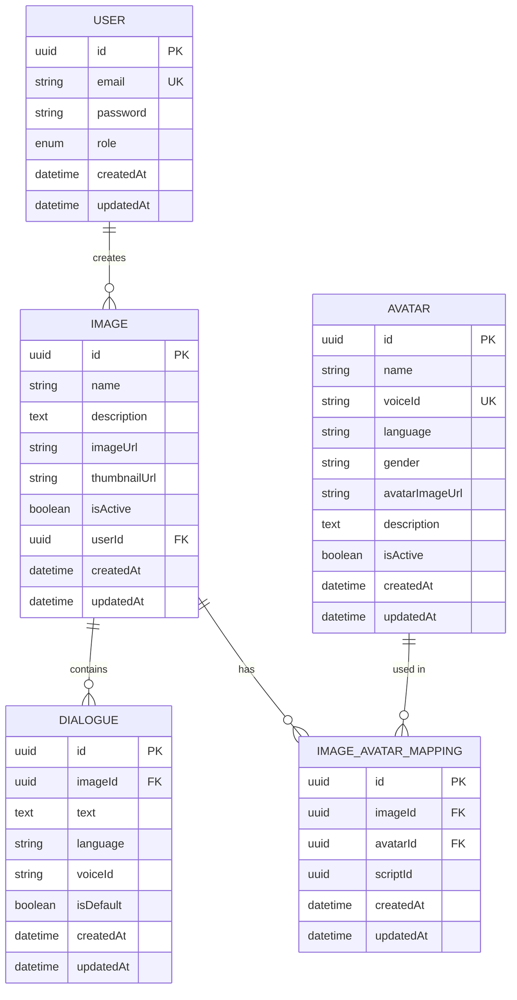
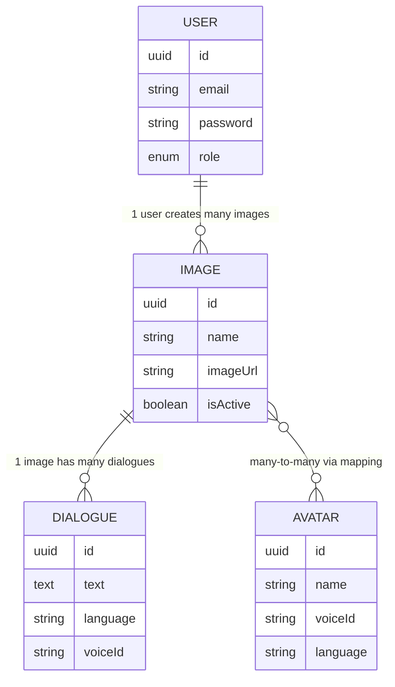

# TalkAR - Simple ER Diagram (Database Schema)

## Entity-Relationship Diagram - Complete Database



---

## Simplified ER Diagram (Key Relationships Only)



---

## Entity Descriptions

### 👤 **USER**
**Purpose**: Stores admin user accounts for authentication and access control

| Attribute | Type | Description | Constraints |
|-----------|------|-------------|-------------|
| `id` | UUID | Primary Key | PK, Auto-generated |
| `email` | String | User email address | UK (Unique), Required |
| `password` | String | Hashed password (bcrypt) | Required |
| `role` | Enum | User role (admin/user) | Default: 'user' |
| `createdAt` | DateTime | Account creation timestamp | Auto-generated |
| `updatedAt` | DateTime | Last update timestamp | Auto-updated |

**Relationships**:
- One User **creates** many Images (1:M)

---

### 🖼️ **IMAGE**
**Purpose**: Stores target images that users scan with AR

| Attribute | Type | Description | Constraints |
|-----------|------|-------------|-------------|
| `id` | UUID | Primary Key | PK, Auto-generated |
| `name` | String | Image display name | Required |
| `description` | Text | Image description | Optional |
| `imageUrl` | String | AWS S3 full image URL | Required |
| `thumbnailUrl` | String | AWS S3 thumbnail URL | Auto-generated |
| `isActive` | Boolean | Active status for AR | Default: true |
| `userId` | UUID | Foreign Key to User | FK, Required |
| `createdAt` | DateTime | Creation timestamp | Auto-generated |
| `updatedAt` | DateTime | Last update timestamp | Auto-updated |

**Relationships**:
- One Image **belongs to** one User (M:1)
- One Image **contains** many Dialogues (1:M)
- One Image **maps to** many Avatars via Mapping (M:N)

---

### 💬 **DIALOGUE**
**Purpose**: Stores scripts/dialogues associated with images in multiple languages

| Attribute | Type | Description | Constraints |
|-----------|------|-------------|-------------|
| `id` | UUID | Primary Key | PK, Auto-generated |
| `imageId` | UUID | Foreign Key to Image | FK, Required |
| `text` | Text | Script/dialogue content | Required |
| `language` | String | Language code (en, es, fr) | Required |
| `voiceId` | String | Voice ID for TTS | Required |
| `isDefault` | Boolean | Default dialogue flag | Default: false |
| `createdAt` | DateTime | Creation timestamp | Auto-generated |
| `updatedAt` | DateTime | Last update timestamp | Auto-updated |

**Relationships**:
- One Dialogue **belongs to** one Image (M:1)

---

### 🎭 **AVATAR**
**Purpose**: Stores avatar configurations with voice settings

| Attribute | Type | Description | Constraints |
|-----------|------|-------------|-------------|
| `id` | UUID | Primary Key | PK, Auto-generated |
| `name` | String | Avatar display name | Required |
| `voiceId` | String | Unique voice identifier | UK (Unique), Required |
| `language` | String | Avatar language | Required |
| `gender` | String | Avatar gender (male/female) | Required |
| `avatarImageUrl` | String | Avatar preview image URL | Optional |
| `description` | Text | Avatar description | Optional |
| `isActive` | Boolean | Active status | Default: true |
| `createdAt` | DateTime | Creation timestamp | Auto-generated |
| `updatedAt` | DateTime | Last update timestamp | Auto-updated |

**Relationships**:
- One Avatar **is used in** many Image Mappings (1:M)

---

### 🔗 **IMAGE_AVATAR_MAPPING**
**Purpose**: Junction table for many-to-many relationship between Images and Avatars

| Attribute | Type | Description | Constraints |
|-----------|------|-------------|-------------|
| `id` | UUID | Primary Key | PK, Auto-generated |
| `imageId` | UUID | Foreign Key to Image | FK, Required |
| `avatarId` | UUID | Foreign Key to Avatar | FK, Required |
| `scriptId` | UUID | Associated script/dialogue ID | Optional |
| `createdAt` | DateTime | Creation timestamp | Auto-generated |
| `updatedAt` | DateTime | Last update timestamp | Auto-updated |

**Relationships**:
- One Mapping **belongs to** one Image (M:1)
- One Mapping **belongs to** one Avatar (M:1)

---

## Relationship Cardinalities

### Relationship Matrix

| From Entity | Relationship | To Entity | Cardinality | Description |
|-------------|--------------|-----------|-------------|-------------|
| USER | creates | IMAGE | 1:M | One user creates many images |
| IMAGE | contains | DIALOGUE | 1:M | One image has many dialogues |
| IMAGE | maps_to | AVATAR | M:N | Many images map to many avatars |
| AVATAR | used_in | IMAGE | M:N | Many avatars used in many images |

### Cardinality Symbols Explained

| Symbol | Meaning | Example |
|--------|---------|---------|
| `||` | **Exactly one** | One user |
| `|o` | **Zero or one** | Optional relationship |
| `}o` | **Zero or more** | Optional multiple |
| `}|` | **One or more** | Required multiple |

**Examples from our diagram**:
- `USER ||--o{ IMAGE` = One User creates zero or many Images
- `IMAGE ||--o{ DIALOGUE` = One Image contains zero or many Dialogues
- `IMAGE }o--o{ AVATAR` = Many Images map to many Avatars (M:N)

---

## Database Constraints

### Primary Keys (PK)
All tables use **UUID** as primary key for:
- Global uniqueness
- Security (non-sequential)
- Distributed system compatibility

### Foreign Keys (FK)
- `IMAGE.userId` → `USER.id`
- `DIALOGUE.imageId` → `IMAGE.id`
- `IMAGE_AVATAR_MAPPING.imageId` → `IMAGE.id`
- `IMAGE_AVATAR_MAPPING.avatarId` → `AVATAR.id`

### Unique Keys (UK)
- `USER.email` - Each email must be unique
- `AVATAR.voiceId` - Each voice ID must be unique

### Indexes (for Performance)
```sql
-- Recommended indexes
CREATE INDEX idx_image_userId ON IMAGE(userId);
CREATE INDEX idx_dialogue_imageId ON DIALOGUE(imageId);
CREATE INDEX idx_mapping_imageId ON IMAGE_AVATAR_MAPPING(imageId);
CREATE INDEX idx_mapping_avatarId ON IMAGE_AVATAR_MAPPING(avatarId);
CREATE INDEX idx_user_email ON USER(email);
```

---

## Sample Data Flow

### 1. Admin Creates Image with Dialogue

```sql
-- Step 1: User exists
INSERT INTO USER (id, email, password, role)
VALUES ('user-uuid-1', 'admin@talkar.com', 'hashed_pwd', 'admin');

-- Step 2: Upload image
INSERT INTO IMAGE (id, name, imageUrl, userId, isActive)
VALUES ('img-uuid-1', 'Product Poster', 's3://bucket/image1.jpg', 'user-uuid-1', true);

-- Step 3: Add dialogue
INSERT INTO DIALOGUE (id, imageId, text, language, voiceId, isDefault)
VALUES ('dlg-uuid-1', 'img-uuid-1', 'Welcome to our store!', 'en', 'voice_001', true);

-- Step 4: Map avatar
INSERT INTO AVATAR (id, name, voiceId, language)
VALUES ('avt-uuid-1', 'Emma', 'voice_001', 'en');

INSERT INTO IMAGE_AVATAR_MAPPING (id, imageId, avatarId)
VALUES ('map-uuid-1', 'img-uuid-1', 'avt-uuid-1');
```

### 2. Mobile App Retrieves Data

```sql
-- Get image with all dialogues and avatars
SELECT 
    i.*,
    d.text, d.language, d.voiceId,
    a.name as avatarName, a.avatarImageUrl
FROM IMAGE i
LEFT JOIN DIALOGUE d ON i.id = d.imageId
LEFT JOIN IMAGE_AVATAR_MAPPING m ON i.id = m.imageId
LEFT JOIN AVATAR a ON m.avatarId = a.id
WHERE i.id = 'img-uuid-1' AND i.isActive = true;
```

---

## Database Schema SQL (PostgreSQL)

```sql
-- Users table
CREATE TABLE users (
    id UUID PRIMARY KEY DEFAULT gen_random_uuid(),
    email VARCHAR(255) UNIQUE NOT NULL,
    password VARCHAR(255) NOT NULL,
    role VARCHAR(50) DEFAULT 'user',
    created_at TIMESTAMP DEFAULT NOW(),
    updated_at TIMESTAMP DEFAULT NOW()
);

-- Images table
CREATE TABLE images (
    id UUID PRIMARY KEY DEFAULT gen_random_uuid(),
    name VARCHAR(255) NOT NULL,
    description TEXT,
    image_url VARCHAR(500) NOT NULL,
    thumbnail_url VARCHAR(500),
    is_active BOOLEAN DEFAULT true,
    user_id UUID REFERENCES users(id) ON DELETE CASCADE,
    created_at TIMESTAMP DEFAULT NOW(),
    updated_at TIMESTAMP DEFAULT NOW()
);

-- Dialogues table
CREATE TABLE dialogues (
    id UUID PRIMARY KEY DEFAULT gen_random_uuid(),
    image_id UUID REFERENCES images(id) ON DELETE CASCADE,
    text TEXT NOT NULL,
    language VARCHAR(10) NOT NULL,
    voice_id VARCHAR(100) NOT NULL,
    is_default BOOLEAN DEFAULT false,
    created_at TIMESTAMP DEFAULT NOW(),
    updated_at TIMESTAMP DEFAULT NOW()
);

-- Avatars table
CREATE TABLE avatars (
    id UUID PRIMARY KEY DEFAULT gen_random_uuid(),
    name VARCHAR(255) NOT NULL,
    voice_id VARCHAR(100) UNIQUE NOT NULL,
    language VARCHAR(10) NOT NULL,
    gender VARCHAR(20),
    avatar_image_url VARCHAR(500),
    description TEXT,
    is_active BOOLEAN DEFAULT true,
    created_at TIMESTAMP DEFAULT NOW(),
    updated_at TIMESTAMP DEFAULT NOW()
);

-- Image-Avatar mapping table
CREATE TABLE image_avatar_mappings (
    id UUID PRIMARY KEY DEFAULT gen_random_uuid(),
    image_id UUID REFERENCES images(id) ON DELETE CASCADE,
    avatar_id UUID REFERENCES avatars(id) ON DELETE CASCADE,
    script_id UUID,
    created_at TIMESTAMP DEFAULT NOW(),
    updated_at TIMESTAMP DEFAULT NOW(),
    UNIQUE(image_id, avatar_id)
);
```

---

## Quick Stats

| Metric | Value |
|--------|-------|
| **Total Entities** | 5 tables |
| **Total Relationships** | 4 relationships |
| **Primary Keys** | 5 (all UUID) |
| **Foreign Keys** | 4 |
| **Unique Constraints** | 2 (email, voiceId) |
| **Many-to-Many** | 1 (Image ↔ Avatar) |
| **One-to-Many** | 3 (User→Image, Image→Dialogue, etc.) |

---

## How to Use This Diagram

### 🚀 Quick View (30 seconds):
1. **Visit**: https://mermaid.live
2. **Copy**: First diagram code (lines 5-55)
3. **Paste**: Into the editor
4. **View**: Your ER diagram!
5. **Export**: PNG/SVG for documentation

### 📂 Add to GitHub:
```bash
git add ER_DIAGRAM.md
git commit -m "Add database ER diagram"
git push
# Auto-renders on GitHub!
```

### 💻 View in VS Code:
1. Open `ER_DIAGRAM.md`
2. Press `Ctrl+Shift+V` (preview)
3. See rendered ER diagram

---

## Database Design Principles Used

✅ **Normalization** - 3NF (Third Normal Form)
- No redundant data
- Each table has single purpose
- Proper use of foreign keys

✅ **Scalability**
- UUID primary keys for distributed systems
- Indexed foreign keys for performance
- Soft deletes via isActive flags

✅ **Data Integrity**
- Foreign key constraints
- Unique constraints on critical fields
- ON DELETE CASCADE for cleanup

✅ **Flexibility**
- Many-to-many relationships via junction table
- Multi-language support in Dialogue
- Extensible avatar system

---

**Perfect for**: Database documentation, developer onboarding, system design reviews, and technical specifications! 📊

**Created**: October 8, 2025  
**Database**: PostgreSQL  
**ORM**: Sequelize (Node.js)
