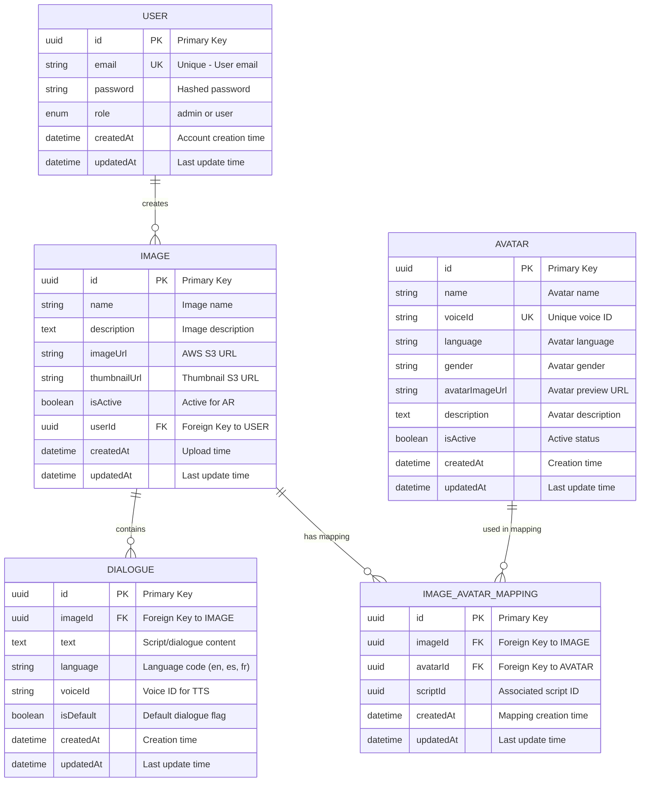
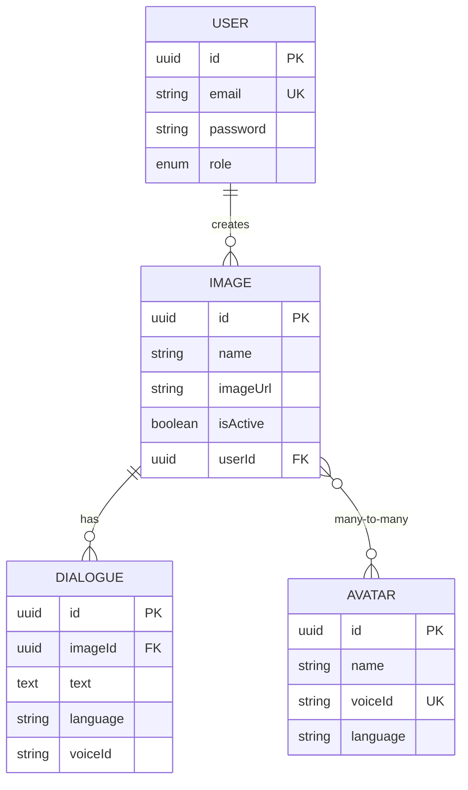

# TalkAR - ER Diagram (UML)

## Complete Entity-Relationship Diagram



---

## Simplified ER Diagram (Core Entities Only)



---

## Entity Descriptions

### 👤 USER
**Purpose**: Stores admin user accounts

| Attribute | Type | Key | Description |
|-----------|------|-----|-------------|
| `id` | UUID | PK | Unique identifier |
| `email` | String | UK | User email (unique) |
| `password` | String | - | Hashed password (bcrypt) |
| `role` | Enum | - | admin or user |
| `createdAt` | DateTime | - | Account creation timestamp |
| `updatedAt` | DateTime | - | Last modification timestamp |

**Relationships**:
- One USER creates many IMAGES (1:M)

---

### 🖼️ IMAGE
**Purpose**: Stores AR target images

| Attribute | Type | Key | Description |
|-----------|------|-----|-------------|
| `id` | UUID | PK | Unique identifier |
| `name` | String | - | Display name |
| `description` | Text | - | Image description |
| `imageUrl` | String | - | AWS S3 full image URL |
| `thumbnailUrl` | String | - | AWS S3 thumbnail URL |
| `isActive` | Boolean | - | Active for AR scanning |
| `userId` | UUID | FK | Creator (links to USER) |
| `createdAt` | DateTime | - | Upload timestamp |
| `updatedAt` | DateTime | - | Last modification |

**Relationships**:
- One IMAGE belongs to one USER (M:1)
- One IMAGE has many DIALOGUES (1:M)
- Many IMAGES map to many AVATARS (M:N)

---

### 💬 DIALOGUE
**Purpose**: Stores scripts and dialogues

| Attribute | Type | Key | Description |
|-----------|------|-----|-------------|
| `id` | UUID | PK | Unique identifier |
| `imageId` | UUID | FK | Parent image (links to IMAGE) |
| `text` | Text | - | Script/dialogue content |
| `language` | String | - | Language code (en, es, fr, etc.) |
| `voiceId` | String | - | Voice ID for text-to-speech |
| `isDefault` | Boolean | - | Default dialogue for image |
| `createdAt` | DateTime | - | Creation timestamp |
| `updatedAt` | DateTime | - | Last modification |

**Relationships**:
- One DIALOGUE belongs to one IMAGE (M:1)

---

### 🎭 AVATAR
**Purpose**: Stores avatar configurations

| Attribute | Type | Key | Description |
|-----------|------|-----|-------------|
| `id` | UUID | PK | Unique identifier |
| `name` | String | - | Avatar display name |
| `voiceId` | String | UK | Unique voice identifier |
| `language` | String | - | Avatar language |
| `gender` | String | - | Avatar gender (male/female) |
| `avatarImageUrl` | String | - | Preview image URL |
| `description` | Text | - | Avatar description |
| `isActive` | Boolean | - | Active status |
| `createdAt` | DateTime | - | Creation timestamp |
| `updatedAt` | DateTime | - | Last modification |

**Relationships**:
- Many AVATARS map to many IMAGES (M:N)

---

### 🔗 IMAGE_AVATAR_MAPPING
**Purpose**: Junction table for Image-Avatar relationship

| Attribute | Type | Key | Description |
|-----------|------|-----|-------------|
| `id` | UUID | PK | Unique identifier |
| `imageId` | UUID | FK | Image reference (links to IMAGE) |
| `avatarId` | UUID | FK | Avatar reference (links to AVATAR) |
| `scriptId` | UUID | - | Associated script/dialogue |
| `createdAt` | DateTime | - | Mapping creation time |
| `updatedAt` | DateTime | - | Last modification |

**Relationships**:
- Many mappings link IMAGES to AVATARS (M:N junction)

---

## Relationship Cardinalities

### Cardinality Notation

| Symbol | Meaning | Example |
|--------|---------|---------|
| `\|\|` | Exactly one | One side must exist |
| `\|o` | Zero or one | Optional single |
| `}o` | Zero or many | Optional multiple |
| `}\|` | One or many | Required multiple |

### Relationship Details

#### 1. USER → IMAGE (One-to-Many)
```
USER ||--o{ IMAGE
```
- **Cardinality**: 1:M
- **Meaning**: One user can create many images
- **Business Rule**: Each image must have exactly one creator

#### 2. IMAGE → DIALOGUE (One-to-Many)
```
IMAGE ||--o{ DIALOGUE
```
- **Cardinality**: 1:M
- **Meaning**: One image can have many dialogues (different languages)
- **Business Rule**: Each dialogue belongs to exactly one image

#### 3. IMAGE ↔ AVATAR (Many-to-Many)
```
IMAGE }o--o{ AVATAR
```
- **Cardinality**: M:N
- **Meaning**: Many images can use many avatars
- **Implementation**: Through IMAGE_AVATAR_MAPPING junction table
- **Business Rule**: Flexible avatar-image associations

---

## Database Schema (PostgreSQL)

### Create Tables

```sql
-- Users table
CREATE TABLE users (
    id UUID PRIMARY KEY DEFAULT gen_random_uuid(),
    email VARCHAR(255) UNIQUE NOT NULL,
    password VARCHAR(255) NOT NULL,
    role VARCHAR(50) DEFAULT 'user',
    created_at TIMESTAMP DEFAULT NOW(),
    updated_at TIMESTAMP DEFAULT NOW()
);

-- Images table
CREATE TABLE images (
    id UUID PRIMARY KEY DEFAULT gen_random_uuid(),
    name VARCHAR(255) NOT NULL,
    description TEXT,
    image_url VARCHAR(500) NOT NULL,
    thumbnail_url VARCHAR(500),
    is_active BOOLEAN DEFAULT true,
    user_id UUID NOT NULL,
    created_at TIMESTAMP DEFAULT NOW(),
    updated_at TIMESTAMP DEFAULT NOW(),
    FOREIGN KEY (user_id) REFERENCES users(id) ON DELETE CASCADE
);

-- Dialogues table
CREATE TABLE dialogues (
    id UUID PRIMARY KEY DEFAULT gen_random_uuid(),
    image_id UUID NOT NULL,
    text TEXT NOT NULL,
    language VARCHAR(10) NOT NULL,
    voice_id VARCHAR(100) NOT NULL,
    is_default BOOLEAN DEFAULT false,
    created_at TIMESTAMP DEFAULT NOW(),
    updated_at TIMESTAMP DEFAULT NOW(),
    FOREIGN KEY (image_id) REFERENCES images(id) ON DELETE CASCADE
);

-- Avatars table
CREATE TABLE avatars (
    id UUID PRIMARY KEY DEFAULT gen_random_uuid(),
    name VARCHAR(255) NOT NULL,
    voice_id VARCHAR(100) UNIQUE NOT NULL,
    language VARCHAR(10) NOT NULL,
    gender VARCHAR(20),
    avatar_image_url VARCHAR(500),
    description TEXT,
    is_active BOOLEAN DEFAULT true,
    created_at TIMESTAMP DEFAULT NOW(),
    updated_at TIMESTAMP DEFAULT NOW()
);

-- Image-Avatar mapping table
CREATE TABLE image_avatar_mappings (
    id UUID PRIMARY KEY DEFAULT gen_random_uuid(),
    image_id UUID NOT NULL,
    avatar_id UUID NOT NULL,
    script_id UUID,
    created_at TIMESTAMP DEFAULT NOW(),
    updated_at TIMESTAMP DEFAULT NOW(),
    FOREIGN KEY (image_id) REFERENCES images(id) ON DELETE CASCADE,
    FOREIGN KEY (avatar_id) REFERENCES avatars(id) ON DELETE CASCADE,
    UNIQUE(image_id, avatar_id)
);
```

### Create Indexes

```sql
-- Performance indexes
CREATE INDEX idx_images_user_id ON images(user_id);
CREATE INDEX idx_images_is_active ON images(is_active);
CREATE INDEX idx_dialogues_image_id ON dialogues(image_id);
CREATE INDEX idx_dialogues_language ON dialogues(language);
CREATE INDEX idx_mappings_image_id ON image_avatar_mappings(image_id);
CREATE INDEX idx_mappings_avatar_id ON image_avatar_mappings(avatar_id);
CREATE INDEX idx_users_email ON users(email);
CREATE INDEX idx_avatars_voice_id ON avatars(voice_id);
```

---

## Sample Queries

### Query 1: Get Image with All Dialogues
```sql
SELECT 
    i.id, i.name, i.image_url,
    d.text, d.language, d.voice_id
FROM images i
LEFT JOIN dialogues d ON i.id = d.image_id
WHERE i.id = 'some-uuid'
  AND i.is_active = true;
```

### Query 2: Get Image with Avatars
```sql
SELECT 
    i.id, i.name,
    a.name as avatar_name, a.voice_id
FROM images i
LEFT JOIN image_avatar_mappings m ON i.id = m.image_id
LEFT JOIN avatars a ON m.avatar_id = a.id
WHERE i.id = 'some-uuid';
```

### Query 3: Get All Images by User
```sql
SELECT 
    i.*,
    COUNT(d.id) as dialogue_count
FROM images i
LEFT JOIN dialogues d ON i.id = d.image_id
WHERE i.user_id = 'user-uuid'
GROUP BY i.id
ORDER BY i.created_at DESC;
```

### Query 4: Get Active Avatars
```sql
SELECT *
FROM avatars
WHERE is_active = true
ORDER BY name;
```

---

## Entity Relationship Summary

### Relationship Matrix

| Entity | Relates To | Relationship | Cardinality |
|--------|-----------|--------------|-------------|
| USER | IMAGE | creates | 1:M |
| IMAGE | DIALOGUE | contains | 1:M |
| IMAGE | AVATAR | uses | M:N |
| IMAGE | IMAGE_AVATAR_MAPPING | has | 1:M |
| AVATAR | IMAGE_AVATAR_MAPPING | used in | 1:M |

### Foreign Key Constraints

| Table | Column | References | On Delete |
|-------|--------|------------|-----------|
| IMAGE | userId | USER.id | CASCADE |
| DIALOGUE | imageId | IMAGE.id | CASCADE |
| IMAGE_AVATAR_MAPPING | imageId | IMAGE.id | CASCADE |
| IMAGE_AVATAR_MAPPING | avatarId | AVATAR.id | CASCADE |

---

## Data Integrity Rules

### Primary Keys
- All tables use **UUID** as primary key
- Generated automatically using `gen_random_uuid()`
- Ensures global uniqueness across distributed systems

### Unique Constraints
- `USER.email` - Each email must be unique
- `AVATAR.voiceId` - Each voice ID must be unique
- `IMAGE_AVATAR_MAPPING(imageId, avatarId)` - Prevent duplicate mappings

### Foreign Key Rules
- **ON DELETE CASCADE** - Child records deleted when parent deleted
- Ensures referential integrity
- Prevents orphaned records

### Default Values
- `isActive` defaults to `true`
- `role` defaults to `'user'`
- `isDefault` defaults to `false`
- Timestamps auto-generated on create/update

---

## Database Normalization

### Normal Forms Achieved

#### ✅ First Normal Form (1NF)
- All attributes contain atomic values
- No repeating groups
- Each column has unique name

#### ✅ Second Normal Form (2NF)
- Meets 1NF requirements
- All non-key attributes fully dependent on primary key
- No partial dependencies

#### ✅ Third Normal Form (3NF)
- Meets 2NF requirements
- No transitive dependencies
- All attributes depend only on primary key

### Benefits
- Minimal data redundancy
- Easy to maintain
- Prevents update anomalies
- Flexible schema for growth

---

## How to Use This Diagram

### 🚀 View in Mermaid Live (30 seconds):
1. **Visit**: https://mermaid.live
2. **Copy**: First diagram code (lines 5-55)
3. **Paste**: Into editor
4. **View**: ER diagram renders!
5. **Export**: PNG/SVG for documentation

### 📂 Add to GitHub:
```bash
git add ER_DIAGRAM_UML.md
git commit -m "Add ER diagram"
git push
# Auto-renders on GitHub!
```

### 💻 VS Code:
1. Install "Markdown Preview Mermaid Support"
2. Open `ER_DIAGRAM_UML.md`
3. Press `Ctrl+Shift+V`
4. See rendered diagram

---

## Quick Reference

### Entity Count: **5 entities**
- USER
- IMAGE
- DIALOGUE
- AVATAR
- IMAGE_AVATAR_MAPPING

### Relationship Count: **4 relationships**
- USER → IMAGE (1:M)
- IMAGE → DIALOGUE (1:M)
- IMAGE → IMAGE_AVATAR_MAPPING (1:M)
- AVATAR → IMAGE_AVATAR_MAPPING (1:M)

### Constraint Count:
- **5 Primary Keys** (all UUID)
- **4 Foreign Keys**
- **2 Unique Constraints**
- **3 Default Values**

---

**Perfect for**: Database design documentation, developer onboarding, schema reference!

**Created**: October 8, 2025  
**Database**: PostgreSQL  
**Standard**: UML Entity-Relationship Diagram  
**Format**: Mermaid ERD syntax
