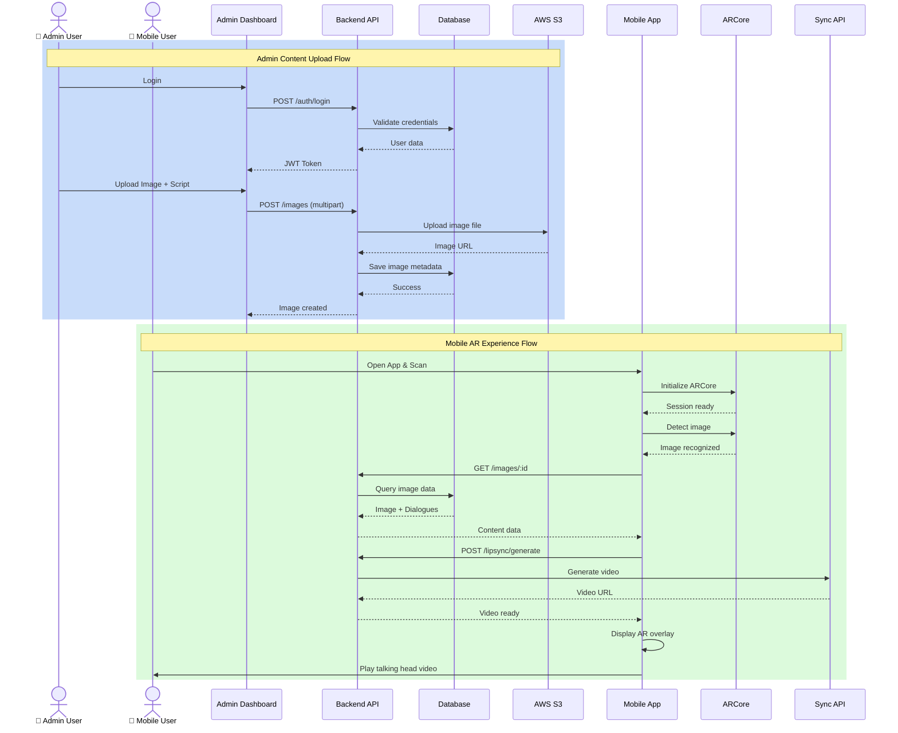
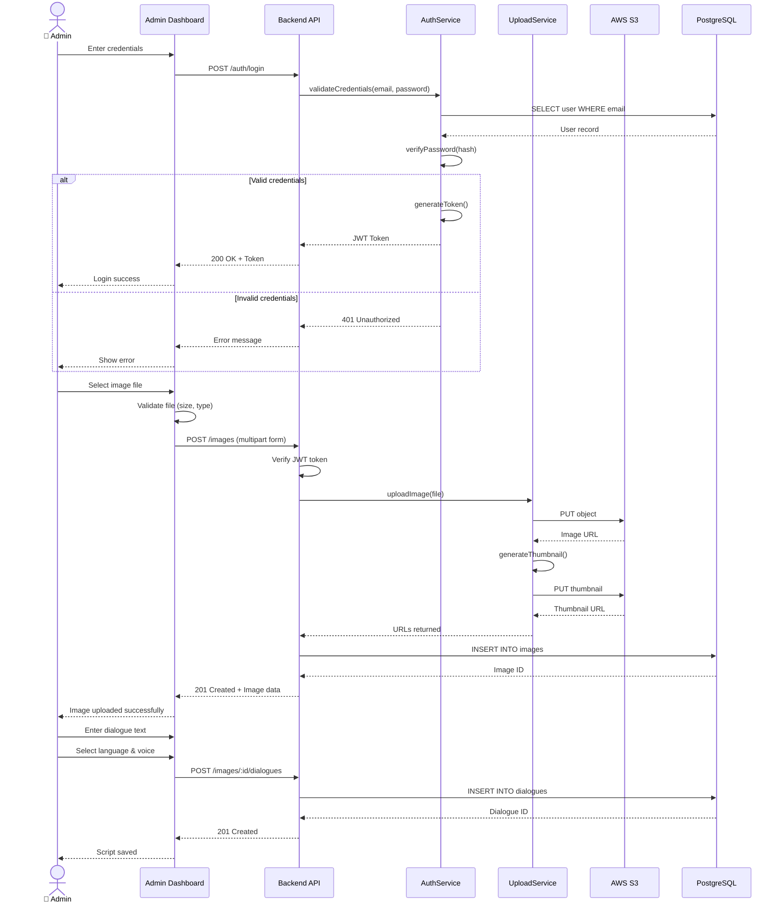
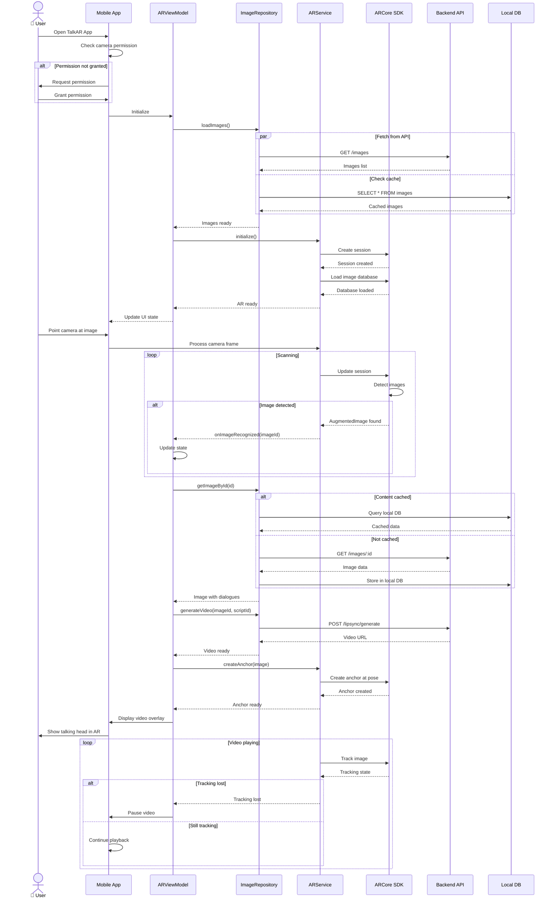
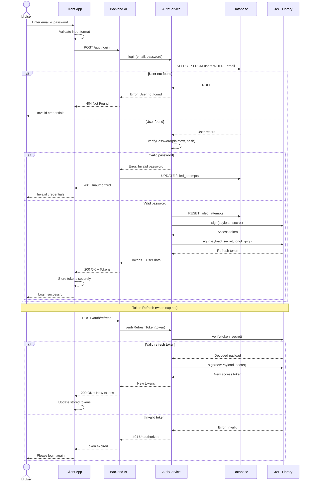
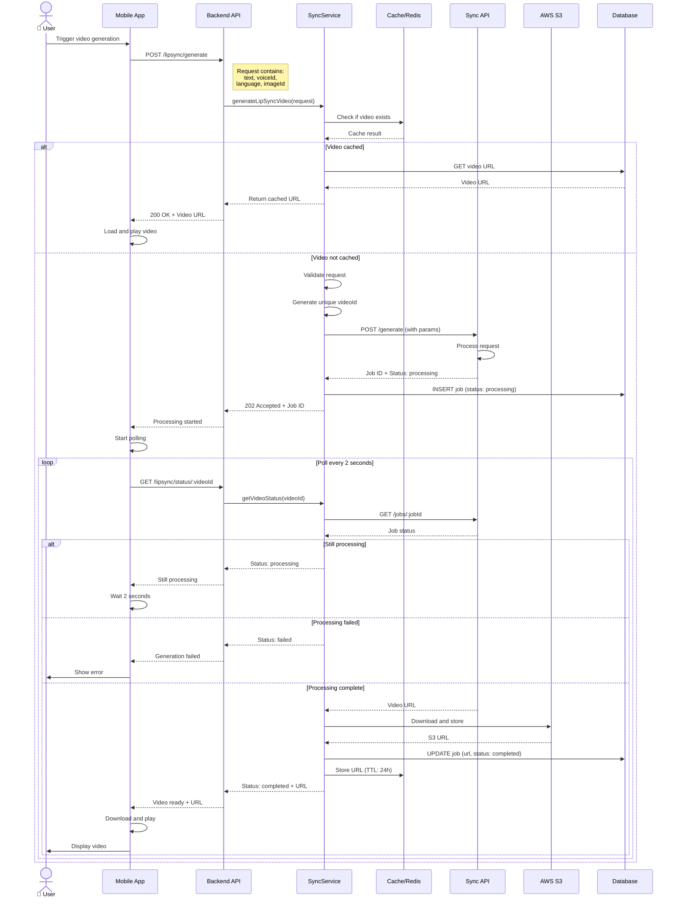
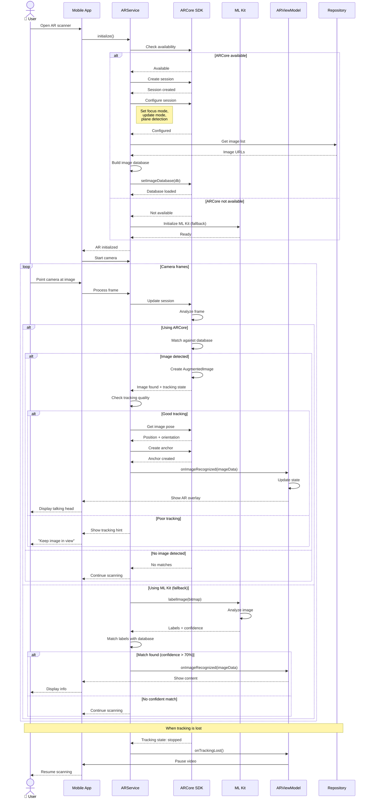
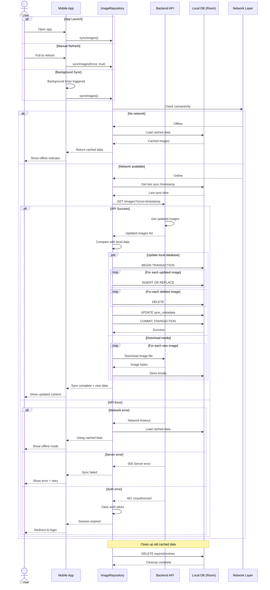

# TalkAR - UML Sequence Diagrams

## Table of Contents
1. [Main System Sequence Diagram](#1-main-system-sequence-diagram)
2. [Admin Upload Content Flow](#2-admin-upload-content-flow)
3. [Mobile AR Experience Flow](#3-mobile-ar-experience-flow)
4. [User Authentication Flow](#4-user-authentication-flow)
5. [Video Generation Flow](#5-video-generation-flow)
6. [Image Recognition Flow](#6-image-recognition-flow)
7. [Content Sync Flow](#7-content-sync-flow)

---

## 1. Main System Sequence Diagram

**Purpose**: Overall system interaction overview



**Description**: This diagram shows the complete flow from admin uploading content to mobile users experiencing AR.

---

## 2. Admin Upload Content Flow

**Purpose**: Detailed admin content creation process



**Key Interactions**:
- Admin authentication with JWT
- Image upload to AWS S3
- Thumbnail generation
- Database persistence
- Script/dialogue creation

---

## 3. Mobile AR Experience Flow

**Purpose**: Complete mobile user AR journey



**Key Interactions**:
- Permission handling
- ARCore initialization
- Image detection and tracking
- Content caching strategy
- Video overlay in AR space

---

## 4. User Authentication Flow

**Purpose**: Login and token management



**Key Interactions**:
- Email/password validation
- Password hash verification (bcrypt)
- JWT token generation
- Refresh token mechanism
- Failed attempt tracking

---

## 5. Video Generation Flow

**Purpose**: Lip-sync video generation process



**Key Interactions**:
- Cache checking for performance
- Async video generation
- Job status polling
- S3 storage for videos
- Error handling with retries

---

## 6. Image Recognition Flow

**Purpose**: AR image detection and tracking



**Key Interactions**:
- ARCore initialization with fallback
- Image database loading
- Frame-by-frame processing
- Tracking quality assessment
- Anchor creation for AR overlay
- ML Kit fallback mechanism

---

## 7. Content Sync Flow

**Purpose**: Mobile app data synchronization



**Key Interactions**:
- Multiple sync triggers (launch, manual, background)
- Network connectivity check
- Incremental sync with timestamps
- Database transactions for consistency
- Media file downloads
- Error handling for offline scenarios

---

## Sequence Diagram Summary

| # | Diagram | Participants | Key Flow |
|---|---------|--------------|----------|
| 1 | **Main System** | 8 | Admin uploads → User AR experience |
| 2 | **Admin Upload** | 6 | Login → Upload → Store → Save |
| 3 | **Mobile AR** | 7 | Initialize → Scan → Detect → Display |
| 4 | **Authentication** | 5 | Login → Validate → Generate tokens |
| 5 | **Video Generation** | 7 | Request → Generate → Poll → Complete |
| 6 | **Image Recognition** | 6 | Initialize → Scan → Detect → Track |
| 7 | **Content Sync** | 5 | Trigger → Fetch → Update → Complete |

---

## Key Patterns Used

### 1. **Request-Response Pattern**
```
Client → Server: Request
Server → Client: Response
```

### 2. **Async Processing with Polling**
```
Client → Server: Start job
Server → Client: Job ID
loop
    Client → Server: Check status
    Server → Client: Status update
end
```

### 3. **Cache-Aside Pattern**
```
Client → Cache: Check
alt Hit
    Cache → Client: Data
else Miss
    Client → API: Fetch
    Client → Cache: Store
end
```

### 4. **Fallback Pattern**
```
Client → Primary: Try
alt Success
    Primary → Client: Result
else Failure
    Client → Fallback: Try alternative
end
```

---

## How to Use These Diagrams

### 🚀 View in Mermaid Live:
1. **Visit**: https://mermaid.live
2. **Copy**: Any diagram code above
3. **Paste**: Into editor
4. **View**: Sequence diagram renders!
5. **Export**: PNG/SVG for documentation

### 📂 GitHub:
```bash
git add SEQUENCE_DIAGRAMS.md
git commit -m "Add UML sequence diagrams"
git push
# Auto-renders on GitHub!
```

### 💻 VS Code:
1. Install "Markdown Preview Mermaid Support"
2. Open `SEQUENCE_DIAGRAMS.md`
3. Press `Ctrl+Shift+V`
4. View all diagrams

---

## Diagram Notation

### Participants
- **actor**: User or external entity
- **participant**: System component

### Messages
- `→`: Synchronous call
- `-->>`: Return/response
- `->>`: Asynchronous message

### Fragments
- **alt**: Alternative paths (if/else)
- **opt**: Optional execution
- **loop**: Repeated execution
- **par**: Parallel execution
- **rect**: Grouping for context

---

**Perfect for**: Understanding system interactions, API documentation, developer onboarding!

**Created**: October 8, 2025  
**Standard**: UML 2.0 Sequence Diagrams  
**Format**: Mermaid sequenceDiagram syntax
