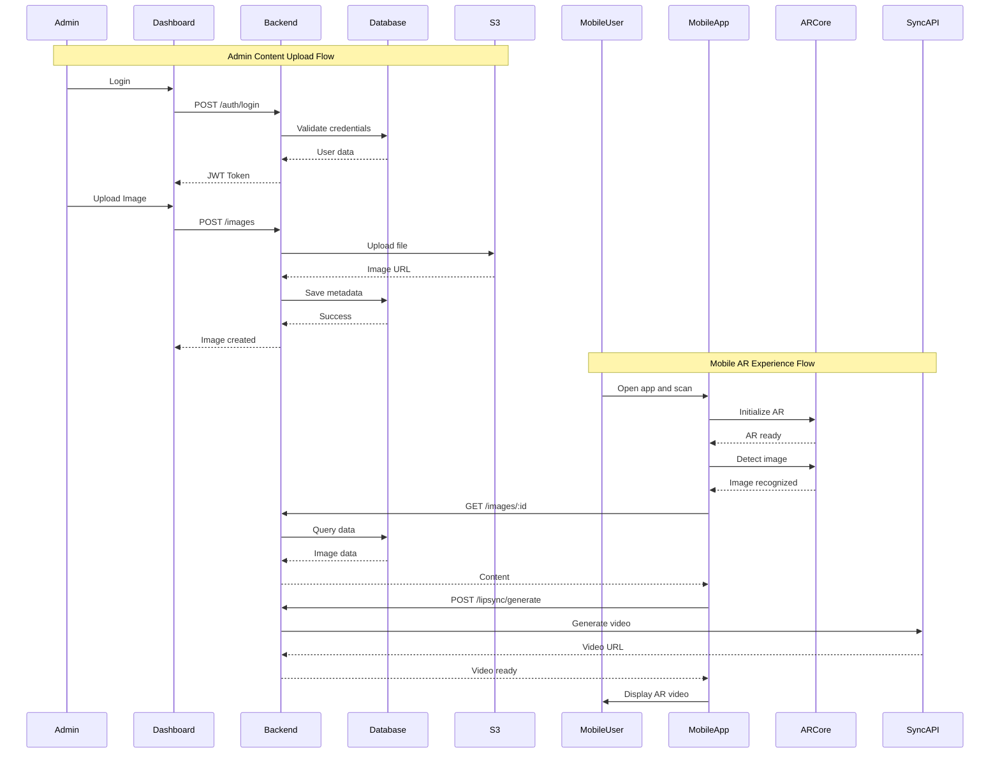
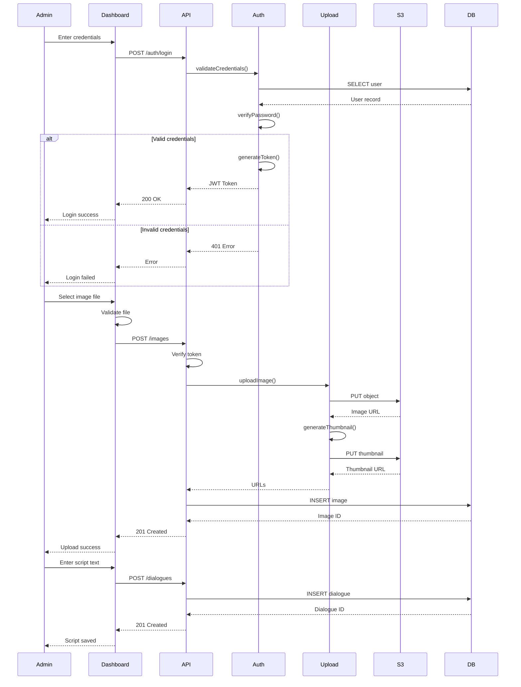
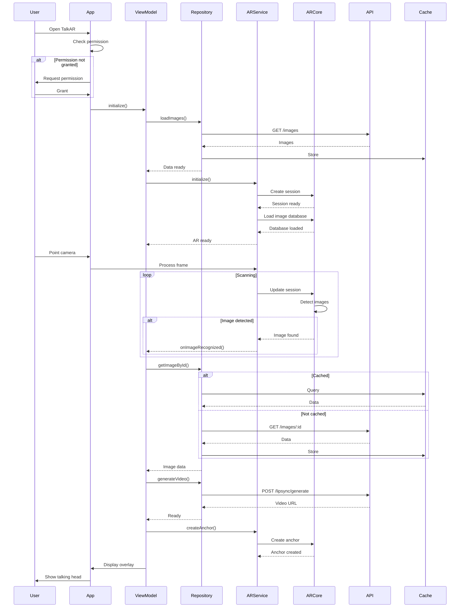
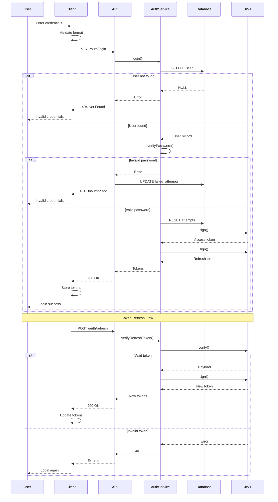
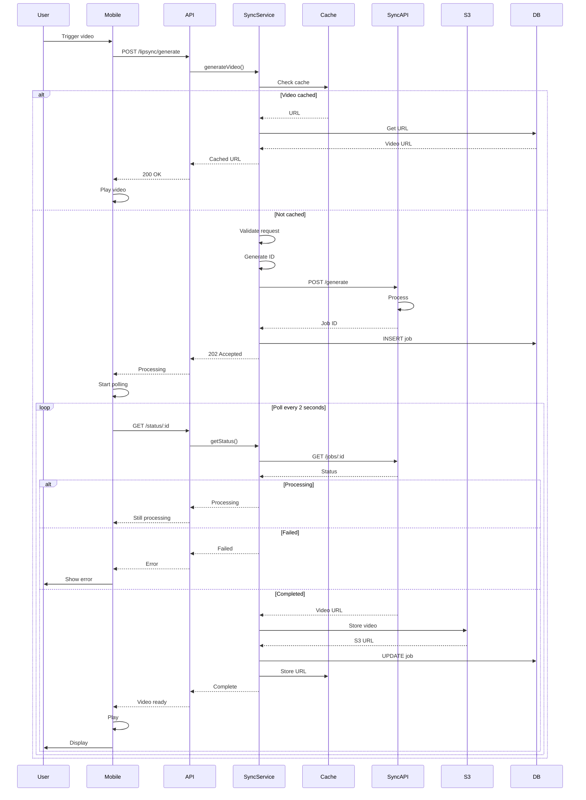
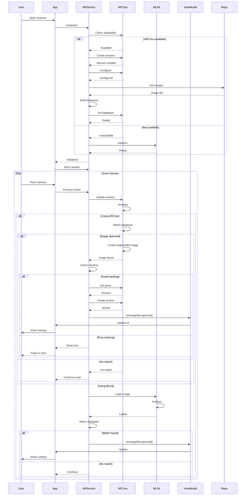
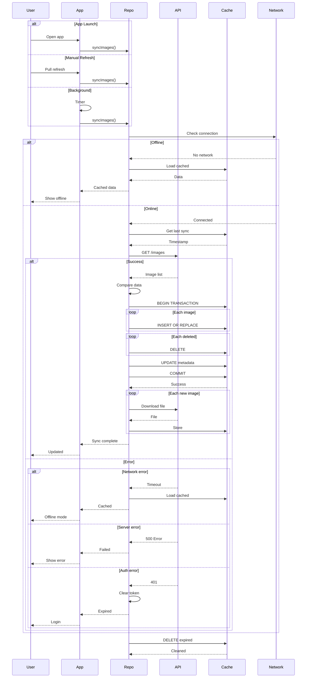

# TalkAR - UML Sequence Diagrams (Fixed)

## Table of Contents
1. [Main System Sequence Diagram](#1-main-system-sequence-diagram)
2. [Admin Upload Content Flow](#2-admin-upload-content-flow)
3. [Mobile AR Experience Flow](#3-mobile-ar-experience-flow)
4. [User Authentication Flow](#4-user-authentication-flow)
5. [Video Generation Flow](#5-video-generation-flow)
6. [Image Recognition Flow](#6-image-recognition-flow)
7. [Content Sync Flow](#7-content-sync-flow)

---

## 1. Main System Sequence Diagram

**Purpose**: Overall system interaction overview



---

## 2. Admin Upload Content Flow

**Purpose**: Detailed admin content creation process



---

## 3. Mobile AR Experience Flow

**Purpose**: Complete mobile user AR journey



---

## 4. User Authentication Flow

**Purpose**: Login and token management



---

## 5. Video Generation Flow

**Purpose**: Lip-sync video generation process



---

## 6. Image Recognition Flow

**Purpose**: AR image detection and tracking



---

## 7. Content Sync Flow

**Purpose**: Mobile app data synchronization



---

## Sequence Diagram Summary

| # | Diagram | Participants | Purpose |
|---|---------|--------------|---------|
| 1 | Main System | 9 | Overall system flow |
| 2 | Admin Upload | 7 | Content creation |
| 3 | Mobile AR | 8 | AR experience |
| 4 | Authentication | 6 | Login & tokens |
| 5 | Video Generation | 8 | Async video processing |
| 6 | Image Recognition | 7 | AR detection |
| 7 | Content Sync | 6 | Data synchronization |

---

## Key Patterns

### Request-Response
```
Client->>Server: Request
Server-->>Client: Response
```

### Async with Polling
```
Client->>Server: Start job
Server-->>Client: Job ID
loop
    Client->>Server: Check status
    Server-->>Client: Status
end
```

### Cache Pattern
```
Client->>Cache: Check
alt Hit
    Cache-->>Client: Data
else Miss
    Client->>API: Fetch
    Client->>Cache: Store
end
```

---

## How to Use

### 🚀 Mermaid Live (30 seconds):
1. Visit: **https://mermaid.live**
2. Copy any diagram above
3. Paste in editor
4. Export as PNG/SVG

### 📂 GitHub:
```bash
git add SEQUENCE_DIAGRAMS_FIXED.md
git commit -m "Add fixed sequence diagrams"
git push
```

### 💻 VS Code:
1. Install "Markdown Preview Mermaid Support"
2. Open file
3. Press `Ctrl+Shift+V`

---

## Message Types

| Symbol | Meaning |
|--------|---------|
| `->>` | Synchronous call |
| `-->>` | Return/response |
| `->>+` | Call with activation |
| `-->>-` | Return with deactivation |

---

## Fragment Types

| Fragment | Purpose |
|----------|---------|
| `alt/else` | Conditional |
| `opt` | Optional |
| `loop` | Repetition |
| `par` | Parallel |

---

**Created**: October 8, 2025  
**Format**: UML Sequence Diagrams (Mermaid)  
**Status**: Syntax Fixed ✅
