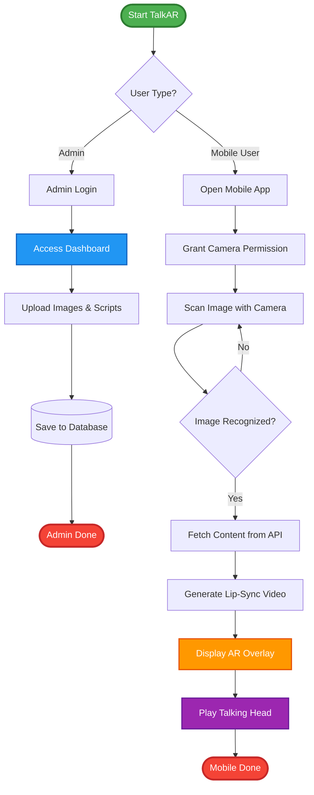
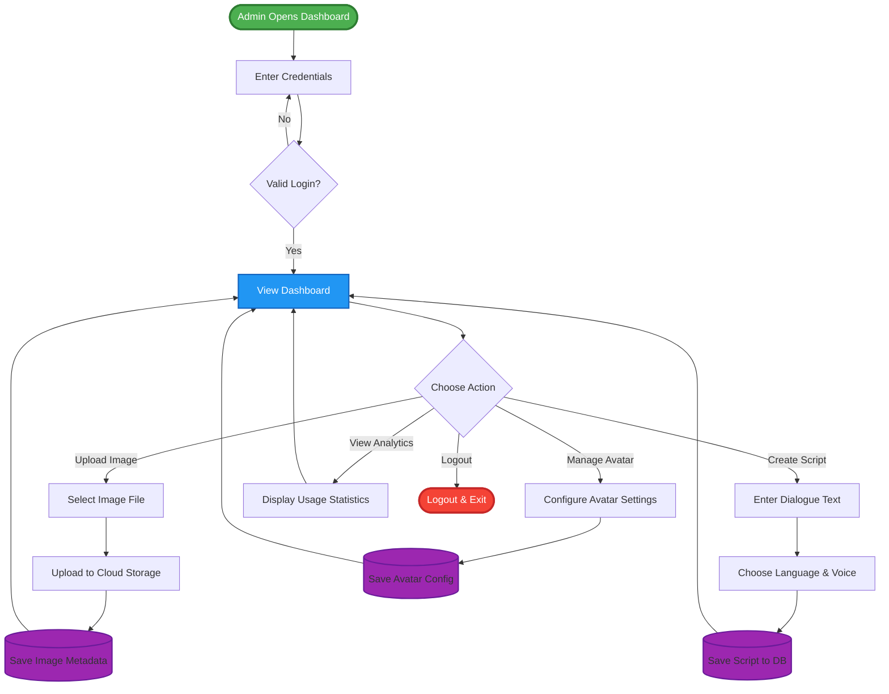
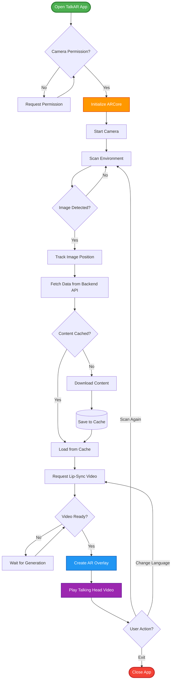
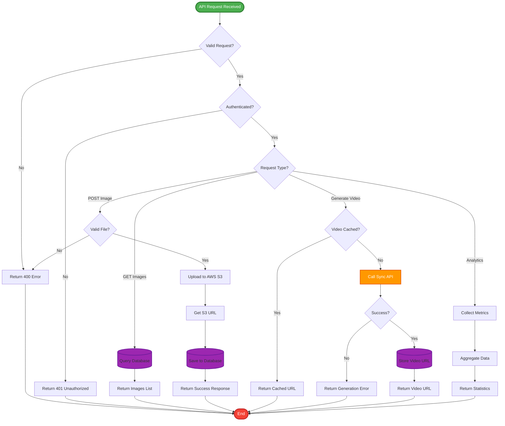

# TalkAR - Simple Activity Diagrams

## Table of Contents
1. [Main Activity Diagram (Overall System)](#main-activity-diagram-overall-system)
2. [Module 1: Admin Dashboard](#module-1-admin-dashboard)
3. [Module 2: Mobile AR App](#module-2-mobile-ar-app)
4. [Module 3: Backend API](#module-3-backend-api)

---

## Main Activity Diagram (Overall System)

**Purpose**: High-level overview of the entire TalkAR system



**Description**: This is the main flow showing how admins create content and mobile users experience AR.

---

## Module 1: Admin Dashboard

**Purpose**: Admin content management workflow



**Key Activities**:
- Login authentication
- Upload images to cloud
- Create scripts/dialogues
- Configure avatars
- View analytics

---

## Module 2: Mobile AR App

**Purpose**: Mobile user AR experience workflow



**Key Activities**:
- Permission handling
- ARCore initialization
- Image scanning & detection
- Content caching
- Video generation
- AR overlay display

---

## Module 3: Backend API

**Purpose**: Backend processing workflow



**Key Activities**:
- Request validation
- Authentication check
- Database operations
- File upload to S3
- Video generation via Sync API
- Analytics processing

---

## Diagram Summary

### Overview

| Diagram | Purpose | Key Steps |
|---------|---------|-----------|
| **Main Activity** | Overall system flow | Admin uploads → User scans → AR displays |
| **Admin Dashboard** | Content management | Login → Upload → Create → Configure |
| **Mobile AR App** | User experience | Scan → Detect → Fetch → Display |
| **Backend API** | Server processing | Validate → Process → Store → Return |

---

## Activity Flow Summary

### 1. Main System Flow
```
Admin: Login → Upload Content → Save
Mobile: Open App → Scan → Recognize → Play Video
```

### 2. Admin Module Flow
```
Login → Dashboard → Action (Upload/Script/Avatar/Analytics) → Save → Dashboard
```

### 3. Mobile Module Flow
```
Permissions → Initialize AR → Scan → Detect → Fetch → Generate Video → Display AR
```

### 4. Backend Module Flow
```
Receive Request → Validate → Authenticate → Route → Process → Return Response
```

---

## Simple Workflow Descriptions

### Admin Workflow
1. **Login** to dashboard
2. **Choose** action (upload/create/manage)
3. **Perform** action
4. **Save** to database
5. **Continue** or logout

### Mobile User Workflow
1. **Open** app
2. **Grant** camera permission
3. **Scan** environment
4. **Recognize** image
5. **Fetch** content
6. **Display** AR video
7. **Watch** talking head

### Backend Workflow
1. **Receive** API request
2. **Validate** request data
3. **Authenticate** user
4. **Process** request
5. **Return** response

---

## How to Use These Diagrams

### 🚀 Quick View (30 seconds):
1. **Visit**: https://mermaid.live
2. **Copy** any diagram code above
3. **Paste** into editor
4. **View** rendered diagram
5. **Export** as PNG/SVG

### 📂 Add to GitHub:
```bash
git add SIMPLE_ACTIVITY_DIAGRAMS.md
git commit -m "Add simple activity diagrams"
git push
# Auto-renders on GitHub!
```

### 💻 View in VS Code:
1. Install "Markdown Preview Mermaid Support"
2. Open `SIMPLE_ACTIVITY_DIAGRAMS.md`
3. Press `Ctrl+Shift+V`
4. View all diagrams

---

## Color Legend

| Color | Meaning |
|-------|---------|
| 🟢 **Green** | Start point |
| 🔴 **Red** | End point |
| 🔵 **Blue** | Important activity |
| 🟠 **Orange** | External service call |
| 🟣 **Purple** | Database operation |

---

## Benefits of These Diagrams

✅ **Simple** - Easy to understand at a glance  
✅ **Clean** - No unnecessary complexity  
✅ **Modular** - Each module separate  
✅ **Complete** - Covers all major flows  
✅ **Professional** - UML standard notation  
✅ **Shareable** - Perfect for presentations  

---

## Quick Stats

| Metric | Value |
|--------|-------|
| **Total Diagrams** | 4 (1 main + 3 modules) |
| **Main Activities** | 8 steps |
| **Admin Activities** | 12 steps |
| **Mobile Activities** | 15 steps |
| **Backend Activities** | 14 steps |

---

**Perfect for**: Documentation, presentations, team training, system understanding!

**Created**: October 8, 2025  
**Format**: UML Activity Diagrams in Mermaid  
**Complexity**: Simple & Clean
