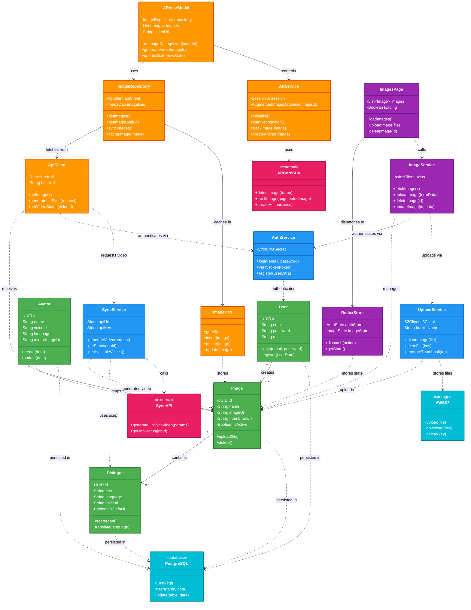

# TalkAR - Simple UML Class Diagram (Complete Project)

## Single Unified Class Diagram - Entire TalkAR System



---

## Diagram Legend

### 🎨 Color Coding

| Color | Component Type | Examples |
|-------|---------------|----------|
| 🟢 **Green** | Backend Database Models | User, Image, Dialogue, Avatar |
| 🔵 **Blue** | Backend Services | AuthService, SyncService, UploadService |
| 🟠 **Orange** | Mobile App Components | ARViewModel, ImageRepository, ARService |
| 🟣 **Purple** | Admin Dashboard | ImagesPage, ReduxStore, ImageService |
| 🔴 **Pink** | External Services | SyncAPI, ARCore SDK |
| 🔷 **Cyan** | Infrastructure | PostgreSQL, AWS S3 |

---

## Class Summary by Application

### 📱 **Mobile App (Android - 5 classes)**
| Class | Purpose |
|-------|---------|
| ARViewModel | MVVM business logic for AR screen |
| ImageRepository | Data management (API + local cache) |
| ARService | ARCore integration for image recognition |
| ImageDao | Local database access (Room) |
| ApiClient | REST API communication (Retrofit) |

### 🌐 **Backend API (Node.js - 7 classes)**
| Class | Purpose |
|-------|---------|
| User | User authentication & management |
| Image | Image metadata & URLs |
| Dialogue | Scripts/dialogues for images |
| Avatar | Avatar & voice configuration |
| AuthService | JWT authentication |
| SyncService | Lip-sync video generation |
| UploadService | AWS S3 file uploads |

### 💻 **Admin Dashboard (React - 3 classes)**
| Class | Purpose |
|-------|---------|
| ImagesPage | Image management UI component |
| ReduxStore | Global state management |
| ImageService | API integration service |

### ⚙️ **External Services (4 classes)**
| Class | Purpose |
|-------|---------|
| SyncAPI | Third-party lip-sync generation |
| ARCoreSDK | Google AR framework |
| PostgreSQL | Relational database |
| AWSS3 | Cloud file storage |

---

## Key Relationships Explained

### 1️⃣ **Backend Data Flow**
```
User creates → Image contains → Dialogue
                      ↓
              Avatar maps to Image
```

### 2️⃣ **Mobile App Flow (MVVM)**
```
ARViewModel → ImageRepository → ApiClient → Backend
                      ↓
                  ImageDao → Local Storage
```

### 3️⃣ **Admin Dashboard Flow**
```
ImagesPage → ReduxStore (state)
           → ImageService → Backend API
```

### 4️⃣ **AR Experience Flow**
```
ARViewModel → ARService → ARCore SDK
           → ImageRepository → Backend API → SyncService → Sync API
```

---

## Relationship Types

| Symbol | Type | Meaning |
|--------|------|---------|
| `-->` | **Association** | "has a" relationship |
| `..>` | **Dependency** | "uses" or "calls" |
| `1` to `0..*` | **Multiplicity** | One-to-many relationship |

### Examples:
- `User "1" --> "0..*" Image` - One User creates many Images
- `SyncService ..> SyncAPI` - SyncService depends on/uses SyncAPI
- `ARViewModel --> ImageRepository` - ARViewModel has a ImageRepository

---

## Complete System Architecture

```
┌─────────────────────────────────────────────────────────────┐
│                    TalkAR System                             │
├─────────────────────────────────────────────────────────────┤
│                                                              │
│  📱 MOBILE APP          🌐 BACKEND API      💻 DASHBOARD    │
│  ──────────────         ──────────────      ──────────      │
│  • ARViewModel          • User              • ImagesPage    │
│  • ImageRepository      • Image             • ReduxStore    │
│  • ARService            • Dialogue          • ImageService  │
│  • ImageDao             • Avatar            │               │
│  • ApiClient            • AuthService       │               │
│                         • SyncService       │               │
│                         • UploadService     │               │
│                                                              │
├─────────────────────────────────────────────────────────────┤
│                    EXTERNAL SERVICES                         │
│  • Sync API  • ARCore SDK  • PostgreSQL  • AWS S3          │
└─────────────────────────────────────────────────────────────┘
```

---

## How to Read This Diagram

### 1. **Start with Backend Models** (Green boxes)
- Core data structures: User, Image, Dialogue, Avatar
- These are stored in PostgreSQL database

### 2. **Follow Backend Services** (Blue boxes)
- Business logic: AuthService, SyncService, UploadService
- These process data and interact with external services

### 3. **Trace Mobile App Flow** (Orange boxes)
- ARViewModel controls the UI
- ImageRepository manages data (API + cache)
- ARService handles AR functionality

### 4. **Understand Admin Dashboard** (Purple boxes)
- ImagesPage is the UI component
- ReduxStore manages state
- ImageService communicates with backend

### 5. **External Dependencies** (Pink & Cyan boxes)
- Sync API generates videos
- ARCore SDK provides AR features
- PostgreSQL stores data
- AWS S3 stores files

---

## Technology Stack Summary

| Component | Technology |
|-----------|-----------|
| **Mobile App** | Kotlin + Jetpack Compose + ARCore |
| **Backend API** | Node.js + TypeScript + Express |
| **Admin Dashboard** | React + TypeScript + Redux |
| **Database** | PostgreSQL + Sequelize ORM |
| **Storage** | AWS S3 |
| **AR Framework** | Google ARCore |
| **Video Generation** | Sync API (external) |

---

## Usage Instructions

### 🚀 Quick View (30 seconds):
1. **Visit**: https://mermaid.live
2. **Copy**: The diagram code (lines 5-243)
3. **Paste**: Into the editor
4. **View**: Your complete system diagram!
5. **Export**: Click "Actions" → "PNG" or "SVG"

### 📂 Add to GitHub:
```bash
git add SIMPLE_CLASS_DIAGRAM.md
git commit -m "Add simple class diagram for entire project"
git push
# Renders automatically on GitHub!
```

### 💻 View in VS Code:
1. Install: "Markdown Preview Mermaid Support" extension
2. Open: `SIMPLE_CLASS_DIAGRAM.md`
3. Press: `Ctrl+Shift+V` (preview)
4. See: Rendered diagram

---

## Benefits of This Diagram

✅ **Single View** - Entire project in one diagram  
✅ **Color Coded** - Easy to identify component types  
✅ **Simplified** - Only essential classes shown  
✅ **Complete** - Covers Mobile, Backend, Dashboard  
✅ **Clear Relationships** - Easy to understand data flow  
✅ **Professional** - UML 2.0 standard notation  
✅ **Shareable** - Perfect for presentations & documentation  

---

## Quick Stats

| Metric | Count |
|--------|-------|
| **Total Classes** | 19 classes |
| **Backend Classes** | 7 (models + services) |
| **Mobile Classes** | 5 (MVVM + data) |
| **Dashboard Classes** | 3 (UI + state) |
| **External Services** | 4 (APIs + infrastructure) |
| **Relationships** | 25+ associations |

---

**Perfect for**: Documentation, presentations, team onboarding, architecture reviews, and stakeholder meetings! 🎯

**Created**: October 8, 2025  
**Version**: 1.0  
**Coverage**: Complete TalkAR System (Mobile + Backend + Dashboard)
