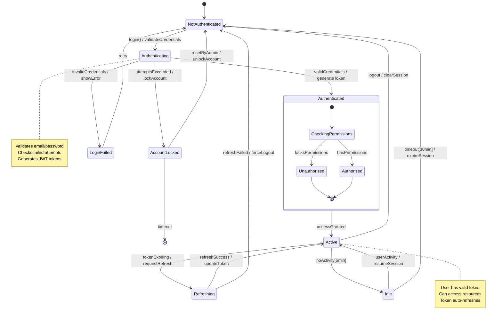
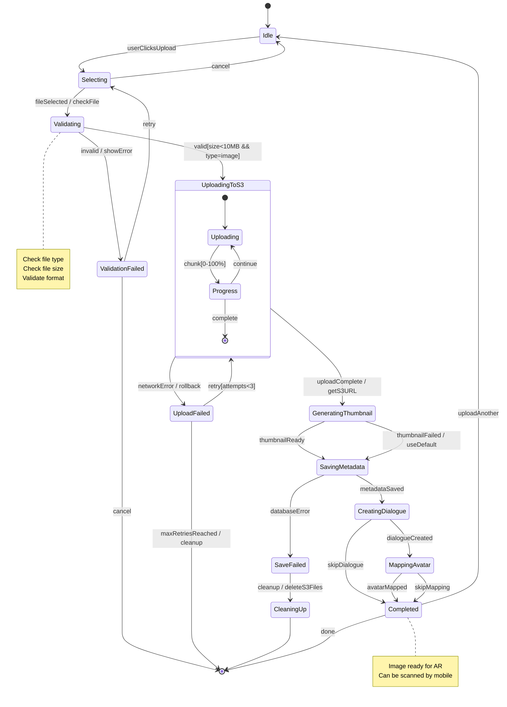
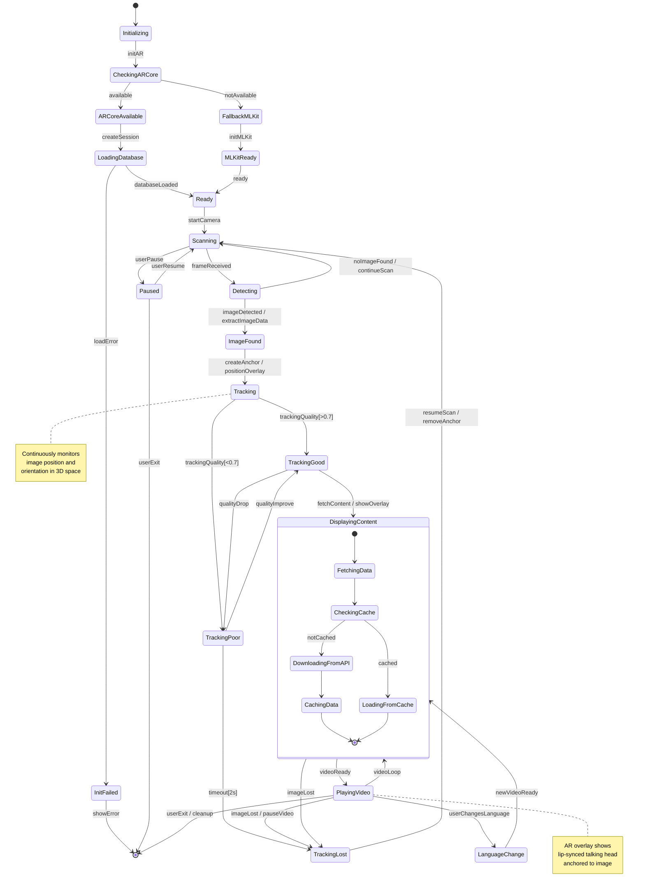
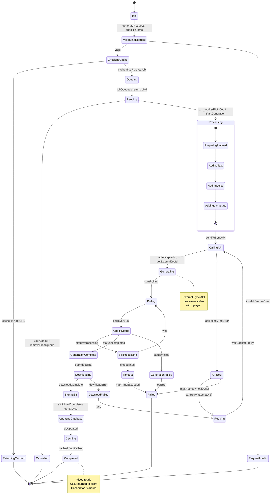
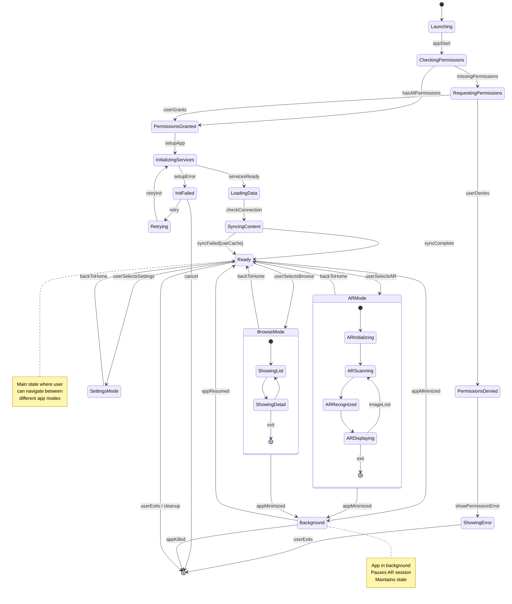
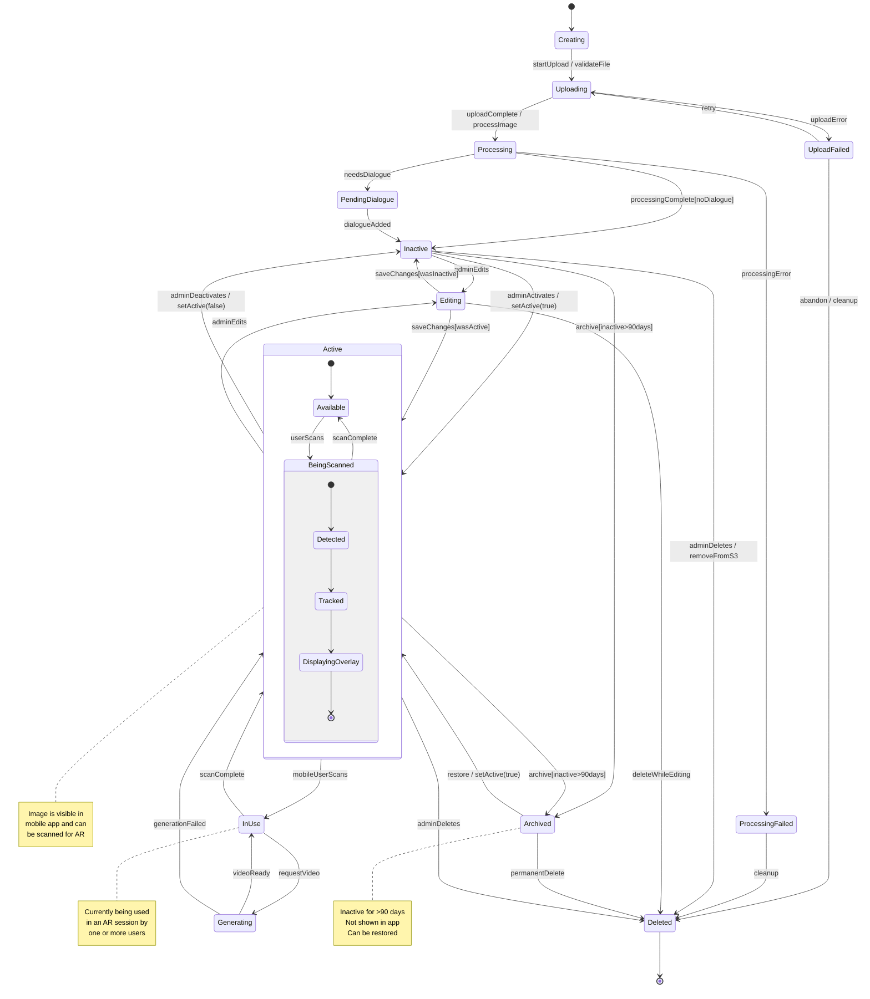
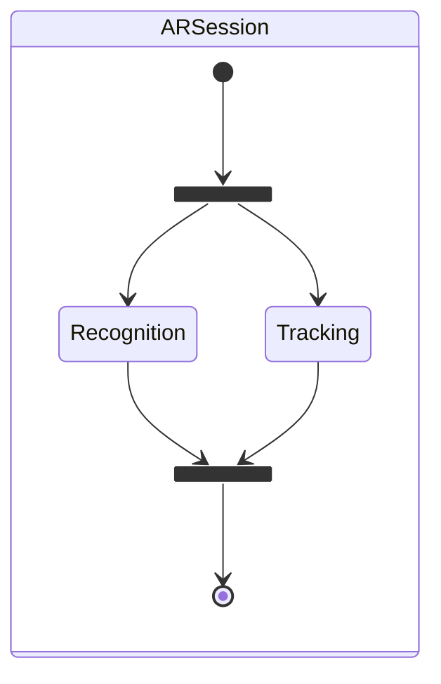

# TalkAR - UML State Machine Diagrams

## Table of Contents
1. [User Session State Machine](#1-user-session-state-machine)
2. [Image Upload State Machine](#2-image-upload-state-machine)
3. [AR Recognition State Machine](#3-ar-recognition-state-machine)
4. [Video Generation State Machine](#4-video-generation-state-machine)
5. [Mobile App State Machine](#5-mobile-app-state-machine)
6. [Image Entity State Machine](#6-image-entity-state-machine)

---

## UML State Machine Notation

### Elements
- **Initial State** (●): Starting point
- **Final State** (◉): End point
- **State**: Represents a condition or situation
- **Transition**: Arrow showing state change
- **Event/Trigger**: What causes transition
- **Guard Condition**: [condition] that must be true
- **Action**: /action performed during transition

### Transition Format
```
Event [Guard] / Action
```

---

## 1. User Session State Machine

**Purpose**: Models user authentication and session lifecycle



---

## 2. Image Upload State Machine

**Purpose**: Models complete image upload workflow



---

## 3. AR Recognition State Machine

**Purpose**: Models image recognition and tracking lifecycle



---

## 4. Video Generation State Machine

**Purpose**: Models async video generation process



---

## 5. Mobile App State Machine

**Purpose**: Models overall mobile application lifecycle



---

## 6. Image Entity State Machine

**Purpose**: Models image lifecycle in the system



---

## State Machine Summary

| # | State Machine | Purpose | States | Transitions |
|---|--------------|---------|--------|-------------|
| 1 | User Session | Authentication lifecycle | 8 | 14 |
| 2 | Image Upload | Upload workflow | 11 | 16 |
| 3 | AR Recognition | Image detection & tracking | 12 | 18 |
| 4 | Video Generation | Async video processing | 15 | 20 |
| 5 | Mobile App | App lifecycle | 13 | 17 |
| 6 | Image Entity | Image lifecycle | 12 | 19 |

---

## State Types

### Simple State
```
StateName
```
Basic state with no internal structure

### Composite State
```
state ParentState {
    [*] --> ChildState1
    ChildState1 --> ChildState2
}
```
State containing sub-states

### Choice Pseudostate
```
State1 --> State2 : condition1[guard]
State1 --> State3 : condition2[guard]
```
Conditional branching based on guards

---

## Transition Types

### 1. External Transition
```
StateA --> StateB : event / action
```
Exits StateA, performs action, enters StateB

### 2. Internal Transition
```
StateA : event / action
```
Handles event without leaving state

### 3. Self Transition
```
StateA --> StateA : event / action
```
Exits and re-enters same state

### 4. Compound Transition
```
StateA --> StateB : event1
StateB --> StateC : event2
```
Sequential transitions

---

## Guard Conditions

### Examples from Diagrams

| Guard | Meaning |
|-------|---------|
| `[size<10MB && type=image]` | File must be under 10MB and be an image |
| `[attempts<3]` | Retry count must be less than 3 |
| `[trackingQuality>0.7]` | Tracking quality above 70% |
| `[inactive>90days]` | Inactive for more than 90 days |
| `[hasPermissions]` | User has required permissions |

---

## Actions

### Common Actions

| Action | Purpose |
|--------|---------|
| `/validateCredentials` | Check email/password |
| `/generateToken` | Create JWT token |
| `/showError` | Display error message |
| `/checkFile` | Validate file format/size |
| `/getS3URL` | Retrieve AWS S3 URL |
| `/createAnchor` | Create AR anchor |
| `/pauseVideo` | Pause video playback |
| `/cleanup` | Clean up resources |

---

## Events/Triggers

### User Events
- `login()`, `logout()`, `retry`
- `userClicksUpload`, `fileSelected`, `cancel`
- `userChangesLanguage`, `userExit`

### System Events
- `validCredentials`, `uploadComplete`
- `imageDetected`, `imageLost`
- `videoReady`, `timeout`

### Temporal Events
- `timeout[5min]`, `timeout[30min]`
- `poll[every 2s]`
- `archive[inactive>90days]`

---

## Concurrent States

### Example: Multiple AR Sessions


---

## How to Use These Diagrams

### 🚀 View in Mermaid Live:
1. Visit: https://mermaid.live
2. Copy any state diagram
3. View state transitions
4. Export as PNG/SVG

### 📂 GitHub:
```bash
git add STATE_MACHINE_DIAGRAMS.md
git commit -m "Add UML state machine diagrams"
git push
```

### 💻 VS Code:
1. Install "Markdown Preview Mermaid Support"
2. Open file
3. Press `Ctrl+Shift+V`
4. View all state machines

---

## Benefits of State Machines

✅ **Clear Lifecycle** - Shows complete object lifecycle  
✅ **Valid States** - Only valid states defined  
✅ **Valid Transitions** - Only valid transitions shown  
✅ **Event Handling** - Clear event response  
✅ **Guard Conditions** - Conditional logic explicit  
✅ **Error Handling** - Error states and recovery paths  
✅ **Documentation** - Self-documenting behavior  

---

## State Machine Validation

### Questions to Validate
1. ✅ Can every state be reached?
2. ✅ Can every state be exited?
3. ✅ Are all events handled?
4. ✅ Are guard conditions complete?
5. ✅ Are error states defined?
6. ✅ Is there a path to final state?

---

## Implementation Notes

### Backend (Node.js/TypeScript)
```typescript
enum UserSessionState {
    NotAuthenticated,
    Authenticating,
    Authenticated,
    Active,
    Idle
}
```

### Mobile (Kotlin)
```kotlin
sealed class ARState {
    object Initializing : ARState()
    object Scanning : ARState()
    data class Tracking(val imageId: String) : ARState()
    data class DisplayingContent(val content: Content) : ARState()
}
```

---

**Created**: October 8, 2025  
**Standard**: UML 2.0 State Machine Diagrams  
**Format**: Mermaid stateDiagram-v2  
**Total Diagrams**: 6 complete state machines
