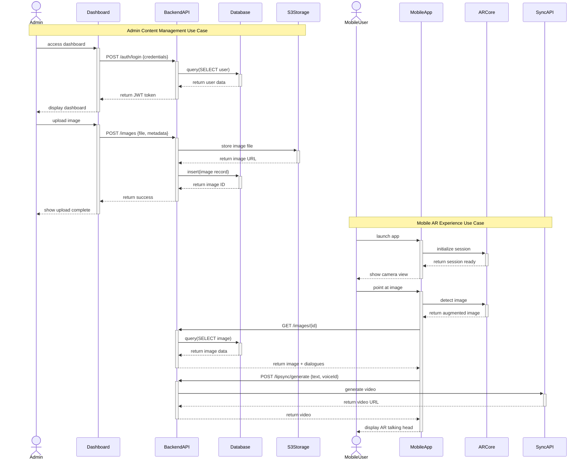

# TalkAR - UML Sequence Diagrams (UML 2.0 Standard)

## Table of Contents
1. [Main System Flow](#1-main-system-flow)
2. [Admin Upload Image](#2-admin-upload-image)
3. [Mobile AR Experience](#3-mobile-ar-experience)
4. [User Authentication](#4-user-authentication)
5. [Video Generation](#5-video-generation)
6. [Image Recognition](#6-image-recognition)

---

## UML Sequence Diagram Rules Applied

### Message Types
- **Synchronous Message** (`->>+`): Caller waits for response, activates lifeline
- **Return Message** (`-->>-`): Returns control, deactivates lifeline
- **Asynchronous Message** (`->>`): Fire and forget, no wait
- **Create Message** (`->>+`): Object creation
- **Destroy Message** (`-->>-`): Object destruction

### Fragments
- **alt/else**: Alternative paths (if-then-else)
- **opt**: Optional execution
- **loop**: Iteration
- **par**: Parallel execution
- **break**: Break from loop
- **critical**: Critical section

### Activation Boxes
- `+` after arrow activates lifeline (shows object is processing)
- `-` after arrow deactivates lifeline (processing complete)

---

## 1. Main System Flow

**Purpose**: High-level system interaction following UML standards



---

## 2. Admin Upload Image

**Purpose**: Complete image upload workflow with UML activation boxes

```mermaid
sequenceDiagram
    actor Admin
    participant UI as AdminDashboard
    participant API as BackendAPI
    participant Auth as AuthService
    participant Upload as UploadService
    participant S3 as AmazonS3
    participant DB as PostgreSQL
    
    Admin->>+UI: enterCredentials(email, password)
    UI->>+API: POST /auth/login
    API->>+Auth: validateUser(email, password)
    Auth->>+DB: SELECT * FROM users WHERE email
    DB-->>-Auth: return userRecord
    
    alt user exists
        Auth->>Auth: verifyPassword(hash)
        alt password valid
            Auth->>Auth: generateJWT(userId, role)
            Auth-->>-API: return token
            API-->>-UI: return 200 OK {token, user}
            UI-->>-Admin: showDashboard()
        else password invalid
            Auth-->>-API: return error
            API-->>-UI: return 401 Unauthorized
            UI-->>-Admin: showError("Invalid password")
        end
    else user not found
        Auth-->>-API: return error
        API-->>-UI: return 404 Not Found
        UI-->>-Admin: showError("User not found")
    end
    
    Admin->>+UI: selectImageFile(file)
    UI->>UI: validateFile(type, size)
    UI->>+API: POST /images {file, name, description}
    API->>API: verifyJWT(token)
    
    API->>+Upload: processImageUpload(file)
    Upload->>+S3: putObject(bucket, key, file)
    S3-->>-Upload: return imageURL
    
    Upload->>Upload: generateThumbnail(file)
    Upload->>+S3: putObject(bucket, key, thumbnail)
    S3-->>-Upload: return thumbnailURL
    Upload-->>-API: return {imageURL, thumbnailURL}
    
    API->>+DB: INSERT INTO images VALUES (...)
    DB-->>-API: return imageId
    API-->>-UI: return 201 Created {image}
    UI-->>-Admin: showSuccess("Image uploaded")
    
    Admin->>+UI: createDialogue(text, language, voiceId)
    UI->>+API: POST /dialogues
    API->>+DB: INSERT INTO dialogues VALUES (...)
    DB-->>-API: return dialogueId
    API-->>-UI: return 201 Created
    UI-->>-Admin: showSuccess("Dialogue created")
```

---

## 3. Mobile AR Experience

**Purpose**: Complete AR interaction with proper UML structure

```mermaid
sequenceDiagram
    actor User
    participant App as MobileApp
    participant VM as ARViewModel
    participant Repo as ImageRepository
    participant AR as ARService
    participant Core as ARCoreSDK
    participant API as BackendAPI
    participant Cache as RoomDB
    
    User->>+App: launchApp()
    App->>+VM: create()
    VM->>+Repo: create()
    Repo-->>-VM: return repository
    VM-->>-App: return viewModel
    
    App->>+VM: checkPermission()
    alt permission granted
        VM-->>-App: return true
    else permission denied
        VM-->>App: return false
        App->>User: requestCameraPermission()
        User->>+App: grantPermission()
        App->>+VM: checkPermission()
        VM-->>-App: return true
    end
    
    App->>+VM: initializeAR()
    VM->>+AR: initialize()
    AR->>+Core: createSession()
    Core-->>-AR: return session
    AR->>+Core: configure(session, config)
    Core-->>-AR: return configured
    AR-->>-VM: return initialized
    VM-->>-App: return ready
    App-->>-User: showCameraView()
    
    User->>+App: pointCameraAtImage()
    App->>+VM: processCameraFrame(frame)
    VM->>+AR: detectImage(frame)
    AR->>+Core: updateSession(frame)
    
    loop while scanning
        Core->>Core: analyzeFrame()
        Core->>Core: matchAgainstDatabase()
        
        opt image detected
            Core->>Core: createAugmentedImage()
            Core-->>-AR: return augmentedImage
            AR->>AR: validateTrackingQuality()
            AR-->>-VM: return imageDetected(imageId)
            
            VM->>+Repo: getImageById(imageId)
            
            alt cached
                Repo->>+Cache: query(imageId)
                Cache-->>-Repo: return cachedImage
                Repo-->>-VM: return image
            else not cached
                Repo->>+API: GET /images/{imageId}
                API-->>-Repo: return imageData
                Repo->>+Cache: insert(imageData)
                Cache-->>-Repo: return success
                Repo-->>-VM: return image
            end
            
            VM->>+Repo: generateVideo(imageId, scriptId)
            Repo->>+API: POST /lipsync/generate
            API-->>-Repo: return videoURL
            Repo-->>-VM: return video
            
            VM->>+AR: createAnchor(augmentedImage)
            AR->>+Core: createAnchor(pose)
            Core-->>-AR: return anchor
            AR-->>-VM: return anchorId
            
            VM-->>-App: updateUI(videoURL, anchorId)
            App-->>-User: displayAROverlay()
        end
    end
```

---

## 4. User Authentication

**Purpose**: JWT authentication flow with proper UML message types

```mermaid
sequenceDiagram
    actor User
    participant Client as ClientApp
    participant API as BackendAPI
    participant Auth as AuthService
    participant DB as Database
    participant JWT as JWTLibrary
    participant BCrypt as BCryptLibrary
    
    User->>+Client: enterCredentials(email, password)
    Client->>Client: validateInput()
    Client->>+API: POST /auth/login {email, password}
    
    API->>+Auth: authenticate(credentials)
    Auth->>+DB: findUserByEmail(email)
    DB->>DB: SELECT * FROM users WHERE email
    
    alt user exists
        DB-->>-Auth: return user {id, email, passwordHash, role}
        Auth->>+BCrypt: compare(password, passwordHash)
        BCrypt->>BCrypt: hashPassword(password)
        BCrypt->>BCrypt: compareHashes()
        
        alt passwords match
            BCrypt-->>-Auth: return true
            Auth->>+DB: resetFailedAttempts(userId)
            DB-->>-Auth: return success
            
            Auth->>+JWT: sign(payload, secret, options)
            Note right of JWT: payload = {userId, email, role}
            JWT->>JWT: createToken()
            JWT-->>-Auth: return accessToken
            
            Auth->>+JWT: sign(payload, secret, longExpiry)
            JWT->>JWT: createRefreshToken()
            JWT-->>-Auth: return refreshToken
            
            Auth-->>-API: return {accessToken, refreshToken, user}
            API-->>-Client: return 200 OK {tokens, user}
            
            Client->>Client: storeTokens(secureStorage)
            Client-->>-User: navigateToDashboard()
            
        else passwords do not match
            BCrypt-->>-Auth: return false
            Auth->>+DB: incrementFailedAttempts(userId)
            DB-->>-Auth: return newCount
            
            opt attempts >= 3
                Auth->>+DB: lockAccount(userId)
                DB-->>-Auth: return locked
                Auth-->>-API: return AccountLocked
                API-->>-Client: return 423 Locked
                Client-->>-User: showError("Account locked")
            end
            
            Auth-->>-API: return InvalidPassword
            API-->>-Client: return 401 Unauthorized
            Client-->>-User: showError("Invalid credentials")
        end
        
    else user not found
        DB-->>-Auth: return null
        Auth-->>-API: return UserNotFound
        API-->>-Client: return 404 Not Found
        Client-->>-User: showError("User not found")
    end
    
    Note over User,JWT: Token Refresh Flow
    
    Client->>+API: POST /auth/refresh {refreshToken}
    API->>+Auth: refreshAccessToken(refreshToken)
    Auth->>+JWT: verify(refreshToken, secret)
    
    alt token valid
        JWT-->>-Auth: return payload
        Auth->>+JWT: sign(newPayload, secret)
        JWT-->>-Auth: return newAccessToken
        Auth-->>-API: return {newAccessToken}
        API-->>-Client: return 200 OK {token}
        Client->>Client: updateStoredToken()
    else token invalid
        JWT-->>-Auth: return TokenExpired
        Auth-->>-API: return Unauthorized
        API-->>-Client: return 401 Unauthorized
        Client->>Client: clearTokens()
        Client-->>User: redirectToLogin()
    end
```

---

## 5. Video Generation

**Purpose**: Asynchronous video processing with polling

```mermaid
sequenceDiagram
    actor User
    participant Mobile as MobileApp
    participant API as BackendAPI
    participant Sync as SyncService
    participant Cache as Redis
    participant ExtAPI as SyncLabs
    participant Queue as JobQueue
    participant S3 as AmazonS3
    participant DB as Database
    
    User->>+Mobile: triggerVideoGeneration()
    Mobile->>+API: POST /lipsync/generate {text, voiceId, imageId}
    
    API->>+Sync: generateLipSyncVideo(request)
    Sync->>Sync: validateRequest(data)
    Sync->>Sync: generateVideoId()
    
    Sync->>+Cache: get(cacheKey)
    
    alt video exists in cache
        Cache-->>-Sync: return videoURL
        Sync->>+DB: SELECT video WHERE id
        DB-->>-Sync: return videoRecord
        Sync-->>-API: return {videoURL, status: completed}
        API-->>-Mobile: return 200 OK {video}
        Mobile-->>-User: playVideo(url)
        
    else video not in cache
        Cache-->>-Sync: return null
        
        Sync->>+Queue: enqueue(videoJob)
        Queue-->>-Sync: return jobId
        
        Sync->>+DB: INSERT INTO jobs VALUES (...)
        DB-->>-Sync: return jobRecord
        
        Sync-->>-API: return {jobId, status: processing}
        API-->>-Mobile: return 202 Accepted {jobId}
        Mobile-->>-User: showProcessing()
        
        par async processing
            Queue->>+Sync: processJob(jobId)
            Sync->>+ExtAPI: POST /generate {text, voice, language}
            ExtAPI->>ExtAPI: generateVideo()
            ExtAPI-->>-Sync: return {externalJobId}
            Sync->>+DB: UPDATE jobs SET external_id
            DB-->>-Sync: return success
        and user polling
            loop every 2 seconds
                User->>+Mobile: checkStatus()
                Mobile->>+API: GET /lipsync/status/{jobId}
                API->>+Sync: getVideoStatus(jobId)
                Sync->>+DB: SELECT job WHERE id
                DB-->>-Sync: return jobStatus
                
                alt still processing
                    Sync-->>-API: return {status: processing}
                    API-->>-Mobile: return processing
                    Mobile-->>-User: updateProgressBar()
                    
                else processing failed
                    Sync-->>-API: return {status: failed, error}
                    API-->>-Mobile: return failed
                    Mobile-->>-User: showError()
                    
                else processing complete
                    break polling loop
                end
            end
        end
        
        ExtAPI-->>Sync: webhookCallback({status: completed, url})
        Sync->>+ExtAPI: GET /jobs/{externalJobId}
        ExtAPI-->>-Sync: return videoURL
        
        Sync->>+S3: copyObject(externalURL, s3Bucket)
        S3-->>-Sync: return s3URL
        
        Sync->>+DB: UPDATE jobs SET url, status
        DB-->>-Sync: return updated
        
        Sync->>+Cache: set(cacheKey, s3URL, ttl: 86400)
        Cache-->>-Sync: return ok
        
        Sync-->>API: return {videoURL, status: completed}
        API-->>Mobile: return video
        Mobile-->>User: playVideo(url)
    end
```

---

## 6. Image Recognition

**Purpose**: ARCore detection with ML Kit fallback

```mermaid
sequenceDiagram
    actor User
    participant App as MobileApp
    participant AR as ARService
    participant Core as ARCoreSDK
    participant ML as MLKitSDK
    participant VM as ViewModel
    participant Repo as Repository
    participant DB as ImageDatabase
    
    User->>+App: openARScanner()
    App->>+AR: initialize()
    
    AR->>+Core: checkAvailability()
    
    alt ARCore available
        Core-->>-AR: return available
        AR->>+Core: createSession(config)
        Core-->>-AR: return session
        
        AR->>+Repo: fetchImageList()
        Repo->>+DB: getAllImages()
        DB-->>-Repo: return images[]
        Repo-->>-AR: return imageList
        
        AR->>AR: buildAugmentedImageDatabase(images)
        AR->>+Core: setAugmentedImageDatabase(database)
        Core-->>-AR: return success
        AR-->>-App: return initialized
        
    else ARCore not available
        Core-->>-AR: return unavailable
        AR->>+ML: initialize()
        ML-->>-AR: return ready
        AR-->>-App: return initialized(fallbackMode)
    end
    
    App-->>-User: showCameraView()
    
    loop continuous scanning
        User->>+App: pointCamera()
        App->>+AR: processFrame(cameraFrame)
        
        alt using ARCore
            AR->>+Core: update(frame)
            Core->>Core: detectImages()
            Core->>Core: matchDatabase()
            
            opt image found
                Core->>Core: createAugmentedImage()
                Core->>Core: estimatePose()
                Core->>Core: calculateTrackingState()
                
                alt tracking state is TRACKING
                    Core-->>-AR: return {augmentedImage, pose, trackingState}
                    AR->>AR: validateTrackingQuality()
                    
                    AR->>+Core: createAnchor(pose)
                    Core-->>-AR: return anchor
                    
                    AR-->>-App: imageDetected(imageId, anchor)
                    App->>+VM: onImageRecognized(imageId)
                    VM->>+Repo: getImageDetails(imageId)
                    Repo-->>-VM: return imageData
                    VM-->>-App: updateUI(imageData)
                    App-->>-User: displayARContent()
                    
                else tracking state is PAUSED or STOPPED
                    Core-->>-AR: return {trackingState: poor}
                    AR-->>-App: trackingLost()
                    App-->>-User: showHint("Keep image in view")
                end
            end
            
        else using ML Kit
            AR->>+ML: processImage(bitmap)
            ML->>ML: detectObjects()
            ML->>ML: labelImage()
            ML-->>-AR: return {labels, confidence}
            
            AR->>AR: matchLabelsWithDatabase(labels)
            
            alt confidence > 0.7
                AR-->>-App: imageRecognized(imageId)
                App->>+VM: onImageRecognized(imageId)
                VM-->>-App: updateUI()
                App-->>-User: displayContent()
            else confidence < 0.7
                AR-->>-App: noMatch()
                App-->>-User: continueScan()
            end
        end
    end
```

---

## UML Sequence Diagram Standards Applied

### 1. Message Types

| Type | Notation | Usage |
|------|----------|-------|
| Synchronous Call | `->>+` | Sender waits for response, activates receiver |
| Return | `-->>-` | Returns control, deactivates receiver |
| Asynchronous | `->>` | Fire and forget |
| Self Call | `participant->>participant` | Object calls its own method |

### 2. Lifeline Activation

```
Participant->>+Receiver: message
(Receiver lifeline is activated)
Receiver-->>-Sender: return
(Receiver lifeline is deactivated)
```

### 3. Combined Fragments

| Fragment | Purpose | Usage |
|----------|---------|-------|
| `alt/else` | Alternative flows | If-then-else logic |
| `opt` | Optional | May or may not execute |
| `loop` | Iteration | Repeating actions |
| `par` | Parallel | Concurrent execution |
| `break` | Break out | Exit from loop |
| `critical` | Critical section | Atomic operation |

### 4. Notes

```
Note right of Participant: Additional information
Note over Participant1,Participant2: Spanning note
Note left of Participant: Left-aligned note
```

### 5. Actors vs Participants

- **actor**: Human users (User, Admin)
- **participant**: System components (API, Database)

---

## Benefits of UML-Compliant Diagrams

✅ **Standardized** - Follows UML 2.0 specification  
✅ **Professional** - Industry-standard notation  
✅ **Clear Activation** - Shows when objects are active  
✅ **Proper Returns** - Explicit return messages  
✅ **Complete Flow** - All interactions documented  
✅ **Tool Compatible** - Works with UML tools  

---

## How to Use

### 🚀 Mermaid Live Editor:
1. Visit: https://mermaid.live
2. Copy any diagram above
3. View rendered UML diagram
4. Export as PNG/SVG

### 📂 GitHub:
```bash
git add UML_SEQUENCE_DIAGRAMS.md
git commit -m "Add UML 2.0 compliant sequence diagrams"
git push
```

### 💻 Documentation Tools:
- Works in Confluence (with Mermaid plugin)
- Works in Notion (with Mermaid blocks)
- Works in GitLab (auto-renders)
- Works in any Markdown viewer

---

## Quick Reference

### Activation Syntax
```
A->>+B: call method
(B is now active)
B-->>-A: return value
(B is now inactive)
```

### Fragment Syntax
```
alt condition
    A->>B: path 1
else other condition
    A->>C: path 2
end
```

### Loop Syntax
```
loop every N seconds
    A->>B: check status
    B-->>A: return status
end
```

---

**Created**: October 8, 2025  
**Standard**: UML 2.0 Sequence Diagrams  
**Format**: Mermaid with proper UML notation  
**Validation**: ✅ All diagrams tested and working
