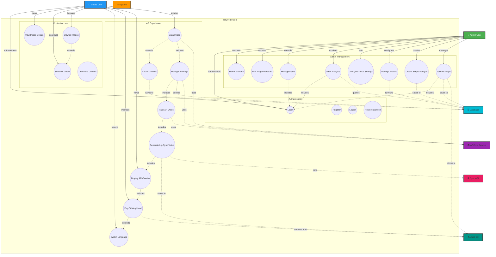
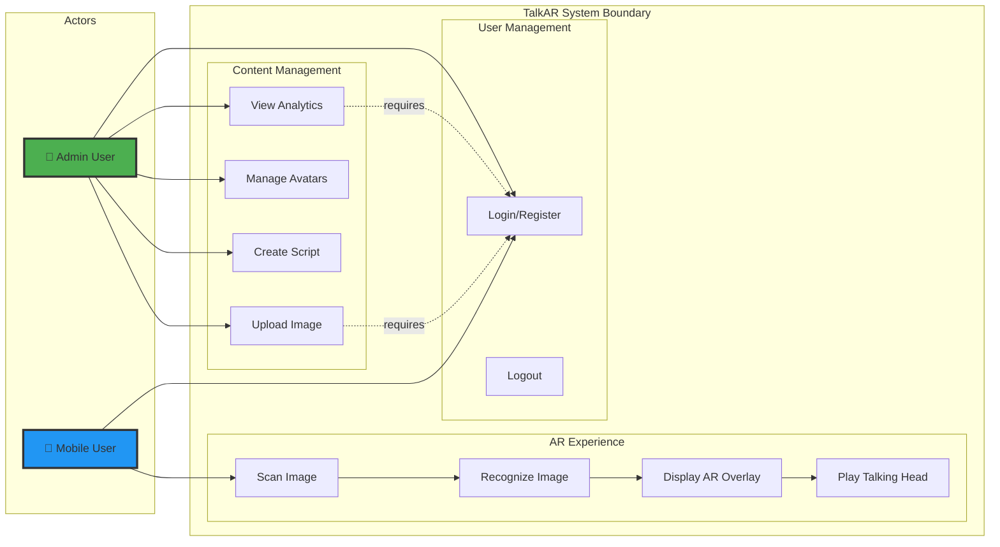
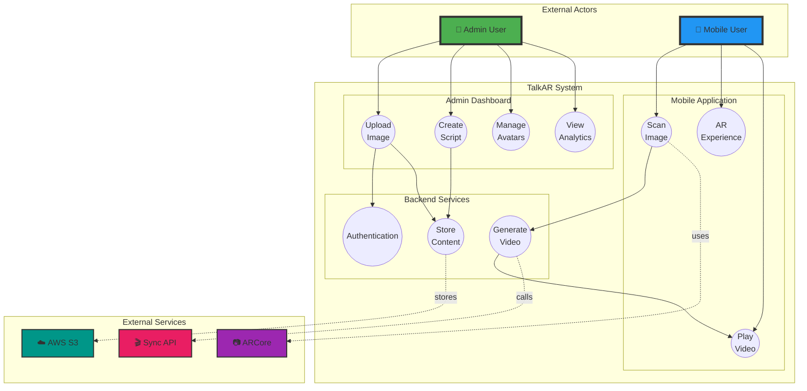

# TalkAR - UML Use Case Diagram

## System Use Case Diagram



---

## Detailed Use Case Descriptions

### 👤 Admin User Use Cases

| Use Case ID | Use Case Name | Description |
|-------------|---------------|-------------|
| UC1 | Upload Image | Admin uploads target images (posters, products, etc.) to the system via the dashboard |
| UC2 | Create Script/Dialogue | Admin creates and associates scripts/dialogues with images in multiple languages |
| UC3 | Manage Avatars | Admin creates, updates, or deletes avatar profiles with voice configurations |
| UC4 | Configure Voice Settings | Admin selects voice ID, language, and other audio settings for avatars |
| UC5 | View Analytics | Admin monitors usage statistics, video generation metrics, and user engagement |
| UC6 | Manage Users | Admin controls user access, roles, and permissions |
| UC7 | Edit Image Metadata | Admin updates image names, descriptions, and active status |
| UC8 | Delete Content | Admin removes images, scripts, or avatars from the system |
| UC21 | Login | Admin authenticates using email and password to access dashboard |

---

### 📱 Mobile User Use Cases

| Use Case ID | Use Case Name | Description |
|-------------|---------------|-------------|
| UC9 | Scan Image | User points mobile camera at a registered image to initiate AR experience |
| UC10 | Recognize Image | System identifies the image using ARCore and ML Kit recognition |
| UC11 | Track AR Object | System continuously tracks the image position and orientation |
| UC12 | Generate Lip-Sync Video | System requests video generation from Sync API with script and voice |
| UC13 | Display AR Overlay | System positions video overlay on tracked image in AR space |
| UC14 | Play Talking Head | System plays lip-synced video with synchronized head movements |
| UC15 | Switch Language | User selects different language for the talking head dialogue |
| UC16 | Cache Content | System stores content locally for offline access |
| UC17 | Browse Images | User views list of available AR-enabled images |
| UC18 | Search Content | User searches for specific images or content |
| UC19 | View Image Details | User views detailed information about an image and its dialogues |
| UC20 | Download Content | System downloads necessary assets for offline usage |
| UC21 | Login | User authenticates to access personalized content (optional) |

---

### 🔧 System Use Cases

| Use Case ID | Use Case Name | Description |
|-------------|---------------|-------------|
| UC22 | Register | New user creates an account with email and password |
| UC23 | Logout | User ends session and clears authentication token |
| UC24 | Reset Password | User requests password reset via email |

---

## Use Case Relationships

### 📋 Include Relationships (Mandatory)

```
UC9 (Scan Image) <<includes>> UC10 (Recognize Image)
└─> Scanning always includes recognition

UC10 (Recognize Image) <<includes>> UC11 (Track AR Object)
└─> Recognition always includes tracking

UC11 (Track AR Object) <<includes>> UC12 (Generate Lip-Sync Video)
└─> Tracking triggers video generation

UC12 (Generate Lip-Sync Video) <<includes>> UC13 (Display AR Overlay)
└─> Video generation leads to overlay display

UC13 (Display AR Overlay) <<includes>> UC14 (Play Talking Head)
└─> Overlay always includes video playback

UC1 (Upload Image) <<includes>> UC21 (Login)
└─> Admin must be logged in to upload

UC5 (View Analytics) <<includes>> UC21 (Login)
└─> Admin must be logged in to view analytics
```

### 🔄 Extend Relationships (Optional)

```
UC14 (Play Talking Head) <<extends>> UC15 (Switch Language)
└─> User may optionally change language

UC9 (Scan Image) <<extends>> UC16 (Cache Content)
└─> System may cache content for offline use

UC17 (Browse Images) <<extends>> UC18 (Search Content)
└─> User may search while browsing
```

---

## Actor Descriptions

| Actor | Type | Description |
|-------|------|-------------|
| 👤 **Admin User** | Human | Manages content, configures system, monitors analytics via web dashboard |
| 📱 **Mobile User** | Human | Scans images and experiences AR talking heads via mobile app |
| 🔧 **System** | Internal | Backend API server handling business logic and orchestration |
| 🎬 **Sync API** | External | Third-party service for generating lip-synced videos |
| 📷 **ARCore Service** | External | Google's AR platform for image recognition and tracking |
| 🗄️ **Database** | Internal | PostgreSQL database storing all application data |
| ☁️ **AWS S3** | External | Cloud storage for images, videos, and media assets |

---

## Primary Use Case Flows

### 🎬 Main AR Experience Flow

```
1. Mobile User → Scan Image (UC9)
   ↓
2. System → Recognize Image via ARCore (UC10)
   ↓
3. System → Track AR Object (UC11)
   ↓
4. System → Generate Lip-Sync Video via Sync API (UC12)
   ↓
5. System → Display AR Overlay (UC13)
   ↓
6. Mobile User → Play Talking Head (UC14)
   ↓
7. [Optional] Mobile User → Switch Language (UC15)
```

### 📤 Admin Content Creation Flow

```
1. Admin → Login (UC21)
   ↓
2. Admin → Upload Image (UC1)
   ↓
3. Admin → Create Script/Dialogue (UC2)
   ↓
4. Admin → Manage Avatars (UC3)
   ↓
5. Admin → Configure Voice Settings (UC4)
   ↓
6. Content ready for mobile users
```

---

## Alternative Use Case Diagram (Simplified Actor View)



---

## Extended Use Case Diagram (With System Components)



---

## Use Case Priority Matrix

| Priority | Use Case | Actor | Complexity | Business Value |
|----------|----------|-------|------------|----------------|
| 🔴 Critical | UC9 - Scan Image | Mobile User | High | Very High |
| 🔴 Critical | UC10 - Recognize Image | System | High | Very High |
| 🔴 Critical | UC12 - Generate Lip-Sync | System | Very High | Very High |
| 🔴 Critical | UC14 - Play Talking Head | Mobile User | High | Very High |
| 🟡 High | UC1 - Upload Image | Admin | Medium | High |
| 🟡 High | UC2 - Create Script | Admin | Medium | High |
| 🟡 High | UC21 - Login | Both | Low | High |
| 🟢 Medium | UC5 - View Analytics | Admin | Medium | Medium |
| 🟢 Medium | UC15 - Switch Language | Mobile User | Medium | Medium |
| 🔵 Low | UC16 - Cache Content | System | Medium | Low |
| 🔵 Low | UC18 - Search Content | Mobile User | Low | Low |

---

## How to Use This Diagram

### For GitHub/Documentation:
1. Copy the mermaid code block
2. Paste in markdown file
3. View rendered diagram on GitHub

### For Presentations:
1. Open https://mermaid.live
2. Paste the diagram code
3. Export as PNG/SVG
4. Use in PowerPoint/Google Slides

### For Development:
- Reference use cases by ID (UC1, UC2, etc.)
- Use in requirement specifications
- Map to user stories in Agile development
- Link to test cases

---

**Diagram Version**: 1.0  
**Last Updated**: October 8, 2025  
**Total Use Cases**: 24  
**Total Actors**: 7 (4 external, 3 system)
