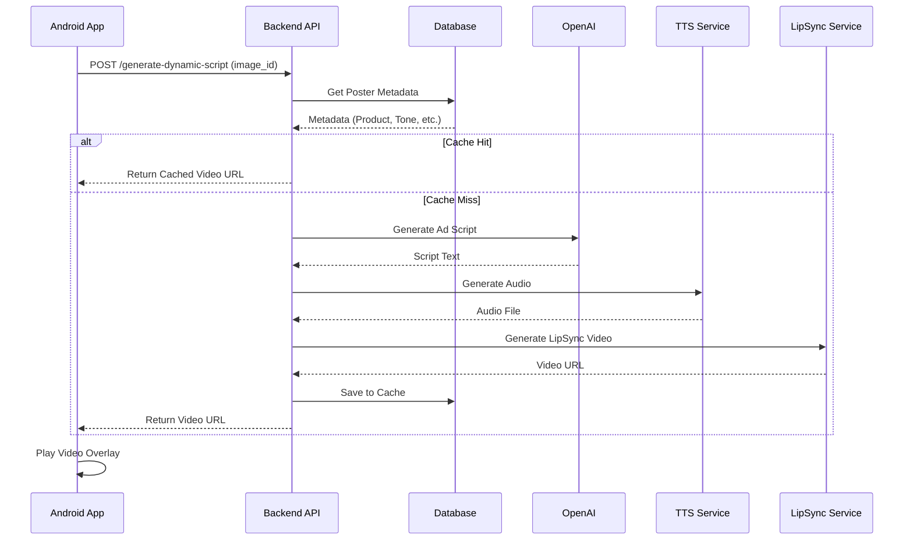

# API Flow: Scan to Video

This document outlines the sequence of events when a user scans a poster.

## Sequence Diagram

## Error Handling Flow

1. **Network Error**: App retries 3 times -> Shows "Offline Mode" UI.
2. **AI Failure**: Backend catches error -> Returns default static script -> App displays text bubble.
3. **Sync Failure**: Backend returns static avatar image + audio -> App displays static avatar with audio.
